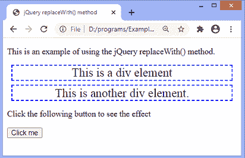
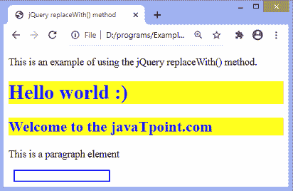
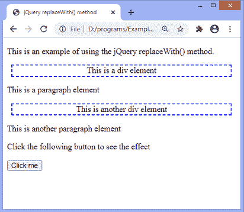
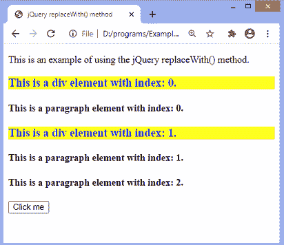

# jQuery replaceWith()方法

> 原文:[https://www.javatpoint.com/jquery-replacewith-method](https://www.javatpoint.com/jquery-replacewith-method)

jQuery 中的 **replaceWith()** 方法用来用新的元素替换选中的元素。此方法用指定的 HTML 元素替换匹配的元素。它返回被替换的元素。这个方法类似于 **replaceAll()** 方法。

### 句法

```

$(selector).replaceWith(newContent, function(index))

```

### 参数值

**replaceWith()** 方法的参数值定义如下。

**新内容:**必选参数。它是替换选定元素的内容。可以是 [HTML](https://www.javatpoint.com/html-tutorial) 元素，DOM 元素，也可以是 [jQuery](https://www.javatpoint.com/jquery-tutorial) 对象。

**函数(索引):**为可选参数。它是返回要替换的内容的函数。它包括一个参数**T3 指数**。 ***索引*** 参数用于返回元素的索引位置。

让我们看一些例子来理解如何使用 **replaceWith()** 方法。

### 示例 1

在这个例子中，有两个 div 元素，一个段落元素和一个按钮，我们在上面应用了 **replaceWith()** 方法。这里我们使用 ***新内容*** 参数的**替换为()**方法。

点击按钮后，带有 **id = "d1"** 的 div 元素被替换为标题 **h1** ，带有 **id = "d2"** 的 div 元素被替换为标题 **h2** 。带有 **id = "p1"** 的段落元素的文本被替换为新内容，带有 **id = "btn"** 的按钮被替换为带有 **id = "d3"** 的新 div 元素。

```

<!DOCTYPE html>
<html>
<head>
<title> jQuery replaceWith() method </title>
<script src= "https://ajax.googleapis.com/ajax/libs/jquery/3.5.1/jquery.min.js"> </script>

<style>
div {
border: 2px dashed blue;
width: auto;
margin: 8px;
font-size: 23px;
text-align: center;
}
h1, h2{
background-color: yellow;
color: blue;
}
#d3{
border: 2px solid blue;
width: 150px;
height: 15px;
}
</style>
</head>
<body>
<p> This is an example of using the jQuery replaceWith() method. </p>
<div id = "d1"> This is a div element </div>
<div id = "d2"> This is another div element. </div>
<p id = "p1"> Click the following button to see the effect </p>
<button id = "btn"> Click me </button>
<script>
$(document).ready(function(){
$("button").click(function() {
$("#d1").replaceWith("<h1> Hello world :) </h1>");
$("#d2").replaceWith("<h2> Welcome to the javaTpoint.com </h2>");
$("#p1").replaceWith("<p> This is a paragraph element </p>");
$("#btn").replaceWith("<div id = 'd3'> </div>");
});
});
</script>

</body>
</html>

```

[Test it Now](https://www.javatpoint.com/oprweb/test.jsp?filename=jquery-replacewith-method1)

**输出:**

执行上述代码后，输出将是-



点击给定按钮后，输出将是-



现在，在下一个示例中，我们将使用 **replaceWith()** 方法的 ***函数(索引)*** 参数。

### 示例 2

在这个例子中，有一些段落元素和一些 div 元素。我们正在对所有 div 元素和段落元素应用 **replaceWith()** 方法。点击给定按钮后，对应类别的[段落](https://www.javatpoint.com/html-paragraph)元素替换为标题 **h4** ，div 元素替换为标题 **h3** 。

这里，我们使用的是 **replaceWith()** 函数的 ***函数(索引)*** 参数。在输出中，我们可以看到元素的索引位置。

```

<!DOCTYPE html>
<html>
<head>
<title> jQuery replaceWith() method </title>
<script src= "https://ajax.googleapis.com/ajax/libs/jquery/3.5.1/jquery.min.js"> </script>

<style>
div {
border: 2px dashed blue;
width: auto;
margin: 8px;
text-align: center;
}
h3{
background-color: yellow;
color: blue;
}

</style>
</head>
<body>
<p> This is an example of using the jQuery replaceWith() method. </p>
<div> This is a div element </div>
<p class = "para"> This is a paragraph element </p>
<div> This is another div element </div>
<p class = "para"> This is another paragraph element </p>
<p class = "para"> Click the following button to see the effect </p>
<button id = "btn"> Click me </button>
<script>
$(document).ready(function(){
$("button").click(function(){
$(".para").replaceWith(function(index){
return "<h4> This is a paragraph element with index: " + index + ".</h4>";
});
$("div").replaceWith(function(index){
return "<h3> This is a div element with index: " + index + ".</h3>";
});

});
});

</script>

</body>
</html>

```

[Test it Now](https://www.javatpoint.com/oprweb/test.jsp?filename=jquery-replacewith-method2)

**输出:**

执行上述代码后，输出将是-



点击给定按钮后，输出将是-



* * *