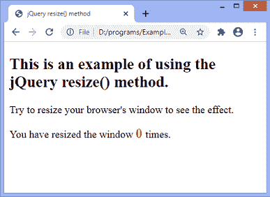
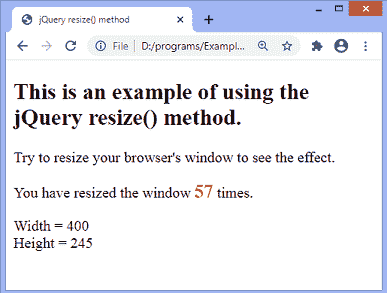

# jQuery resize()方法

> 原文：<https://www.javatpoint.com/jquery-resize-method>

当浏览器窗口的大小改变时，jQuery **resize()** 方法会触发一个 resize 事件。它绑定事件处理程序来调整事件的大小或在元素上触发该事件。此方法可用于执行一些必需的操作，如在调整窗口大小时避免滚动条，以及许多其他操作。

如果调整大小事件触发，并且元素的维度发生变化，元素内部的内容也会随之调整。

### 句法

```

$(selector).resize(function)

```

该方法接受一个可选参数 ***函数*** ，该参数指定每次触发调整大小事件时要执行的函数。

现在，让我们看一个使用 jQuery **resize()** 方法的例子。

### 例子

在这个例子中，我们使用的是 **resize()** 方法。这里，我们使用的是 **resize()** 方法的可选参数。当用户调整窗口大小时，更新后的窗口宽度和高度将显示在屏幕上。它还将显示用户尝试调整窗口大小的次数。

当我们改变窗口的高度时，更新的高度也会相应地改变。同样，当我们改变窗口的宽度时，更新的宽度也会相应地改变。

```

<!DOCTYPE html>
<html>
<head>
<title> jQuery resize() method </title>
<script src = "https://ajax.googleapis.com/ajax/libs/jquery/3.5.1/jquery.min.js"> </script>
<script>
var i = 0;
$(document).ready(function(){
$(window).resize(function(){
$("span").text(i += 1);
var res = "Width = " + $(window).width() + "<br/>Height = " + $(window).height();
$('#para').html(res);
});
});
</script>
<style>
span {
font-weight: bold;
color: red;
font-size: 20px;
}
</style>
</head>
<body>
<h2> This is an example of using the jQuery resize() method. </h2>
<p> Try to resize your browser's window to see the effect. </p>
<p> You have resized the window <span id = "s1"> 0 </span> times.</p>
<p id = "para"> </p>
</body>
</html>

```

[Test it Now](https://www.javatpoint.com/oprweb/test.jsp?filename=jquery-resize-method1)

**输出:**

成功执行上述代码后，输出将是-



当我们尝试调整窗口大小时，输出将是-



* * *