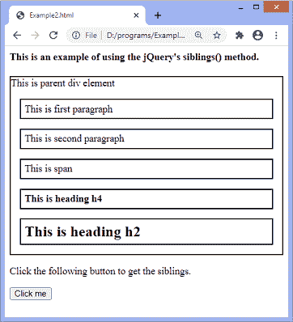
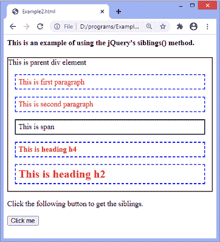
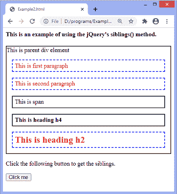

# jQuery 兄弟()方法

> 原文:[https://www.javatpoint.com/jquery-siblings-method](https://www.javatpoint.com/jquery-siblings-method)

顾名思义，**兄弟()**方法返回所选元素的所有兄弟。它是 jQuery 中的一个内置方法。兄弟姐妹是共享一个共同的父元素的元素。

假设我们有一个表示元素集的 jQuery 对象，那么**兄弟()**方法搜索 DOM 树中元素的兄弟，并构建一个包含匹配元素的新 jQuery 对象。

### 句法

```

$(selector).siblings(filter)

```

该方法接受一个名为 ***过滤器*** 的可选参数，定义如下。

**过滤器:**这是一个选择器表达式，用于缩小同级元素的搜索范围。它可以有多个值。这些值应该用逗号分隔。

假设有一个有多个兄弟的段落元素，我们要找到该段落的 **h2** 和[T3】spanT5】兄弟，那么可以写成如下。](https://www.javatpoint.com/html-span-tag)

```

$("p").siblings("h2, span")

```

上述语法将只返回 [**p**](https://www.javatpoint.com/html-paragraph) 元素的 **h2** 和 **span** 兄弟。

### 示例 1

在这个例子中，有一个父 div 元素和多个子元素。在这里，我们使用**兄弟()**方法来查找 **span** 元素的兄弟。 **span** 元素及其同级共享公共父元素 **div** 元素。

这里，我们不使用兄弟()方法的可选参数。我们必须点击给定的按钮来获得**跨度**元素的兄弟。

```

<html>

<head>
<style>
div{
border: 2px solid black;
}
.d1 *{
display: block;
border: 2px solid black;
color: black;
padding: 5px;
margin: 15px;
}
</style>
<script src="https://ajax.googleapis.com/ajax/libs/jquery/3.5.1/jquery.min.js"> </script>
<script>
$(document).ready(function() {
$("button").click(function() {
$("span").siblings().css({ "color": "red", "border": "2px dashed blue"});
});
});
</script>
</head>

<body>
<h4> This is an example of using the jQuery's siblings() method. </h4>
<div class = "d1">
This is parent div element
<p> This is first paragraph </p>
<p> This is second paragraph </p>
<span> This is span </span>
<h4> This is heading h4 </h4>
<h2>This is heading h2 </h2>
</div>
<p> Click the following button to get the siblings. </p>
<button> Click me </button>
</body>

</html>

```

[Test it Now](https://www.javatpoint.com/oprweb/test.jsp?filename=jquery-siblings-method1)

**输出:**

执行上述代码后，输出将是-



点击给定按钮后，输出将是-



### 示例 2

在这个例子中，我们使用的是**兄弟()**方法的可选参数。这里，我们为 ***过滤器*** 参数指定了多个值。

该参数缩小了搜索范围，找到了 **span** 元素的 **h2** 和 **p** 兄弟。

```

<html>

<head>
<style>
div{
border: 2px solid black;
}
.d1 *{
display: block;
border: 2px solid black;
color: black;
padding: 5px;
margin: 15px;
}
</style>
<script src="https://ajax.googleapis.com/ajax/libs/jquery/3.5.1/jquery.min.js"> </script>
<script>
$(document).ready(function() {
$("button").click(function() {
$("span").siblings("h2, p").css({ "color": "red", "border": "2px dashed blue"});
});
});
</script>
</head>

<body>
<h4> This is an example of using the jQuery's siblings() method. </h4>
<div class = "d1">
This is parent div element
<p> This is first paragraph </p>
<p> This is second paragraph </p>
<span> This is span </span>
<h4> This is heading h4 </h4>
<h2>This is heading h2 </h2>
</div>
<p> Click the following button to get the siblings. </p>
<button> Click me </button>
</body>

</html>

```

[Test it Now](https://www.javatpoint.com/oprweb/test.jsp?filename=jquery-siblings-method2)

**输出:**

执行上述代码后，输出将是-


点击给定按钮后，输出将是-



* * *