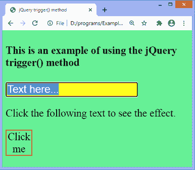

# jQuery 触发器()方法

> 原文：<https://www.javatpoint.com/jquery-trigger-method>

trigger()方法用于为每个匹配的元素触发指定的事件处理程序。此方法也可用于触发选定元素的默认行为。

### 句法

使用**触发器()**方法的常用语法如下。

```

$(selector).trigger(event,param1,param2,...)

```

此方法有一个强制参数，并且可以有多个可选参数。

### 参数值

**事件:**为必选参数。它指定触发特定元素的事件。它可以是标准事件或自定义事件。

**参数 1，参数 2，...:**这些是可选的附加参数，将作为参数传递给事件处理程序。它们对自定义事件很有用。

让我们看一些使用**触发器()**方法的例子。

### 示例 1

在本例中，单击给定段落元素时，将使用**触发器()**方法触发输入元素的**选择**事件。当激发 select 事件时，它将更改输入字段和文档正文的样式。

这里，我们使用的是**触发器()**方法的强制**事件**参数。

```

<!DOCTYPE html>
<html>
<head>
<title> jQuery trigger() method </title>
<script src="https://ajax.googleapis.com/ajax/libs/jquery/3.5.1/jquery.min.js"></script>
<style>
#p2 {
border: 2px solid red;
width: 60px;
text-align: center;
}
</style>
<script>
$(document).ready(function(){
  $("p").click(function(){
    $("#tf").trigger("select");
  });
    $("#tf").select(function(){
    $("#tf").css({"backgroundColor": "yellow", "fontSize": "25px"});
    $("body").css({"backgroundColor": "lightgreen", "fontSize": "25px"});
  });
});
</script>
</head>
<body>
<h4> This is an example of using the jQuery trigger() method </h4>
<input id = "tf" type = "text" value = "Text here...">
<br>
<p id = "p1"> Click the following text to see the effect. </p>
<p id = "p2"> Click me </p>

</body>
</html>

```

[Test it Now](https://www.javatpoint.com/oprweb/test.jsp?filename=jquery-trigger-method1)

**输出:**

执行上述代码后，输出将是-


单击给定的段落元素后，输出将是-



### 示例 2

在这个例子中，我们使用的是**触发器()**方法的可选参数。这些附加参数作为参数传递给事件处理程序。

```

<!DOCTYPE html>
<html>
<head>
<script src = "https://ajax.googleapis.com/ajax/libs/jquery/3.5.1/jquery.min.js"></script>
<style>
#p2 {
border: 2px solid red;
width: 60px;
text-align: center;
}
</style>
<script>
$(document).ready(function(){
$("#p2").click(function () {
 $("#p2").bind("custom", function(event, id, name, salary){
      alert("Employee ID = " + id + "\nName = " + name + "\nSalary = " + salary);
    });

      $("#p2").trigger("custom", ["E01", "John", "30,000"]);
    });
});
</script>
</head>
<body>
<h4> This is an example of using the jQuery trigger() method </h4>

<p id = "p1"> Click the following text to see the effect. </p>
<p id = "p2"> Click me </p>
</body>
</html>

```

[Test it Now](https://www.javatpoint.com/oprweb/test.jsp?filename=jquery-trigger-method2)

**输出:**

执行上述代码后，输出将是-


单击给定的段落元素后，输出将是-


* * *