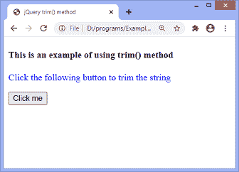
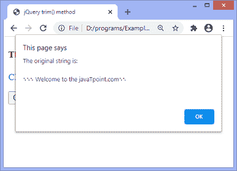
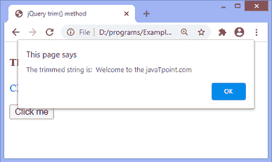

# jQuery trim()方法

> 原文：<https://www.javatpoint.com/jquery-trim-method>

**trim()** 方法用于从指定字符串的开头和结尾删除空格、制表符和所有换行符。如果这些空白字符在字符串的中间，此方法不会删除这些字符。

使用这种方法的常用语法如下。

### 句法

```

jQuery.trim( str )

```

**修剪()**方法接受单参数 **str，**定义如下。

**字符串:**是需要修剪的字符串。

### 例子

在这个例子中，首先，我们必须点击给定的按钮。单击按钮后，将显示一个警告框，显示原始字符串。关闭相应的警告框后，将显示另一个警告框，显示修剪后的字符串。

在这里，原始字符串在字符串的开头和结尾包含多个新行、制表符和空格。

```

<!DOCTYPE html>
<html>
<head>
<title> jQuery trim() method</title>
<script src = "https://ajax.googleapis.com/ajax/libs/jquery/3.5.1/jquery.min.js"></script>
</head>

<body>

<h4> This is an example of using trim() method </h4>
<p style = "color: blue;"> Click the following button to trim the string </p>
<button id = "btn"> Click me </button>
<script>
$(document).ready(function(){
$("#btn").click(function(){
var str = "\n\n			 Welcome to the javaTpoint.com		\n\n";
alert("The original string is: " + str);
str = jQuery.trim(str);
alert("The trimmed string is:  " + str);
});
});
</script>
</body>

</html>

```

[Test it Now](https://www.javatpoint.com/oprweb/test.jsp?filename=jquery-trim-method1)

**输出:**

执行上述代码后，输出将是-



点击给定按钮后，输出将是-



关闭警报对话框后，我们将获得如下所示的修剪字符串:



* * *