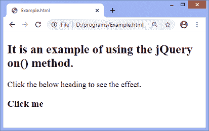
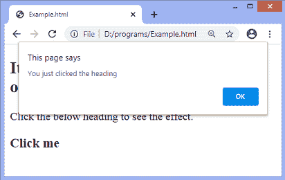
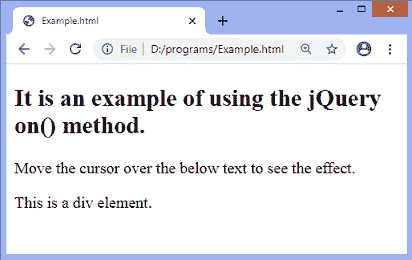
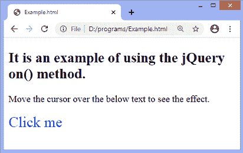
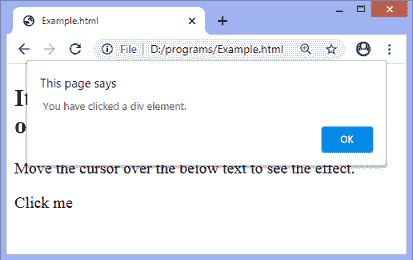
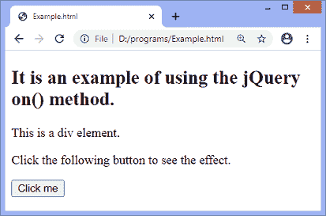
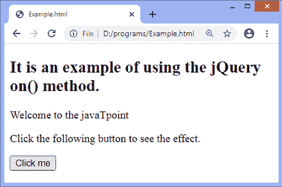

# 方法上的 jQuery

> 原文：<https://www.javatpoint.com/jquery-on-method>

on()方法用于将事件处理程序附加到选定的元素。()上的**方法取代了**委托()，绑定()，**和 **live()** 方法。建议使用此方法，因为它简化了 jQuery 代码库。我们可以使用 **off()** 方法移除 **on()** 方法附加的事件处理程序。**

 **它是 [jQuery](https://www.javatpoint.com/jquery-tutorial) 中的一个内置方法。在()方法上使用**的语法如下-**

### 句法

```js

$(selector).on(event, childSelector, data, function, map)

```

此方法接受五个参数，其中一个是必需的，其他是可选的。()上**方法的参数值定义如下。**

 ****事件:**为必选参数。此参数指定要附加到选定元素的一个或多个事件或命名空间。如果我们必须指定多个事件，事件值必须用空格隔开。

**儿童选择器:**为可选参数。它指定事件处理程序要附加到的子元素。

**数据:**也是可选参数。它是在事件被触发时传递给处理程序的附加数据。

**函数(eventObj):** 也是可选参数。它是当事件触发时运行的函数。

**图:**是事件图。

现在，让我们看一些插图来理解**在()**方法上的使用。

### 示例 1

在这个例子中，有一个 **h3** [标题元素](https://www.javatpoint.com/html-heading)，在这个元素上我们应用 **on()** 方法来附加**点击**事件。我们要点击文字为**的 h3 元素点击我**才能看到效果。

```js

<!DOCTYPE html>
<html>
<head>
<script src = "https://ajax.googleapis.com/ajax/libs/jquery/3.5.1/jquery.min.js"> </script>
<script>
   $(document).ready(function(){
   $("h3").on("click",function(){
	   alert("You just clicked the heading");
      });
   });
</script>
</head>
<body>
<h2> It is an example of using the jQuery on() method. </h2>
<p> Click the below heading to see the effect. </p>
<h3> Click me </h3>
</body>
</html>

```

[Test it Now](https://www.javatpoint.com/oprweb/test.jsp?filename=jquery-on-method1)

**输出**

执行上述代码后，输出将是-



点击给定文本 ***点击我*** 后，会出现如下提醒对话框-



### 示例 2

在前面的例子中，我们已经为选择器附加了一个事件处理程序。但是在这个例子中，我们将看到如何将多个事件处理程序附加到选定的元素。

这里有一个 div 元素，我们在上面应用了 **on()** 方法来添加三个事件，分别是**鼠标悬停、鼠标移出、**和**点击**。当我们将光标移动到给定的文本**“这是一个 div 元素”**上时，该元素的样式和文本将被更改，并且事件**鼠标悬停、鼠标移出、**和**单击**将被附加到其上。

```js

<!DOCTYPE html>
<html>
<head>
<script src = "https://ajax.googleapis.com/ajax/libs/jquery/3.5.1/jquery.min.js"> </script>
<script>
   $(document).ready(function(){
   $("div").on("mouseover mouseout click",function(){
	   $("div").text("Click me").toggleClass("myDiv");
      });
	  $("div").click(function(){
	alert(" You have clicked a div element. ");
  });
   });
</script>
<style>
.myDiv {
  color: blue;
  font-size: 25px;
}
</style>
</head>
<body>
<h2> It is an example of using the jQuery on() method. </h2>
<p> Move the cursor over the below text to see the effect. </p>
<div> This is a div element. </div>
</body>
</html>

```

[Test it Now](https://www.javatpoint.com/oprweb/test.jsp?filename=jquery-on-method2)

**输出**

执行上述代码后，输出将是-



当我们将光标移动到文本 ***上时，这是一个 div 元素*** ，输出将是-



点击文字**点击我**后，输出会是-



### 示例 3

在本例中，我们使用()上的**方法将自定义事件附加到 **div** 元素。**

```js

<!DOCTYPE html>
<html>
<head>
<script src = "https://ajax.googleapis.com/ajax/libs/jquery/3.5.1/jquery.min.js"> </script>
<script>
$(document).ready(function(){
  $("div").on("customEvent", function(e, show){
    $(this).text("Welcome to the " + show).show();
  });
  $("button").click(function(){
    $("div").trigger("customEvent", ["javaTpoint"]);
  });
});
</script>
</head>
<body>
<h2> It is an example of using the jQuery on() method. </h2>
<div> This is a div element. </div>
<p> Click the following button to see the effect. </p>
<button> Click me </button>
</body>
</html>

```

[Test it Now](https://www.javatpoint.com/oprweb/test.jsp?filename=jquery-on-method3)

**输出**

执行上述代码后，输出将是-



点击给定按钮后，输出将是-



* * *******