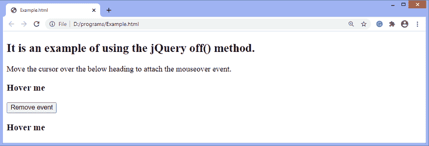
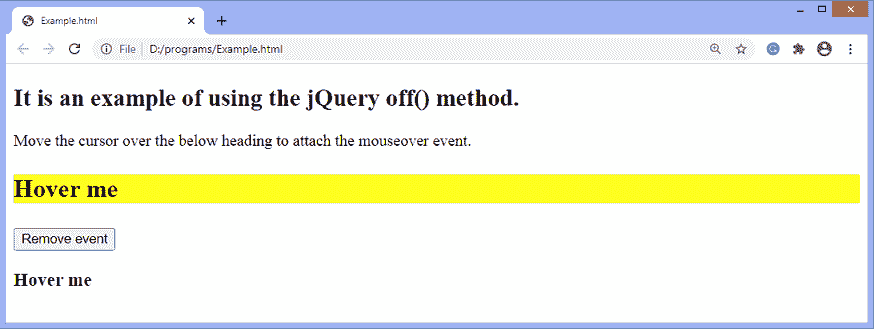
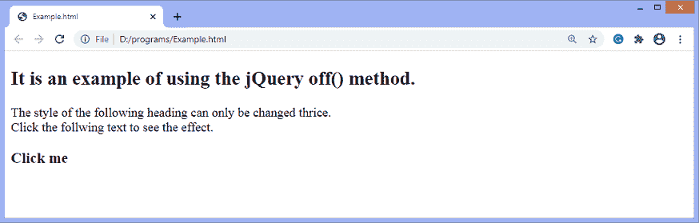
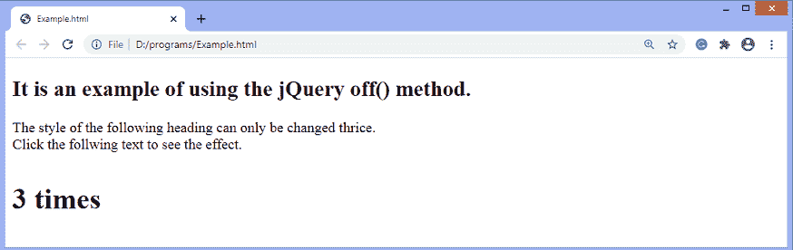

# jQuery off()方法

> 原文：<https://www.javatpoint.com/jquery-off-method>

jQuery 中的 **off()** 方法移除使用 [jQuery **on()** 方法](https://www.javatpoint.com/jquery-on-method)附加的事件处理程序。推荐使用这种方法，因为它简化了 [jQuery](https://www.javatpoint.com/jquery-tutorial) 代码库。 **off()** 方法取代了**undelete()、 [unbind()](https://www.javatpoint.com/jquery-unbind-method) 、**和 **die()** 方法。

### 句法

```js

$(selector).off(event,selector,function(eventObj),map)

```

此方法接受四个参数，其中一个是必需的，其他是可选的。 **off()** 方法的参数值定义如下。

**事件:**为必选参数。此参数指定要从选定元素中移除的一个或多个事件或命名空间。如果我们必须指定多个事件，事件值必须用空格隔开。

**选择器:**可选参数。它应该与最初传给**的相匹配。在附加事件处理程序时使用 on()** 方法。

**函数(eventObj):** 也是可选参数。它是当事件触发时运行的函数。

**图:**是事件图。

我们也可以在不使用任何参数的情况下使用 **off()** 方法。如果在没有任何参数的情况下调用该方法，该方法将移除附加到元素的所有处理程序。如果我们必须移除一个特定的事件处理程序，我们可以提供事件名称、选择器、处理函数名称或名称空间的组合。

现在，让我们看一些插图来了解 **off()** 方法的使用。

### 示例 1

在这个例子中，有两个 **h3** 标题元素和一个按钮。我们必须用文本悬停元素 ***悬停我*** ，以将**鼠标悬停在**事件上。该按钮将移除附加到 **h3** 元素的事件。

我们可以通过首先悬停一个 **h3** 元素，然后单击按钮来检查 **off()** 方法的工作情况。在 h3 标题上悬停时，相应的 **h3** 元素的背景颜色将发生变化，当我们点击给定的按钮时，悬停不会影响另一个 h3 元素。

```js

<!DOCTYPE html>
<html>
<head>
<script src = "https://ajax.googleapis.com/ajax/libs/jquery/3.5.1/jquery.min.js"> </script>
<script>
   $(document).ready(function(){
   $("h3").on("mouseover",function(){
	   $(this).css({"background-color": "yellow", "font-size": "25px"});
      });
      $("#b3").click(function(){
         $("h3").off("mouseover");
      });
   });
</script>
</head>
<body>
<h2> It is an example of using the jQuery off() method. </h2>
<p> Move the cursor over the below heading to attach the mouseover event. </p>
<h3> Hover me </h3>
<button id = "b3"> Remove event </button>
<h3> Hover me </h3>
</body>
</html>

```

[Test it Now](https://www.javatpoint.com/oprweb/test.jsp?filename=jquery-off-method1)

**输出**

执行上述代码后，输出将是-



在悬停第一个 **h3** 元素时，输出将为-



点击给定按钮后，当我们悬停第二个 **h3** 元素时，不会因为事件被移除而发生任何事情。

### 示例 2

在这个例子中，我们使用 **off()** 方法，一旦事件被触发了一定的次数，就移除一个事件处理程序。这里有一个标题 h3，它的大小只能增加三倍。这是因为 **off()** 功能一旦触发三次，就会移除其**点击**事件。每次点击，标题的大小将增加 **4.5px** 。

```js

<!DOCTYPE html>
<html>
<head>
<script src = "https://ajax.googleapis.com/ajax/libs/jquery/3.5.1/jquery.min.js"> </script>
<script>
$(document).ready(function(){
var i = 0, j = 1;
$("h3").click(function(e){
$("h3").animate({fontSize: "+=4.5px"}).text(j + " times");
i++;
j++;
if (i >= 3) {
$(this).off(e);
}
});
});
</script>
</head>
<body>
<h2> It is an example of using the jQuery off() method. </h2>
<p> The style of the following heading can only be changed thrice. </br> Click the follwing text to see the effect. </p>
<h3> Click me </h3>
</body>
</html>

```

[Test it Now](https://www.javatpoint.com/oprweb/test.jsp?filename=jquery-off-method2)

**输出**

执行上述代码后，输出将是-



标题 **h3** 带文字 ***点击我*** 只能点击三次。点击文本 ***三次*** 后，输出会是-



* * *