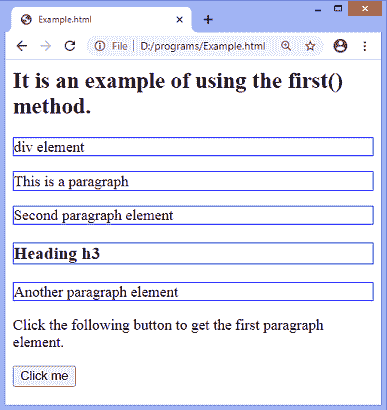
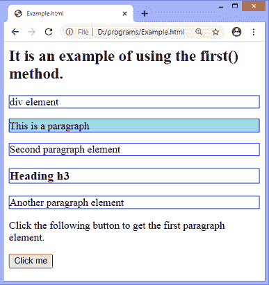
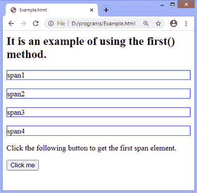
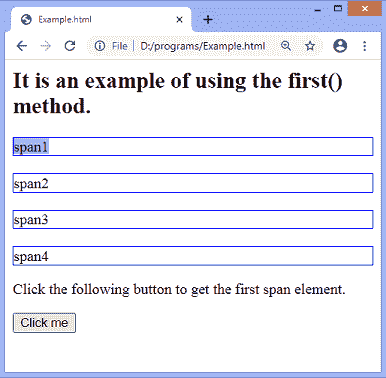

# jQuery first()方法

> 原文：<https://www.javatpoint.com/jquery-first-method>

顾名思义， **first()** 方法返回选中元素的第一个元素。如果需要获取最后一个元素，可以使用 **last()** 方法。

### 句法

```

$(selector).first()

```

这个方法不接受任何参数。以上语法中的 ***选择器*** 是必须指定的。

让我们看一些插图来了解如何使用 **first()** 方法。

### 示例 1

在本例中，我们使用 **first()** 方法从元素集中获取第一个[段落元素](https://www.javatpoint.com/html-paragraph)。我们使用 **p** 作为选择器，因此该方法将返回第一个段落元素。

```

<html>

<head>
<script src="https://ajax.googleapis.com/ajax/libs/jquery/3.5.1/jquery.min.js"> </script>
<script>
$(document).ready(function() {
$("button").click(function(){
$("p").first().css("background-color", "lightblue");
});
});
</script>
</head>

<body id = "main">

<h2> It is an example of using the first() method. </h2>
<div style = "border: 1px solid blue;">
div element
</div>
<p style = "border: 1px solid blue;">
This is a paragraph
</p>
<p style = "border: 1px solid blue;">
Second paragraph element
</p>

<h3 style = "border: 1px solid blue;">
Heading h3
</h3>
<p style = "border: 1px solid blue;">
Another paragraph element
</p>

<p> Click the following button to get the first paragraph element. </p>
<button> Click me </button>
</body>

</html>

```

[Test it Now](https://www.javatpoint.com/oprweb/test.jsp?filename=jquery-first-method1)

**输出**

执行上述代码后，输出将是-



点击给定按钮后，输出将是-



### 示例 2

在本例中，我们使用 **first()** 方法从元素集中获取第一个 span 元素。

```

<html>

<head>
<script src="https://ajax.googleapis.com/ajax/libs/jquery/3.5.1/jquery.min.js"> </script>
<script>
$(document).ready(function() {
$("button").click(function(){
$("div span").first().css("background-color", "lightblue");
});
});
</script>
<style>
div {
border: 1px solid blue;
}
</style>
</head>

<body id = "main">

<h2> It is an example of using the first() method. </h2>
<div>
<span> span1 </span>
</div>
</br>
<div>
<span> span2 </span>
</div>
</br>
<div>
<span> span3 </span>
</div>
</br>
<div>
<span> span4 </span>
</div>
<p> Click the following button to get the first span element. </p>
<button> Click me </button>
</body>

</html>

```

[Test it Now](https://www.javatpoint.com/oprweb/test.jsp?filename=jquery-first-method2)

**输出**

执行上述代码后，输出将是-



点击给定按钮后，输出将是-



* * *