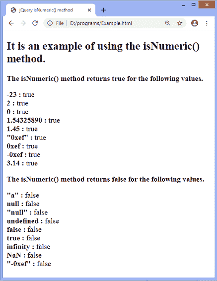
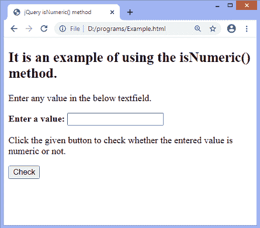
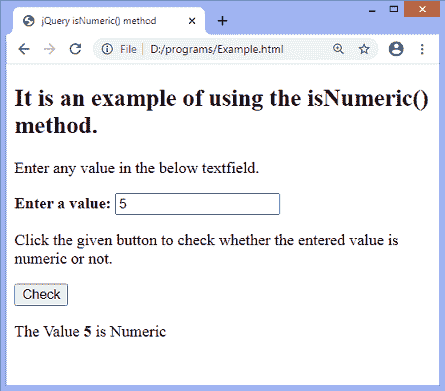
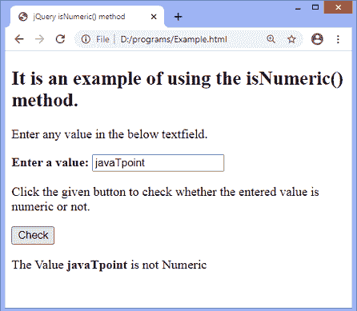

# jQuery isNumeric()方法

> 原文:[https://www.javatpoint.com/jquery-isnumeric-method](https://www.javatpoint.com/jquery-isnumeric-method)

[jQuery](https://www.javatpoint.com/jquery-tutorial) 中的 **isNumeric()** 方法用于确定传递的参数是否为数值。

**isNumeric()** 方法返回一个布尔值。如果给定的参数是数值，则该方法返回 true 否则，它返回 false。这种方法很有帮助，因为它减少了代码行。对于十六进制数、八进制整数、负数、十进制数以及指数字符串，它也返回 true。

### 句法

```

$.isNumeric(argument);

```

此方法接受一个可以是任何类型的强制参数。上述语法中的参数 ***参数*** 代表要测试的值。

让我们看一些插图来理解 **isNumeric()** 方法的概念。

### 示例 1

在本例中，我们将一些值传递给 **isNumeric()** 方法，以检查这些值是否为数字。如果传递的值本质上是数值， **isNumeric()** 方法将返回 true，否则将返回 false。

这里有两个 div 元素，其中第一个 div 元素显示了**是 Numeric()** 方法返回**真**的值集。第二个 div 元素显示了一组值， **isNumric()** 方法返回 **false** 。

```

<!DOCTYPE html>
<html>
<head>
<title> jQuery isNumeric() method </title>
<script src = "https://ajax.googleapis.com/ajax/libs/jquery/3.5.1/jquery.min.js"> </script>
<style>
p {
font-weight: bold;
}
</style>
</head>
<body>
<h2> It is an example of using the isNumeric() method. </h2>
<p> The isNumeric() method returns true for the following values. </p>
<div id = "d1"> </div>
<p> The isNumeric() method returns false for the following values. </p>
<div id = "d2"> </div>

<script>
$( "#d1" ).append("<b> -23 : </b>" + $.isNumeric( -23 )
+ "<br>" + "<b> 2 : </b>" + $.isNumeric( 2 )
+ "<br>" + "<b> 0 : </b>" + $.isNumeric( 0 )
+ "<br>" + "<b> 1.54325890 : </b>" + $.isNumeric( 1.54325890 )
+ "<br>" + "<b> 1.45 : </b>" + $.isNumeric( 1.45 )
+ "<br>" + '<b> "0xef" : </b>'+ $.isNumeric( "0xef" )
+ "<br>" + "<b> 0xef : </b>"+ $.isNumeric( 0xef )
+ "<br>" + "<b> -0xef : </b>"+ $.isNumeric( -0xef )
+ "<br>" + "<b> 3.14 : </b>" + $.isNumeric( 3.14 ));
$( "#d2" ).append('<b> "a" : </b>' + $.isNumeric("a")
+ "<br>" + "<b> null : </b>" + $.isNumeric( null )
+ "<br>" + '<b> "null" : </b>' + $.isNumeric( "null" )
+ "<br>" + "<b> undefined : </b>" + $.isNumeric( undefined )
+ "<br>" + "<b> false : </b>" + $.isNumeric( false )
+ "<br>" + "<b> true : </b>" + $.isNumeric( true )
+ "<br>" + "<b> infinity : </b>"+ $.isNumeric( "infinity" )
+ "<br>" + "<b>NaN : </b>"+ $.isNumeric( NaN )
+ "<br>" + '<b> "-0xef" : </b>' + $.isNumeric("-0xef"));
</script>
</body>
</html>
</body>
</html>

```

[Test it Now](https://www.javatpoint.com/oprweb/test.jsp?filename=jquery-isnumeric-method1)

**输出**

执行上述代码后，输出将是-



### 示例 2

在这个例子中，我们使用 **isNumeric()** 方法来检查用户输入的值是否是数字。这里，有一个用于接受用户输入的文本字段，以及一个用于检查输入的按钮。我们必须在给定的文本字段中输入一个值，然后我们必须单击给定的按钮来检查输入的值是否是数字。

```

<!DOCTYPE html>
<html>
<head>
<title> jQuery isNumeric() method </title>
<script src = "https://ajax.googleapis.com/ajax/libs/jquery/3.5.1/jquery.min.js"> </script>
</head>
<body>
<h2> It is an example of using the isNumeric() method. </h2>
<p> Enter any value in the below textfield. </p>
<b> Enter a value: </b> <input type = "text">
<br/>
<p> Click the given button to check whether the entered value is numeric or not. </p>
<button> Check </button>
<p id = "p1"> </p1>
<script>
$(document).ready(function() {
$("button").click(function() {
var val = $("input").val();
var check = $.isNumeric(val);

if (check) {
$("#p1").html("The Value " + "<b>" + val + "</b>"+ " is Numeric");
}
else {
$("#p1").html("The Value " + "<b>" + val + "</b>"+ " is not Numeric");
}
});
});
</script>
</body>
</html>
</body>
</html>

```

[Test it Now](https://www.javatpoint.com/oprweb/test.jsp?filename=jquery-isnumeric-method2)

**输出**

执行上述代码后，输出将是-



输入一个数值并点击给定的按钮，输出将是-



输入一个非数值并点击给定的按钮，输出将是-



* * *