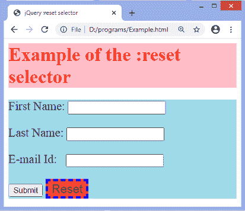

# jQuery:重置选择器

> 原文：<https://www.javatpoint.com/jquery-reset-selector>

在本文中，我们将讨论如何在 jQuery 中使用**:重置**选择器。在 [jQuery](https://www.javatpoint.com/jquery-tutorial) 中，:**复位**选择器用于选择类型复位的元素。它用 type = reset 选择输入元素和按钮。

如果我们写**输入:复位**，选择器只会选择类型为复位的输入元素。然而，如果我们写**:重置**，选择器将选择输入和按钮元素。因此，我们也可以使用**:复位**选择器选择类型复位的特定元素。

### 句法

```js

$(":reset")

```

现在，我们来看一个**:复位**选择器的例子。

### 例子

为了理解在 jQuery 中使用:**重置**选择器，我们创建了一个简单的 HTML 文档，并在其中创建了一个表单，表单的 id 为**“my form”**。在这个表单中，有四个文本字段和两个按钮，分别是**“提交”**、**“重置”**。

我们使用:**复位**选择器选择复位类型的按钮元素。名为**“复位”**的按钮为复位类型，因此**:复位**选择器将选择该按钮。

```js

<!DOCTYPE html> 
<html>
<head> 
<title> jQuery :reset selector </title>
<script src = "https://ajax.googleapis.com/ajax/libs/jquery/3.5.1/jquery.min.js"> </script>
</head>
<body>
<div style = "background: pink;">
  <font color = "red" size = "6px">
	<b> Example of the :reset selector </b>
  </font>
 </div>
    <div style = "background: lightblue;">
	<form id = "myForm" style = "font-size: 20px;" >
	<p> First Name: <input type = "text" id = "fname" /> </p>
	<p> Last Name: <input type = "text" id = "lname" /> </p>
	<p> E-mail Id:  <input type = "email" id = "email" /> </p>
	<input type = "submit">
	<button type = "reset"> Reset </button>
	</form>
    </div>
<script>
   $(document).ready(function() { 
            $("button:reset").css({"background-color": "coral", "font-size": "20px", "border": "4px dashed blue"}); 
        });  
</script>

</body>
</html>

```

[Test it Now](https://www.javatpoint.com/oprweb/test.jsp?filename=jquery-reset-selector1)

**输出**

在输出中，我们可以看到**重置**按钮的样式发生了变化。执行上述代码后，输出将是-



* * *