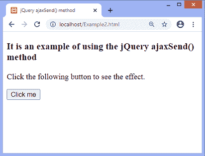
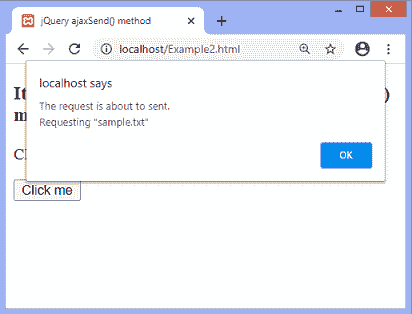
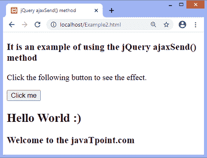

# jQuery ajaxSend()方法

> 原文：<https://www.javatpoint.com/jquery-ajaxsend-method>

jQuery 的 **ajaxSend()** 方法用于在发送 [AJAX](https://www.javatpoint.com/ajax-tutorial) 请求之前附加一个要运行的函数。这是一个 AJAX 事件，当 AJAX 请求即将被发送时触发。

### 句法

```js

$(document).ajaxSend( function(event, xhr, options) )

```

**ajaxSend()** 方法接受单个参数，定义如下-

**函数(事件、xhr、选项):**这是一个强制参数。它是一个回调函数，对成功的服务器请求执行。

它还有三个额外的参数命名为 ***事件、xhr、*** 和 ***选项*** 。附加参数定义如下-

**事件:**包括事件对象。

**xhr:** 它包括 XMLHttpRequest 对象。

**选项:**它包括 AJAX 请求中使用的选项。

现在，让我们看一个使用 **ajaxSend()** 方法的简单例子。

### 例子

这是一个使用 **ajaxSend()** 方法的简单例子。在本例中，作为 **ajaxSend()** 方法的强制参数传递的函数将在请求即将发送时被触发。触发功能将显示一个警告对话框，显示请求页面的网址。该警告框将在发送请求之前显示。

这里有一个名为 **sample.txt** 的外部文件，里面包含了一些数据。我们使用 **load()** 方法从服务器加载外部文件。

在输出中，我们可以看到从服务器加载的数据。我们必须单击给定的按钮从外部加载数据。txt 文件。

**sample.txt**

```js

<h2> Hello World :) </h2>
<h3> Welcome to the javaTpoint.com </h3>

```

**Example2.html**

```js

<!DOCTYPE html>
<html>
<head>
<title> jQuery ajaxSend() method </title>

<script src = "https://ajax.googleapis.com/ajax/libs/jquery/3.5.1/jquery.min.js"> </script>
<script>
$(document).ready(function(){
$("button").click(function(){
$(document).ajaxSend(function(e, xhr, opt){
alert("The request is about to sent.\nRequesting " + '"' + opt.url + '"');
});
$("div").load("sample.txt");
});
});
</script>
</head>

<body>
<h3> It is an example of using the jQuery ajaxSend() method </h3>
<p> Click the following button to see the effect. </p>
<button> Click me </button>

<div> </div>

</body>
</html>

```

执行上述代码后，输出将是-



点击给定按钮后，将显示一个对话框，显示请求页面的网址-



关闭对话框后，将显示请求页面的数据，如下图所示。



* * *