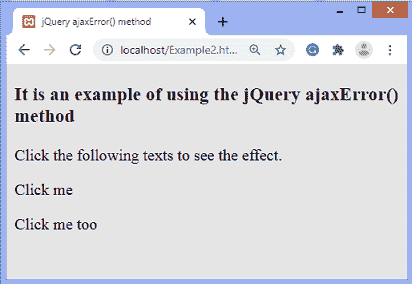
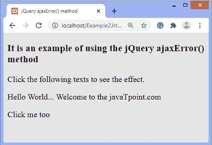
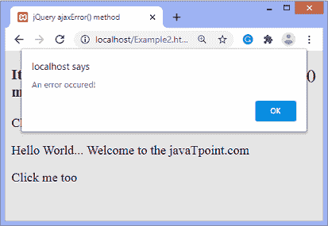
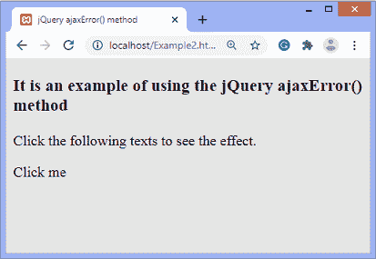
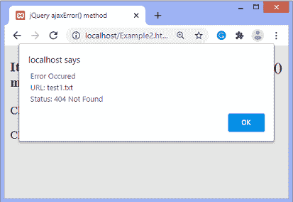

# jQuery ajaxError()方法

> 原文：<https://www.javatpoint.com/jquery-ajaxerror-method>

**ajaxError()** 方法用于在 [AJAX](https://www.javatpoint.com/ajax-tutorial) 请求失败时附加要运行的函数。这是一个 AJAX 事件。当 AJAX 请求因出错而完成时， [jQuery](https://www.javatpoint.com/jquery-tutorial) 会触发 **ajaxError** 事件。

### 句法

```

$(document).ajaxError( function(event, xhr, options, exc))

```

**ajaxError()** 方法接受单个参数，定义如下-

**函数(event、xhr、options、exc):** 这是一个强制参数。它是一个回调函数，在请求失败时执行。

它还包括一些名为 ***事件、xhr、options、*** 和 ***exc*** 的附加参数。附加参数定义如下-

**事件:**包括事件对象。

**xhr:** 它包括 XMLHttpRequest 对象。

**选项:**它包括 AJAX 请求中使用的选项。

**exc:** 是异常对象。当请求处理过程中发生异常时，它被传递。

现在，让我们看一些使用 **ajaxError()** 方法的例子。

### 示例 1

这是一个使用 **ajaxError()** 方法的简单例子。在本例中，作为 **ajaxError()** 方法的强制参数传递的函数将在请求失败时被触发。触发功能将显示一个警报对话框，显示错误信息。

有两个段落元素，我们必须点击这两个段落才能看到效果。单击第一段，将加载一个文件，并且该段的内容将被更改。当用户单击第二段时，请求失败，因为传递的文件丢失了，所以将显示一个警告框，显示错误消息。

**sample.txt**

```

<h2> Hello World :) </h2>
<h3> Welcome to the javaTpoint.com </h3>

```

**Example2.html**

```

<!DOCTYPE html>
<html>
<head>
<title> jQuery ajaxError() method </title>

<script src = "https://ajax.googleapis.com/ajax/libs/jquery/3.5.1/jquery.min.js"> </script>
<script>
$(document).ready(function(){
$(document).ajaxError(function(){
alert("An error occured!");
});
$("#p1").click(function(){
$("#p1").load("sample.txt");
});
$("#p2").click(function(){
$("#p2").load("test1.txt");
});
});	</script>
</head>

<body>
<h3> It is an example of using the jQuery ajaxError() method </h3>
<p> Click the following texts to see the effect. </p>
<p id = "p1"> Click me </p>
<p id = "p2"> Click me too </p>
</body>
</html>

```

[Test it Now](https://www.javatpoint.com/oprweb/test.jsp?filename=jquery-ajaxerror-method1)

**输出**

执行上述代码后，输出将是-



点击第一段文字 ***点击我*** 后，输出会是-



点击第二段文字 ***点击我也*** 后，输出会是-



### 示例 2

这个例子类似于第一个例子，除了这里我们使用的是在 **ajaxError()** 方法中传递的函数的附加参数。这里，我们使用 **xhr** 和**选项**参数来获取请求的 URL 和状态。

这里有一个[段落元素](https://www.javatpoint.com/html-paragraph)带文字 ***点击我*** ，我们要点击对应的段落才能看到效果。当用户单击该段落时，由于传递的文件丢失，请求失败，因此将显示一个警告框，显示错误消息以及请求的 URL 和状态。

```

<!DOCTYPE html>
<html>
<head>
<title> jQuery ajaxError() method </title>

<script src = "https://ajax.googleapis.com/ajax/libs/jquery/3.5.1/jquery.min.js"> </script>
<script>
$(document).ready(function(){
$(document).ajaxError(function(event, xhr, options){
    alert(" Error Occured " + "\n URL: " + options.url + "\n Status: " + xhr.status + " " + xhr.statusText);
});
$("#p1").click(function(){
$("#p1").load("test1.txt");
});
});	</script>
</head>

<body>
<h3> It is an example of using the jQuery ajaxError() method </h3>
<p> Click the following texts to see the effect. </p>
<p id = "p1"> Click me </p>
</body>
</html>

```

[Test it Now](https://www.javatpoint.com/oprweb/test.jsp?filename=jquery-ajaxerror-method2)

**输出**

执行上述代码后，输出将是-



点击文本为 ***的段落后，点击我*** ，输出将为-



以上例子足以说明 **ajaxError()** 方法的使用。

* * *