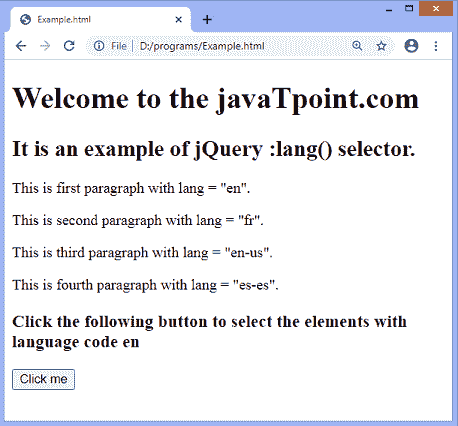
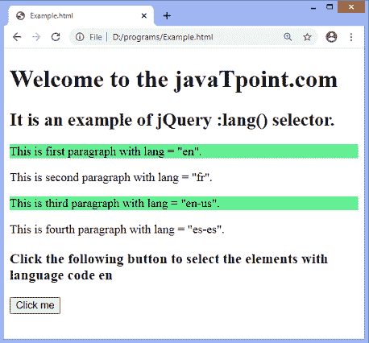

# jQuery :lang()选择器

> 原文:[https://www.javatpoint.com/jquery-lang-selector](https://www.javatpoint.com/jquery-lang-selector)

**:lang()** 选择器用于选择指定语言代码的元素。它选择语言值等于提供的语言代码的元素。该选择器还可以选择语言值以所提供的语言开头，后跟连字符**(“-”**)的元素。我们可以使用 [HTML](https://www.javatpoint.com/html-tutorial) 中的**郎**属性来确定元素的语言值。

例如，假设我们使用的是**$(“p:lang(en)”)**，那么选择器只会选择那些语言值为 **en** 或者以 en 开头的段落元素，如 **en-us、en-uk** 等。，即 **< p lang = "en" >** 和 **< p lang = "en-us" >** ，但它不会选择 **< p lang = "fr" >** 或任何其他语言值与所提供的语言代码不同的段落元素。

### 句法

```

$(":lang(language)")

```

该参数接受指定语言代码的单个参数*。*

 *### 例子

在本例中，我们使用 **:lang()** 选择器选择语言代码为 **en** 或以 **en** 开头的段落元素。

```

<!DOCTYPE html>
<html>

<head>
<script src = "https://ajax.googleapis.com/ajax/libs/jquery/3.3.1/jquery.min.js"> </script>
<script>
$(document).ready(function() {
$("button").click(function() {
$("p:lang(en)").css("background-color", "lightgreen");
});
});
</script>
</head>

<body>
<h1> Welcome to the javaTpoint.com </h1>
<h2> It is an example of jQuery :lang() selector. </h2>
<p lang = "en"> This is first paragraph with lang = "en". </p>
<p lang = "fr"> This is second paragraph with lang = "fr". </p>
<p lang = "en-us"> This is third paragraph with lang = "en-us". </p>
<div lang = "es-es"> This is fourth paragraph with lang = "es-es". </div>
<h3> Click the following button to select the elements with language code en </h3>
<button> Click me </button>
</body>

</html>

```

[Test it Now](https://www.javatpoint.com/oprweb/test.jsp?filename=jquery-lang-selector1)

**输出**

执行上述代码后，输出将是-



点击给定按钮后，输出将是-



* * **