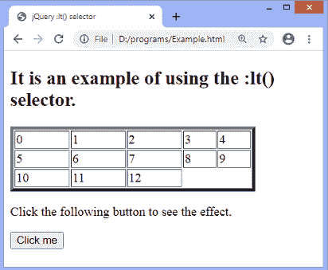
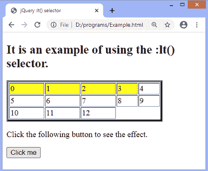

# jQuery :lt()选择器

> 原文：<https://www.javatpoint.com/jquery-lt-selector>

:lt()选择器选择的元素的索引值小于:lt()选择器的*参数中指定的值。**指数**从 0 开始。*

 *我们可以使用 **:gt()** 选择器选择索引值大于指定索引的元素。

### 句法

```

$(":lt(index)")

```

上述语法中的**索引**是必需的参数。参数指定要选择的元素。索引值低于指定值的元素将被选中。

让我们看一个插图来了解 **:lt()** 选择器的工作原理。

### 例子

在本例中，我们将 **:lt()** 选择器应用于表格元素。这里，我们将索引值指定为 4，因此选择器将返回索引值低于 4 的元素。

```

<!DOCTYPE html>
<html>
<head>
<title> jQuery :lt() selector </title>
<script src = "https://ajax.googleapis.com/ajax/libs/jquery/3.5.1/jquery.min.js"></script></head>
<body>
<h2> It is an example of using the :lt() selector. </h2>
<table style = "width:80%" border = "4">
<tr>
<td> 0 </td>
<td> 1 </td>
<td> 2 </td>
<td> 3 </td>
<td> 4 </td>
</tr>
<tr>
<td> 5 </td>
<td> 6 </td>
<td> 7 </td>
<td> 8 </td>
<td> 9 </td>
</tr>
<tr>
<td> 10 </td>
<td> 11 </td>
<td> 12 </td>
</tr>
</table>
<p> Click the following button to see the effect. </p>
<button> Click me </button>
<script>
$(document).ready(function() {
$("button").click(function(){
$("td:lt(4)").css("backgroundColor", "yellow");
});
});
</script>

</body>

</html>

```

[Test it Now](https://www.javatpoint.com/oprweb/test.jsp?filename=jquery-lt-selector1)

**输出**

执行上述代码后，输出将是-



点击给定按钮后，输出将是-



* * **