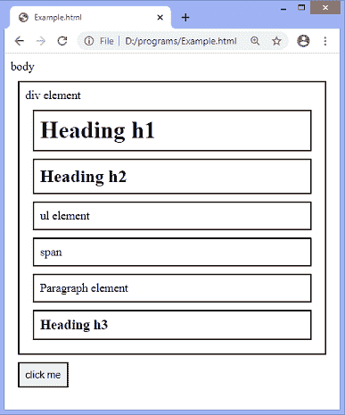
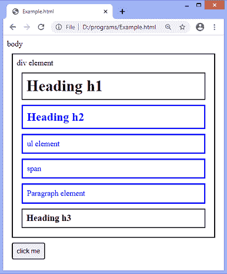
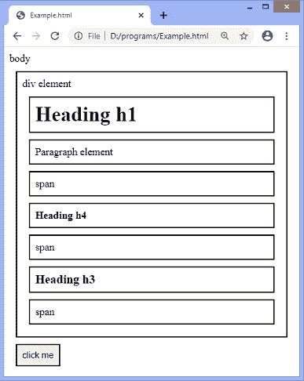
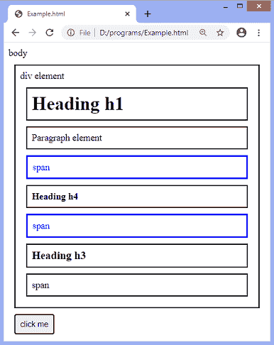
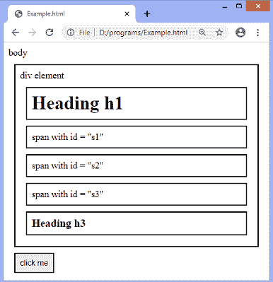
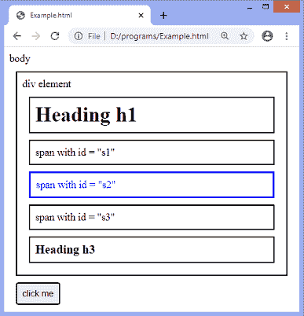

# jQuery nextUntil()方法

> 原文：<https://www.javatpoint.com/jquery-nextuntil-method>

**NextToll()**方法是一个内置的 jQuery 方法。用于查找 ***选择器*** 和 ***停止*** 之间的下一个兄弟元素。该方法与 DOM 元素的同级一起向前遍历。

如果没有提供 ***选择器*** 或者不匹配，【next 直到()方法将返回所有下一个兄弟元素，类似于 **nextAll()** 方法。

### 句法

```js

$(selector).nextUntil(stop,filter)

```

以上语法中的 ***选择器*** 是起始元素。它可以是标签名、类名或 id。**下一步直到()**方法接受两个可选参数，定义如下-

**停止:**这是可选参数。它可以是选择器表达式、 [jQuery](https://www.javatpoint.com/jquery-tutorial) 对象或指示停止搜索的元素。

**过滤器:**这是可选参数。这是一个缩小搜索范围的选择器表达式。

让我们用一些插图来理解**next 直到()**方法。

### 示例 1

这里有一个 div 元素，包括多个子元素。我们正在使用**next 直到()**方法来获取 **h1** 元素的兄弟，因为我们正在传递 **h1** 作为 ***选择器*** 。

我们正在传递 **h3** 元素作为**next 直到()**方法的 ***stop*** 参数的值。因此，该方法将返回 **h3** [标题元素](https://www.javatpoint.com/html-heading)之前的兄弟。

```js

<!DOCTYPE html>
<html>
<head>
<style>
.main * { 
  display: block;
  position: relative;
  border: 2px solid black;
  padding: 8px;
  margin: 10px;
}
</style>
<script src = "https://ajax.googleapis.com/ajax/libs/jquery/3.5.1/jquery.min.js"> </script>
<script>
function fun(){
$(document).ready(function(){
  $("h1").nextUntil("h3").css({ "color": "blue", "border": "3px solid blue"});
});
}
</script>
</head>

<body class = "main"> body
  <div id = "div1"> div element
  <h1> Heading h1 </h1>
<h2> Heading h2 </h2>
<ul> ul element </ul>
<span> span </span>
<p> Paragraph element </p>
<h3> Heading h3 </h3>
	</div>
<button onclick = "fun()"> click me </button>
  </body>
</html>

```

[Test it Now](https://www.javatpoint.com/oprweb/test.jsp?filename=jquery-nextuntil-method1)

**输出**

执行上述代码后，输出将是-



在上面的截图中，我们可以注意到 **h1** 元素的兄弟。单击给定按钮，该方法将返回 **h3** 标题元素之前的兄弟。点击给定按钮后，输出将是-



### 示例 2

在这个例子中，我们使用了**next 直到()**方法的两个可选参数来过滤两个元素之间的搜索。我们将 **h1** 作为**T5】选择器，将 h3** 作为 ***停止*** 参数，将**跨度**作为 ***过滤器*** 参数的值。我们通过仅返回标题 **h1** 和标题 **h3** 之间的下一个同级 **span** 元素来缩小搜索结果。

虽然 div 在 **h3** 元素之后还有 [**跨度**元素](https://www.javatpoint.com/html-span-tag)，但是该方法将只选择出现在 **h3** 之前的**跨度**元素。

```js

<!DOCTYPE html>
<html>
<head>
<style>
.main * { 
  display: block;
  position: relative;
  border: 2px solid black;
  padding: 8px;
  margin: 10px;
}
</style>
<script src = "https://ajax.googleapis.com/ajax/libs/jquery/3.5.1/jquery.min.js"> </script>
<script>
function fun(){
$(document).ready(function(){
  $("h1").nextUntil("h3", "span").css({ "color": "blue", "border": "3px solid blue"});
});
}
</script>
</head>

<body class = "main"> body
  <div id = "div1"> div element
  <h1> Heading h1 </h1>
<p> Paragraph element </p>
<span> span </span>
<h4> Heading h4 </h4>
<span> span </span>
<h3> Heading h3 </h3>
<span> span </span>
	</div>
<button onclick = "fun()"> click me </button>
  </body>
</html>

```

[Test it Now](https://www.javatpoint.com/oprweb/test.jsp?filename=jquery-nextuntil-method2)

**输出**

执行上述代码后，输出将是-



点击给定按钮，将选择 **h3** 之前的**跨度**元素。点击给定按钮后，输出将是-



### 示例 3

这个例子类似于上面的例子。这里 ***选择器*** 和 ***停止*** 之间有多个**跨度**元素。当我们通过传递 **id = "s2"** 作为 ***过滤器*** 来缩小搜索范围时，nextUntil()方法将返回 id = "s2 "的 span 元素。

```js

<!DOCTYPE html>
<html>
<head>
<style>
.main * { 
  display: block;
  border: 2px solid black;
  padding: 8px;
  margin: 10px;
}
</style>
<script src = "https://ajax.googleapis.com/ajax/libs/jquery/3.5.1/jquery.min.js"> </script>
<script>
function fun(){
$(document).ready(function(){
  $("h1").nextUntil("h3", "#s2").css({ "color": "blue", "border": "3px solid blue"});
});
}
</script>
</head>

<body class = "main"> body
  <div id = "div1"> div element
  <h1> Heading h1 </h1>
<span id = "s1"> span with id = "s1" </span>
<span id = "s2"> span with id = "s2" </span>
<span id = "s3"> span with id = "s3" </span>
<h3> Heading h3 </h3>
	</div>
<button onclick = "fun()"> click me </button>
  </body>
</html>

```

[Test it Now](https://www.javatpoint.com/oprweb/test.jsp?filename=jquery-nextuntil-method3)

**输出**

执行上述代码后，输出将是-



点击给定的按钮，输出将是-



* * *