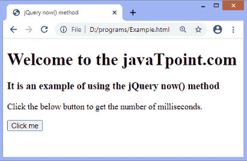
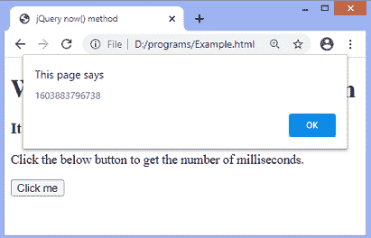

# jQuery now()方法

> 原文:[https://www.javatpoint.com/jquery-now-method](https://www.javatpoint.com/jquery-now-method)

[jQuery](https://www.javatpoint.com/jquery-tutorial) 中的 **now()** 方法返回一个代表当前时间的数字。此方法返回从 1970 年 1 月 1 日午夜到当前时间的毫秒数。

**now()** 方法返回一个代表毫秒数的数字。

### 句法

```

$.now()

```

它不接受任何参数。

### 例子

在本例中，我们使用 **now()** 方法显示从 1970 年 1 月 1 日午夜到当前时间的毫秒数。

```

<!DOCTYPE html>
<html>
<head>
<title> jQuery now() method </title>
<script src = "https://ajax.googleapis.com/ajax/libs/jquery/3.5.1/jquery.min.js"> </script>
</head>
<body>

<h1> Welcome to the javaTpoint.com </h1>
<h3> It is an example of using the jQuery now() method </h3>
<p> Click the below button to get the number of milliseconds. </p>
<button> Click me </button>
<script>
$(document).ready(function(){
$("button").click(function(){
alert(jQuery.now());
});
});
</script>
</body>
</html>

```

[Test it Now](https://www.javatpoint.com/oprweb/test.jsp?filename=jquery-now-method1)

**输出**

执行上述代码后，输出将是-



单击给定按钮时，将显示一个警告框，显示毫秒数，如下图所示。



* * *