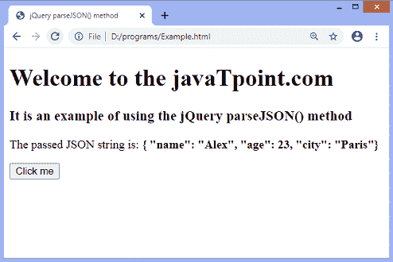
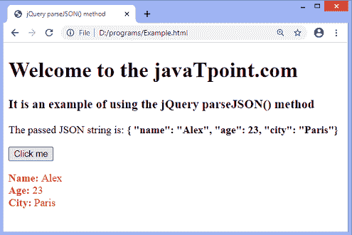

# jQuery parseJSON()方法

> 原文：<https://www.javatpoint.com/jquery-parsejson-method>

jQuery parseJSON()方法接受一个 JSON 字符串并返回一个 JavaScript 对象。指定的 JSON 字符串必须遵循严格的 JSON 格式。传递不正确的字符串将导致 JS 异常。

可能导致传递异常的格式错误的 JSON 字符串的一些例子如下-

```

{id: 01} // The attribute name id must be double-quoted
{'id': 01} // The attribute name id must be double-quoted instead of single quotation
{"name": 'john'} // The value of the name attribute is a string so, it must be double-quoted instead of single quotation
".7" //A number must start with a digit. We can write "0.7"
"undefined"// We cannot represent undefined in a JSON string

```

与上述字符串类似，多个其他格式错误的字符串将导致异常。 [JSON](https://www.javatpoint.com/json-tutorial) 标准也不允许字符串中出现控制字符(如制表符或换行符)。

在[jQuery](https://www.javatpoint.com/jquery-tutorial)1.9 版本之前，如果我们传递一个空字符串， **null** ，或者 **undefined** ， **parseJSON()** 方法返回 **null** 而不是抛出一个错误。

### 句法

```

jQuery.parseJSON( json )

```

此方法接受单个参数，定义如下-

**json:** 是要解析的有效 json 字符串。

现在，让我们用一个例子来理解这个方法的工作原理。

### 例子

这里，我们将一个格式良好的 JSON 字符串传递给 **parseJSON()** 方法。我们必须点击给定的按钮来获得输出。

```

<!DOCTYPE html>
<html>
<head>
<title> jQuery parseJSON() method </title>
<script src = "https://ajax.googleapis.com/ajax/libs/jquery/3.5.1/jquery.min.js"> </script>
<style>
#p2 {
color: red;
}
</style>
</head>
<body>

<h1> Welcome to the javaTpoint.com </h1>
<h3> It is an example of using the jQuery parseJSON() method </h3>
<p id = "p1"> </p>
<button> Click me </button>
<p id = "p2"> </p>
<script>
$(document).ready(function(){
var json = '{ "name": "Alex", "age": 23, "city": "Paris"}';
var emp = jQuery.parseJSON(json);
$("#p1").html("The passed JSON string is: <b>" + json + "</b>");
$("button").click(function() {
$("#p2").html("<b> Name: </b>" + emp.name + "<br> <b> Age: </b>" + emp.age + "<b> <br> City: </b>" + emp.city);
});
});
</script>
</body>
</html>

```

[Test it Now](https://www.javatpoint.com/oprweb/test.jsp?filename=jquery-parsejson-method1)

**输出**

执行上述代码后，输出将是-



点击给定按钮后，输出将是-



* * *