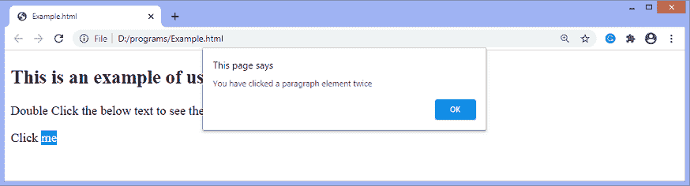
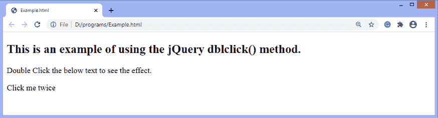
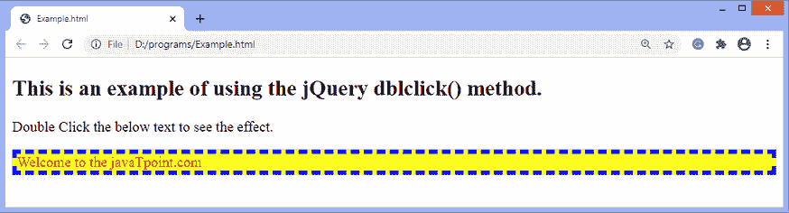

# jQuery dblclick()方法

> 原文：<https://www.javatpoint.com/jquery-dblclick-method>

**dblclick()** 方法用于触发 dblclick 事件或附加一个函数在双击元素时执行。当在很短的时间内单击元素两次时，就会发生事件。这是 [jQuery](https://www.javatpoint.com/jquery-tutorial) 中的一个内置方法。

### 句法

我们可以简单地使用 **dblclick()** 方法，也可以给 **dblclick** 事件添加一个函数。使用 **dblclick()** 方法的语法如下-

**触发所选元素的事件**

```js

$(selector).dblclick()

```

**附加功能**

```js

$(selector).dblclick(function)

```

以上语法中的 ***选择器*** 就是选中的元素。上述语法中提到的参数 ***功能*** 是可选的。当 **dblclick** 事件发生时执行的功能。附加函数在双击元素时执行特定任务。

让我们看一些使用 **dblclick()** 方法的例子。

### 示例 1

这是使用 **dblclick()** 方法的一个简单示例。这里，双击给定的带有文字 ***【点击我】*** 的段落，会显示一个提示框，显示一些信息。

```js

<!DOCTYPE html>
<html>
<head>
<script src = "https://ajax.googleapis.com/ajax/libs/jquery/3.5.1/jquery.min.js"> </script> 
</head>
<body>
<h2> This is an example of using the jQuery dblclick() method. </h2>
<p> Double Click the below text to see the effect. </p>
<p id = "p1"> Click me </p>
<script>
$(document).ready(function(){
$("#p1").dblclick(function(){
alert("You have clicked a paragraph element twice");
});
});
</script>
</body>
</html>

```

[Test it Now](https://www.javatpoint.com/oprweb/test.jsp?filename=jquery-dblclick-method1)

**输出**

执行上述代码后，输出将是-


点击文字 ***点击我*** 后，输出会是-



### 示例 2

这是 **dblclick()** 方法的另一个例子。在这里，双击带有文字 ***的段落两次*** ，段落的样式和文字会发生变化。

```js

<!DOCTYPE html>
<html>
<head>
<script src = "https://ajax.googleapis.com/ajax/libs/jquery/3.5.1/jquery.min.js"> </script> 
</head>
<body>
<h2> This is an example of using the jQuery dblclick() method. </h2>
<p> Double Click the below text to see the effect. </p>
<p id = "p1"> Click me twice </p>
<script>
$(document).ready(function(){
$("#p1").dblclick(function(){
$("#p1").text("Welcome to the javaTpoint.com").css({ "border": "5px dashed blue", "color": "red", "background-color": "yellow"});
});
});
</script>
</body>
</html>

```

[Test it Now](https://www.javatpoint.com/oprweb/test.jsp?filename=jquery-dblclick-method2)

**输出**

执行上述代码后，输出将是-



点击文本 ***两次*** 后，输出会是-



* * *