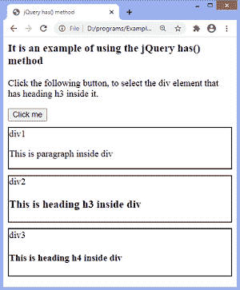
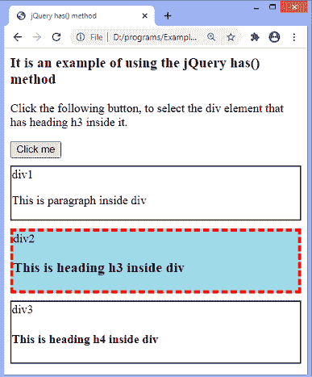
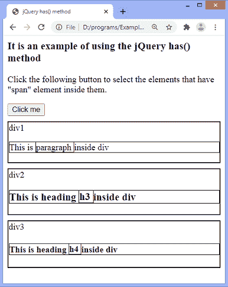
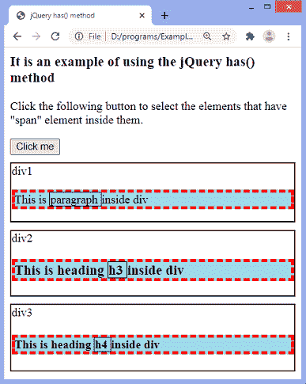
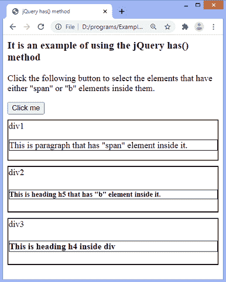
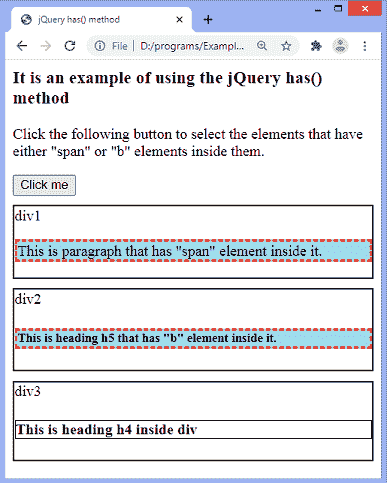

# jQuery 有()方法

> 原文：<https://www.javatpoint.com/jquery-has-method>

jQuery **有()**方法，用于返回所有内部有一个或多个与给定选择器匹配的元素的元素。如果我们必须选择元素，包括其中的几个元素，我们必须使用逗号。

### 句法

```

$(selector).has(element)

```

以上语法中的 ***[选择器](https://www.javatpoint.com/jquery-selectors)*** 是选择并返回其中匹配元素的元素。它可以是标记名、类名或元素 id。

**有()**方法接受单个参数，定义如下-

**元素:**它是强制参数，可以是元素或选择器表达式来匹配元素。

现在，我们通过一些插图来了解一下 [jQuery](https://www.javatpoint.com/jquery-tutorial) **有()**方法的工作原理。

### 示例 1

在这个例子中，我们使用 **has()** 方法来选择标题为 **h3** 的 div 元素。这里有多个包含不同子级的**T5【div】T6**元素，但是方法只会选择包含标题 **h3** 的 **div** 。我们必须点击给定的按钮来查看 **has()** 方法的工作情况。

```

<html>

<head>
<title> jQuery has() method </title>
<script src = "https://ajax.googleapis.com/ajax/libs/jquery/3.5.1/jquery.min.js"> </script>
<script>
$(document).ready(function() {
$("button").click(function(){
$("div").has("h3").css({ "border": "4px dashed red", "background-color": "lightblue" });
});
});
</script>
<style>
div{
border: 2px solid black;
margin-top: 10px;
}

</style>
</head>

<body>
<h3> It is an example of using the jQuery has() method </h3>
<p> Click the following button, to select the div element that has heading h3 inside it. </p>
<button> Click me </button>
<div> div1
<p> This is paragraph inside div </p>
</div>
<div> div2
<h3> This is heading h3 inside div </h3>
</div>
<div> div3
<h4> This is heading h4 inside div </h4>
</div>
</body>

</html>

```

[Test it Now](https://www.javatpoint.com/oprweb/test.jsp?filename=jquery-has-method1)

**输出**

执行上述代码后，输出将是-



点击给定按钮后，输出将是-



### 示例 2

这是使用 **has()** 方法的另一个例子。这里，我们指定多个选择器，用逗号分隔。**有()**方法只有在选择器中给定的元素内有 **span** 元素时才会选择它们。

```

<html>

<head>
<title> jQuery has() method </title>
<script src = "https://ajax.googleapis.com/ajax/libs/jquery/3.5.1/jquery.min.js"> </script>
<script>
$(document).ready(function() {
$("button").click(function(){
$(" h4, h3, p ").has("span").css({ "border": "4px dashed red", "background-color": "lightblue" });
});
});
</script>
<style>
div{
border: 2px solid black;
margin-top: 10px;
}
div *{
border: 1px solid black;
}
</style>
</head>

<body>
<h3> It is an example of using the jQuery has() method </h3>
<p>Click the following button to select the elements that have "span" element inside them. </p>
<button> Click me </button>
<div> div1
<p> This is <span> paragraph </span> inside div </p>
</div>
<div> div2
<h3> This is heading <span> h3 </span> inside div </h3>
</div>
<div> div3
<h4> This is heading <span> h4 </span> inside div </h4>
</div>
</body>

</html>

```

[Test it Now](https://www.javatpoint.com/oprweb/test.jsp?filename=jquery-has-method2)

**输出**

执行上述代码后，输出将是-



点击给定按钮后，输出将是-



### 示例 3

在本例中， **has()** 方法将返回内部有多个元素的元素。该方法将只返回那些具有带 **id = "span1"** 或 **< b >** 元素的 **p、h5、**和 **h4** 元素。

```

<html>
<head>
<title> jQuery has() method </title>
<script src = "https://ajax.googleapis.com/ajax/libs/jquery/3.5.1/jquery.min.js"> </script>
<script>
$(document).ready(function() {
$("button").click(function(){
$("p, h5, h4").has(" #span1, b ").css({ "border": "3px dashed red", "background-color": "lightblue" });
});
});
</script>
<style>
div{
border: 2px solid black;
margin-top: 10px;
}
div p, h5, h4{
border: 1px solid black;
}
</style>
</head>

<body>
<h3> It is an example of using the jQuery has() method </h3>
<p> Click the following button to select the elements that have either "span" or "b" elements inside them.
</p>
<button> Click me </button>
<div> div1
<p> This is <span id = "span1"> paragraph </span> that has "span" element inside it. </p>
</div>
<div> div2
<h5> This is heading <b> h5 </b> that has "b" element inside it. </h5>
</div>
<div> div3
<h4> This is heading h4 inside div </h4>
</div>
</body>

</html>

```

[Test it Now](https://www.javatpoint.com/oprweb/test.jsp?filename=jquery-has-method3)

**输出**

执行上述代码后，输出将是-



点击给定按钮后，输出将是-



* * *