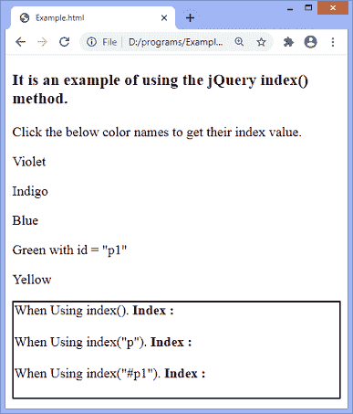
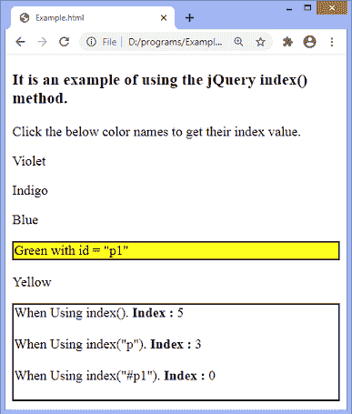

# jQuery 索引()方法

> 原文:[https://www.javatpoint.com/jquery-index-method](https://www.javatpoint.com/jquery-index-method)

**index()** 方法用于返回元素相对于选择器的索引值。如果没有找到元素，该方法将返回 **-1** 。

### 句法

**第一个匹配元素的索引，相对于兄弟**

```

$(selector).index()

```

如果没有参数传递给 **index()** 方法，该方法将返回一个整数，表示 jQuery 对象中第一个元素相对于其同级元素的位置。

**元素的索引，相对于选择器**

```

$(selector).index(element)

```

此方法接受一个可选参数，定义如下-

**元素:**这是一个可选参数，可以是 [jQuery 选择器](https://www.javatpoint.com/jquery-selectors)或 DOM 元素。它指定要获取其索引位置的元素。

假设我们传递一个 DOM 元素作为参数，并对元素集使用 **index()** 方法。在这种情况下，该方法将返回一个整数，该整数表示传递的元素相对于原始集合的位置。

将选择器字符串作为参数传递时， **index()** 方法将返回一个整数，该整数表示相对于选择器匹配的元素， [jQuery](https://www.javatpoint.com/jquery-tutorial) 对象中第一个元素的位置。

### 例子

在本例中，我们使用 **index()** 方法来获取段落元素的索引值。在这里，我们使用带或不带参数的方法。因此，单击段落元素，我们将根据语法获得相应段落的索引。索引从 0 开始。

这里，颜色名称是段落元素。

```

<!DOCTYPE html>
<html>

<head>
<script
src = "https://ajax.googleapis.com/ajax/libs/jquery/3.5.1/jquery.min.js"> </script>
<script>
$(document).ready(function() {
$("p").click(function() {
$("p").css({"background-color": "white", "border": "0px solid black"});
$(this).css({"background-color": "yellow", "border": "2px solid black"});
document.getElementById("s1").innerHTML = $(this).index();
document.getElementById("s2").innerHTML = $(this).index("p");
document.getElementById("s3").innerHTML = $(this).index("#p1");
});
});
</script>
</head>

<body>
<h3> It is an example of using the jQuery index() method. </h3>
<span> Click the below color names to get their index value. </span>
<p> Violet </p>
<p> Indigo </p>
<p> Blue </p>
<p id = "p1"> Green with id = "p1" </p>
<p> Yellow </p>
<div style = "border: 2px solid black;">
When Using index(). <b> Index : </b> <span id="s1"> </span> </br> </br>
When Using index("p"). <b> Index : </b> <span id="s2"> </span> </br> </br>
When Using index("#p1"). <b> Index : </b> <span id="s3"> </span> </br> </br>
</div>
</body>
</html>

```

[Test it Now](https://www.javatpoint.com/oprweb/test.jsp?filename=jquery-index-method1)

**输出**



单击段落时，相应段落元素的索引将根据语法显示，如下图所示。



如我们所见，id 为 p1 的段落的索引为 0。这是因为索引从 0 开始。

* * *