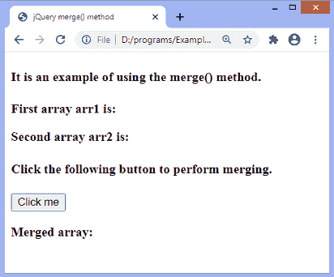
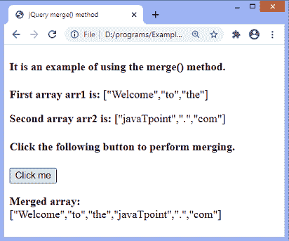
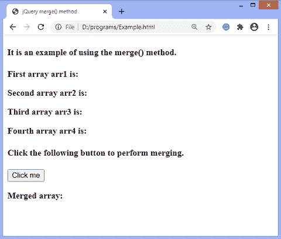
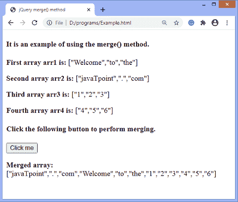
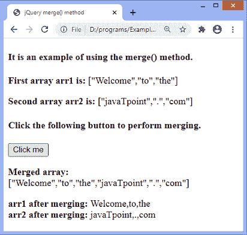

# jQuery merge()方法

> 原文:[https://www.javatpoint.com/jquery-merge-method](https://www.javatpoint.com/jquery-merge-method)

jQuery **merge()** 方法将两个数组的内容合并到第一个数组中。此方法返回合并的数组。

**merge()** 方法形成一个包含两个数组元素的数组。如果我们需要第一个数组，我们应该在调用 **merge()** 方法之前复制它。

### 句法

使用 **merge()** 方法的常用语法如下。

```

jQuery.merge( first, second )

```

该方法接受如下定义的两个参数-

**第一个:**此参数指定第一个数组。用于合并，包含合并后第二个数组的内容。

**秒:**此参数指定第二个数组。它也用于合并，但不会被修改。

现在，让我们通过一些插图来理解 **merge()** 方法。

### 示例 1

在本例中，有两个名为 **arr1** 和 **arr2** 的数组。我们正在使用 [jQuery](https://www.javatpoint.com/jquery-tutorial) 的 **merge()** 方法来合并两个数组。单击给定的按钮，我们将得到合并的数组。合并后的数组将是修改后的第一个数组。

```

<!DOCTYPE html>
<html>
<head>
<title> jQuery merge() method </title>
<script src = "https://ajax.googleapis.com/ajax/libs/jquery/3.5.1/jquery.min.js"> </script>
</head>
<body>

<h4> It is an example of using the merge() method. </h4>
<p id = "p1"> <b> First array arr1 is: </b> </p>
<p id = "p2"> <b> Second array arr2 is: </b> </p>
<h4> Click the following button to perform merging. </h4>
<button> Click me </button>
<p id = "p3"> <b> Merged array: </b> </p>
<script>
$(document).ready(function() {
$("button").click(function() {
var arr1 = [ "Welcome", "to", "the" ];  
var arr2 = [ "javaTpoint", ".", "com" ];
$( "#p1" ).append( JSON.stringify( arr1 ));
$( "#p2" ).append( JSON.stringify( arr2 ));
$.merge( arr1, arr2 );
$( "#p3" ).append( JSON.stringify( arr1 ));
});
});
</script>
</body>
</html>

```

[Test it Now](https://www.javatpoint.com/oprweb/test.jsp?filename=jquery-merge-method1)

**输出**

执行上述代码后，输出将是-



点击给定按钮后，输出将是-



### 示例 2

这是使用 **merge()** 方法的另一个例子。这里，我们将两个以上的数组合并到第一个数组中。这里有四个数组，分别是 **arr1、arr2、arr3** 和 **arr4** 。单击给定的按钮，所有四个数组将合并为一个数组，并且该方法将返回合并后的数组。合并后的数组将是修改后的第一个数组。

```

<!DOCTYPE html>
<html>
<head>
<title> jQuery merge() method </title>
<script src = "https://ajax.googleapis.com/ajax/libs/jquery/3.5.1/jquery.min.js"> </script>
</head>
<body>

<h4> It is an example of using the merge() method. </h4>
<p id = "p1"> <b> First array arr1 is: </b> </p>
<p id = "p2"> <b> Second array arr2 is: </b> </p>
<p id = "p3"> <b> Third array arr3 is: </b> </p>
<p id = "p4"> <b> Fourth array arr4 is: </b> </p>
<h4> Click the following button to perform merging. </h4>
<button> Click me </button>
<p id = "merge"> <b> Merged array: </b> </p>
<script>
$(document).ready(function() {
$("button").click(function() {
var arr1 = [ "Welcome", "to", "the" ];  
var arr2 = [ "javaTpoint", ".", "com" ];
var arr3 = [ "1", "2", "3" ];
var arr4 = [ "4", "5", "6" ];
$( "#p1" ).append( JSON.stringify( arr1 ));
$( "#p2" ).append( JSON.stringify( arr2 ));
$( "#p3" ).append( JSON.stringify( arr3 ));
$( "#p4" ).append( JSON.stringify( arr4 ));
$.merge( arr2, $.merge( arr1, $.merge( arr3, arr4 )));
$( "#merge" ).append( JSON.stringify( arr2 ));
});
});
</script>
</body>
</html>

```

[Test it Now](https://www.javatpoint.com/oprweb/test.jsp?filename=jquery-merge-method2)

**输出**

执行上述代码后，输出将是-



点击给定按钮后，输出将是-



### 示例 3

在本例中，我们合并了数组，但也使用了副本，因此原始数组不会被更改。在输出中，我们可以看到两个数组在合并后没有改变。

```

<!DOCTYPE html>
<html>
<head>
<title> jQuery merge() method </title>
<script src = "https://ajax.googleapis.com/ajax/libs/jquery/3.5.1/jquery.min.js"> </script>
</head>
<body>

<h4> It is an example of using the merge() method. </h4>
<p id = "p1"> <b> First array arr1 is: </b> </p>
<p id = "p2"> <b> Second array arr2 is: </b> </p>
<h4> Click the following button to perform merging. </h4>
<button> Click me </button>
<p id = "merge"> <b> Merged array: </b> </p>
<p id = "p4"></p>
<script>
$(document).ready(function() {
$("button").click(function() {
var arr1 = [ "Welcome", "to", "the" ];  
var arr2 = [ "javaTpoint", ".", "com" ];
$( "#p1" ).append( JSON.stringify( arr1 ));
$( "#p2" ).append( JSON.stringify( arr2 ));
var n = $.merge( $.merge( [], arr1), arr2);
$( "#merge" ).append( JSON.stringify( n ));
$( "#p4" ).html(" <b> arr1 after merging: </b> " + arr1 + "<br> <b> arr2 after merging: </b> " + arr2 );
});
});
</script>
</body>
</html>

```

[Test it Now](https://www.javatpoint.com/oprweb/test.jsp?filename=jquery-merge-method3)

**输出**

执行上述代码后，输出将是-


点击给定按钮后，输出将是-



* * *