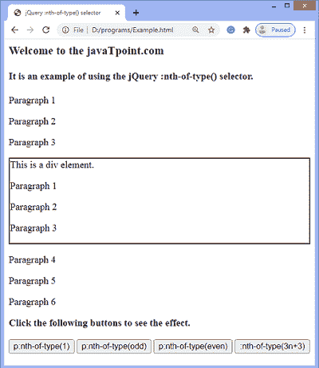
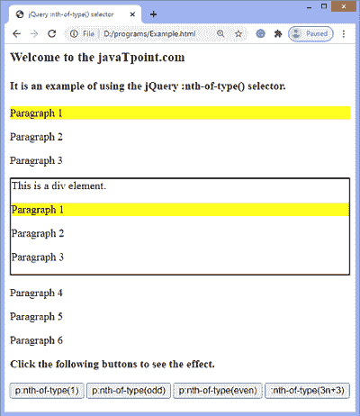
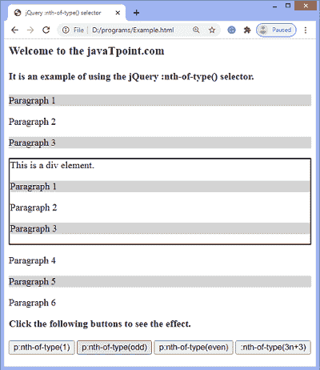
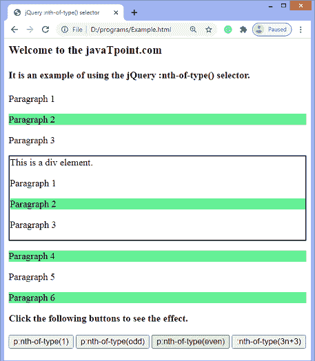
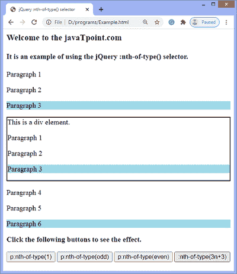

# jQuery:第 n 个类型()选择器

> 原文：<https://www.javatpoint.com/jquery-nth-of-type-selector>

这个 jQuery 选择器用于选择特定类型的父元素的第 n 个子元素。

我们可以使用**:第 n 个子()**选择器根据元素的位置来选择元素，而不管它们的父元素的类型。

### 句法

使用**:第 n 类**选择器的语法如下。

```js

:nth-of-type( n | odd | even | formula)

```

### 参数值

上述语法中提到的值定义如下。

**n:** 上面语法中的 ***n*** 必须是整数。它表示要匹配的每个子级的索引。该参数指示[选择器](https://www.javatpoint.com/jquery-selectors)选择出现在指定索引值的子对象。第一个元素的索引号是 1。

**奇数:**它选择每一个奇数子元素。

**偶数:**它选择每个偶数子元素。

**公式:**选择出现在公式值处的子元素。寻找不同孩子的公式是 **an+b** 。

如果我们考虑 a = 2 和 b = 1，公式将是 2n+1，这将只选择索引值 1，3，5，…索引处存在的元素。为了解出这个公式，我们可以把 n 的值设为 0，1，2，…n。

现在，让我们看一个使用:**第 n 个 type()** 选择器的所有参数值的例子。

### 例子

在本例中，我们使用了**:第 n 个类型()选择器**的所有参数值。这里有很多段落元素。按钮将选择与选择器值相关的段落元素。同样，第一个按钮将选择索引值为 1 的段落，第二个按钮将选择奇数段落，第三个按钮将选择偶数段落，第四个按钮将选择索引值为 3，6，9，…n 的段落。

```js

<html>
<head>
<title> jQuery :nth-of-type() selector </title>

<script src = "https://ajax.googleapis.com/ajax/libs/jquery/3.5.1/jquery.min.js"></script>
</head>
<body>

<h3> Welcome to the javaTpoint.com </h3>
<h4> It is an example of using the jQuery :nth-of-type() selector. </h4>

<p> Paragraph 1 </p>
<p> Paragraph 2 </p>
<p> Paragraph 3 </p>
<div style = "border: 2px solid black;"> This is a div element. 
<p> Paragraph 1 </p>
<p> Paragraph 2 </p>
<p> Paragraph 3 </p>
</div>
<p> Paragraph 4 </p>
<p> Paragraph 5 </p>
<p> Paragraph 6 </p>
<b> Click the following buttons to see the effect. </b>
</br> </br>
<button id = "n"> p:nth-of-type(1) </button>
<button id = "odd"> p:nth-of-type(odd) </button>
<button id = "even"> p:nth-of-type(even) </button>
<button id = "formula"> :nth-of-type(3n+3) </button>

<script>
$(document).ready(function(){
    $("#n").click(function () {
	$("p").css("background-color", "white");
    $("p:nth-of-type(1)").css("background-color", "yellow");    
    });

	$("#odd").click(function () {
	$("p").css("background-color", "white");
    $("p:nth-of-type(odd)").css("background-color", "lightgray");    
    });

	$("#even").click(function () {
	$("p").css("background-color", "white");
    $("p:nth-of-type(even)").css("background-color", "lightgreen");    
    });

	$("#formula").click(function () {
    $("p").css("background-color", "white");
	$("p:nth-of-type(3n+3)").css("background-color", "lightblue");    

    });

	});
</script>

</body>
</html>

```

[Test it Now](https://www.javatpoint.com/oprweb/test.jsp?filename=jquery-nth-of-type-selector1)

**输出**

执行上述代码后，输出将是-



点击第一个按钮后-



点击第二个按钮后-



点击第三个按钮后-



点击第四个按钮后-



* * *