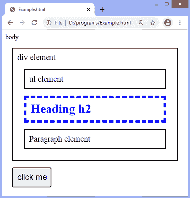

# jQuery prev()方法

> 原文：<https://www.javatpoint.com/jquery-prev-method>

**prev()** 方法是 [jQuery](https://www.javatpoint.com/jquery-tutorial) 中的一个内置方法，它返回所选元素的前一个同级。这个方法与 DOM 元素的前一个同级一起向后遍历。

### 句法

```js

selector.prev( [selector] )

```

此方法接受一个可选参数，该参数用于指定缩小上一个同级搜索范围的选择器表达式。

让我们看一些插图来了解 **prev()** 方法的工作原理。

### 示例 1

在这个例子中，有一个 div 元素，包括三个子元素，分别是**[【ul】](https://www.javatpoint.com/html-unordered-list)**元素、标题 **h2** 和段落元素。这里，我们使用 **prev()** 方法来获取 **[p](https://www.javatpoint.com/html-paragraph)** 元素的前一个兄弟。我们没有使用 **prev()** 方法的可选参数。

**prev()** 方法将返回 **[h2](https://www.javatpoint.com/html-heading)** 元素，因为它是第 **p** 段的上一个同级元素。

我们必须点击给定的按钮才能看到效果。

```js

<!DOCTYPE html>
<html>
<head>
<style>
.main * {
display: block;
font-size: 20px;
position: relative;
border: 2px solid black;
color: black;
padding: 10px;
margin: 17px;
}
</style>
<script src="https://ajax.googleapis.com/ajax/libs/jquery/3.5.1/jquery.min.js"></script>
<script>
function fun(){
$(document).ready(function(){
$("p").prev().css({ "font-size": "30px", "color": "blue", "border": "6px dashed blue"});
});
}
</script>
</head>

<body class = "main"> body
<div id = "div1"> div element
<ul> ul element </ul>
<h2> Heading h2 </h2>
<p> Paragraph element </p>
</div>
<button onclick = "fun()"> click me </button>
</body>
</html>

```

[Test it Now](https://www.javatpoint.com/oprweb/test.jsp?filename=jquery-prev-method1)

**输出**

执行上述代码后，输出将是-


点击给定按钮后，输出将是-



### 示例 2

在本例中，我们使用 **prev()** 方法的可选参数来缩小搜索范围。这里有一个 div 元素，包括多个子元素。有许多具有不同兄弟的 **h2** 标题元素。但是我们正在传递 **p** 元素作为 **prev()** 方法的可选参数。因此，该方法将只返回 **p** 元素，它们是 **h2** 元素的前一个兄弟元素。

```js

<!DOCTYPE html>
<html>
<head>
<style>
.main * { 
  display: block;
  font-size: 20px;
  position: relative;
  border: 2px solid black;
  color: black; 
  padding: 10px;
  margin: 17px;
}
</style>
<script src="https://ajax.googleapis.com/ajax/libs/jquery/3.5.1/jquery.min.js"></script>
<script>
function fun(){
$(document).ready(function(){
  $("h2").prev("p").css({ "color": "blue", "border": "5px dashed blue"});
});
}
</script>
</head>

<body class = "main"> body
  <div id = "div1"> div element
<ul> ul element </ul>
<h2> Heading h2 </h2>
<p> Paragraph element </p>
<h2> Heading h2 </h2>
<span> span element </span>
<h2> Heading h2 </h2>
	</div>
<button onclick = "fun()"> click me </button>
  </body>
</html>

```

[Test it Now](https://www.javatpoint.com/oprweb/test.jsp?filename=jquery-prev-method2)

**输出**

执行上述代码后，输出将是-


在上面的截图中，我们可以注意到 **h2** 元素的兄弟。但是该方法将只返回 **p** 元素，因为我们已经将 **p** 元素作为 **prev()** 方法的可选参数。点击给定按钮后，输出将是-


### 示例 3

这是使用 **prev()** 方法的另一个例子。 **prev()** 方法将在点击给定按钮时触发，并开始遍历 DOM 元素。该方法将返回每个 div 元素的前一个同级，并将相应 div 的背景色更改为红色。

```js

<!DOCTYPE html>
<html>
<head>
<style>
div { 
  display: block;
  width: 50px;
  height: 50px;
  font-size: 20px;
  margin: 10px;
  border: 2px solid black;
  float: left;
}
p {
clear: left;
margin: 10px;
}
</style>
<script src = "https://ajax.googleapis.com/ajax/libs/jquery/3.5.1/jquery.min.js"> </script>
<script>
$(document).ready(function(){
var current = $("#d5");
current .css( "background-color", "red");
$("button").click(function(){
  current  = current .prev();
  $("div").css("background", "");
  current.css( "background-color", "red" );
});
});
</script>
</head>

<body>
<div> </div>
<div> </div>
<div> </div>
<div> </div>
<div id = "d5"> </div>
<p> Click the below button to see the effect. </p>
<p>
<button> click me </button>
</p>
</body>
</html>

```

[Test it Now](https://www.javatpoint.com/oprweb/test.jsp?filename=jquery-prev-method3)

**输出**

单击给定的按钮，jQuery **prev()** 方法触发并开始遍历 DOM 元素。

* * *