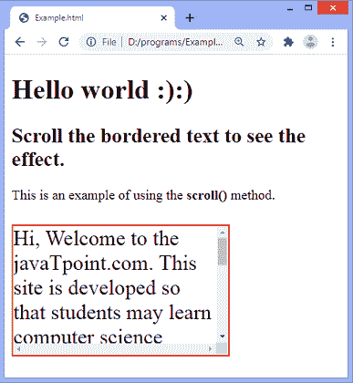
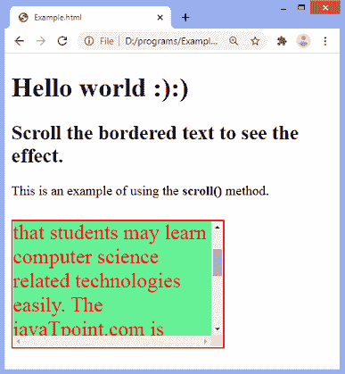

# jQuery scroll()方法

> 原文:[https://www.javatpoint.com/jquery-scroll-method](https://www.javatpoint.com/jquery-scroll-method)

**滚动()**方法用于触发**滚动**事件或附加一个函数在滚动发生时运行。

当滚动条用于元素时，滚动事件发生。当用户向上或向下移动滚动条时，事件被触发。我们可以使用 [CSS **溢出**属性](https://www.javatpoint.com/css-overflow)来创建滚动条。对窗口对象或所有可滚动元素触发滚动事件。

### 句法

我们既可以简单地使用**滚动()**方法，也可以给**滚动**事件添加一个功能。使用**卷轴()**方法的语法如下-

**触发所选元素的事件**

```

$(selector).scroll()

```

**附加功能**

```

$(selector).scroll(function)

```

以上语法中的 ***选择器*** 就是选中的元素。上述语法中提到的参数 ***功能*** 是可选的。这是当**滚动**事件发生时要执行的功能。附加的函数在滚动时执行特定的任务。

让我们看一个使用**滚动()**方法的例子。

### 例子

这是使用**滚动()**方法的一个简单示例。这里有一个带有 **id = "para"** 的段落元素，我们在其上应用**卷轴()**方法。在滚动段落时， **scroll()** 方法附带的功能将触发并改变相应段落的颜色和背景颜色。这里，我们使用的是**滚动()**方法的可选参数。

```

<!DOCTYPE html>
<html>
<head>
<script src = "https://ajax.googleapis.com/ajax/libs/jquery/3.5.1/jquery.min.js"></script>
<style>
#para{
width: 250px;
height: 150px;
overflow: scroll;
border: 2px solid red;
font-size: 25px;
}
</style>
</head>

<body>
<h1> Hello world :):) </h1>
<h2> Scroll the bordered text to see the effect. </h2>
<p> This is an example of using the <b> scroll() </b> method. </p>
<p id = "para"> Hi, Welcome to the javaTpoint.com. This site is developed so that students may learn computer science related technologies easily. The javaTpoint.com is always providing an easy and in-depth tutorial on various technologies. No one is perfect in this world, and nothing is eternally best. But we can try to be better. </p>
<script>
$(document).ready(function(){
$("#para").scroll(function(){
$("#para").css("color", "red");
$("#para").css("background", "lightgreen");
});
});
</script>
</body>
</html>

```

[Test it Now](https://www.javatpoint.com/oprweb/test.jsp?filename=jquery-scroll-method1)

**输出**



在屏幕上滚动带边框的文本后，我们将获得以下输出-



* * *