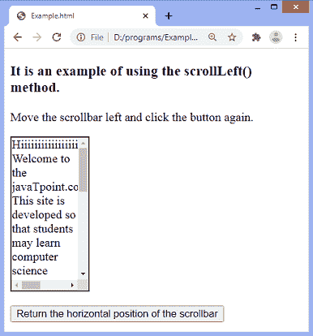
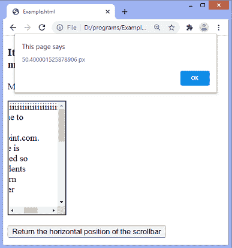
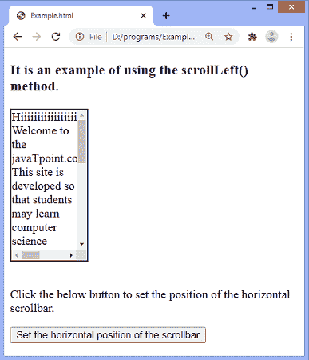
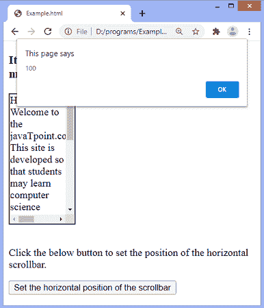
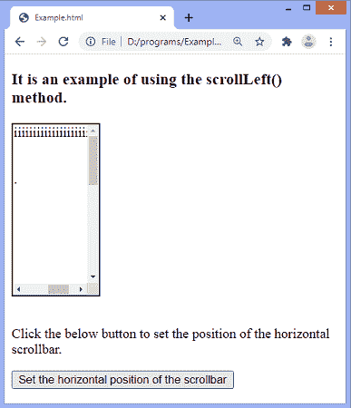

# jQuery scrollLeft()方法

> 原文：<https://www.javatpoint.com/jquery-scrollleft-method>

**scrolleft()**方法用于设置或返回所选元素的水平滚动条位置。当滚动条在左边时，它指定位置 0。

**返回位置:**当我们使用**scrolleft()**方法获取位置时，它将返回集合中第一个匹配元素的当前水平位置。

**设置位置:**用此方法设置位置时，为所有匹配的元素设置滚动条的水平位置。

### 句法

如果我们必须设置水平滚动条的位置，**scrolleft()**方法接受一个参数。然而，获取水平滚动条的位置并不需要任何参数。

**设置水平滚动条位置:**

```js

$(selector).scrollLeft(position)

```

**返回水平滚动条位置:**

```js

$(selector).scrollLeft()

```

上述语法中提到的 ***位置*** 参数是一个整数，用于以像素为单位指定水平滚动条的位置。

现在，让我们看一些插图来理解**scrolleft()**方法的使用。

### 示例 1

在这个例子中，我们使用**scrolleft()**方法来获取水平滚动条的位置。

```js

<!DOCTYPE html>  
<html>  
<head>  
<script src = "https://ajax.googleapis.com/ajax/libs/jquery/3.5.1/jquery.min.js"> </script>  
<script>  
$(document).ready(function(){  
    $("button").click(function(){  
        alert($("div").scrollLeft() + " px");  
    });  
});  
</script>  
<style>
div{
border: 2px solid black;
width: 100px;
height: 200px;
overflow: auto;
}
</style>
</head>  
<body>  
<h3> It is an example of using the scrollLeft() method. </h3>
<p> Move the scrollbar left and click the button again. </p>  
<div>  
Hiiiiiiiiiiiiiiiiiiiiiiiiiiiiiiiiiiiiiiiiiiii, Welcome to the javaTpoint.com. This site is developed so that students may learn computer science related technologies easily. The javaTpoint.com is always providing an easy and in-depth tutorial on various technologies. No one is perfect in this world, and nothing is eternally best. But we can try to be better.
</div>
</br>  
<button> Return the horizontal position of the scrollbar </button>  

</body>  
</html>

```

[Test it Now](https://www.javatpoint.com/oprweb/test.jsp?filename=jquery-scrollleft-method1)

**输出**



向左移动滚动条，然后点击给定的按钮，将显示一个警告框，显示水平滚动条的当前位置，如下图所示-



### 示例 2

在本例中，我们使用**scrolleft()**方法的 ***位置*** 参数来设置水平滚动条的位置。当用户点击给定按钮时，水平滚动条向左设置为 **100px** ，当前位置将显示在一个警告框中。

```js

<!DOCTYPE html>  
<html>  
<head>  
<script src = "https://ajax.googleapis.com/ajax/libs/jquery/3.5.1/jquery.min.js"> </script>  
<script>  
$(document).ready(function(){  
    $("button").click(function(){  
      $("div").scrollLeft(100);
	  alert($("div").scrollLeft());
    });  
});  
</script>  
<style>
div{
border: 2px solid black;
width: 100px;
height: 200px;
overflow: auto;
}
</style>
</head>  
<body>  
<h3> It is an example of using the scrollLeft() method. </h3>
<div>  
Hiiiiiiiiiiiiiiiiiiiiiiiiiiiiiiiiiiiiiiiiiiii, Welcome to the javaTpoint.com. This site is developed so that students may learn computer science related technologies easily. The javaTpoint.com is always providing an easy and in-depth tutorial on various technologies. No one is perfect in this world, and nothing is eternally best. But we can try to be better.
</div>
</br>  
<p> Click the below button to set the position of the horizontal scrollbar. </p>  
<button> Set the horizontal position of the scrollbar </button>  

</body>  
</html>

```

[Test it Now](https://www.javatpoint.com/oprweb/test.jsp?filename=jquery-scrollleft-method2)

**输出**



点击给定按钮后，滚动条设置为左侧 100px，水平滚动条的位置将显示在提醒框中，如下图截图所示-




* * *