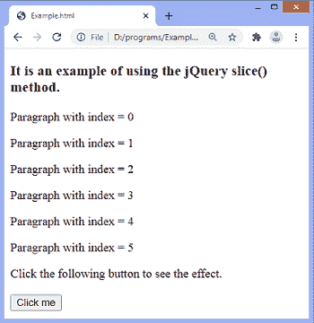
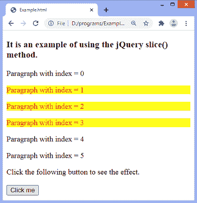
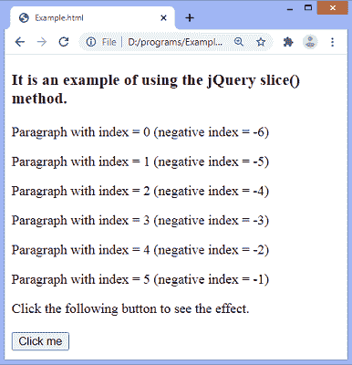
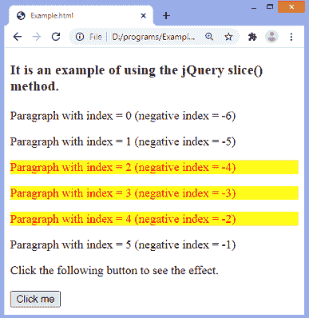

# jQuery slice()方法

> 原文：<https://www.javatpoint.com/jquery-slice-method>

jQuery **slice()** 方法根据索引的范围选择匹配元素的子集(更大集合的一部分)。此方法限制组中的元素选择。

它返回起始索引和结束索引值之间的元素。索引从 0 开始。如果我们不指定结束索引，该方法将从开始索引开始，并选择每个匹配的元素，直到最后一个匹配的元素被选择。

### 句法

```

$(selector).slice(start, stop)

```

此方法接受两个参数，其中第一个是必需的，另一个是可选的。参数值定义如下-

**start:** 为必选参数。它是一个整数，表示从中选择元素的索引值。索引从 0 开始。允许负值。使用负值将从匹配元素的末尾开始选择。

**stop:** 为可选参数。它是一个整数，表示元素被选中时的索引值。如果省略，选择将继续到集合的末尾。

现在，让我们看一些使用 [jQuery](https://www.javatpoint.com/jquery-tutorial) **slice()** 方法的简单示例。

### 示例 1

在这个例子中，有几个段落元素。该段落以索引值 0 开始。这里，我们使用**切片()**方法的两个参数，起始值为 **1** 和**停止值为 **4** 来选择指定范围内的段落。该方法将从索引值 1 开始选择段落元素，并且选择将持续到端点。**

```

<!DOCTYPE html>
<html>
<head>
<script src = "https://ajax.googleapis.com/ajax/libs/jquery/3.5.1/jquery.min.js"> </script>
</head>

<body>
<h3> It is an example of using the jQuery slice() method. </h3>
<p> Paragraph with index = 0 </p>
<p> Paragraph with index = 1 </p>
<p> Paragraph with index = 2 </p>
<p> Paragraph with index = 3 </p>
<p> Paragraph with index = 4 </p>
<p> Paragraph with index = 5 </p>
<span> Click the following button to see the effect. </span> </br> </br>
<button> Click me </button>
<script>
$(document).ready(function(){
$("button").click(function() {
  $("p").slice(1, 4).css({"background-color": "yellow", "color": "red"});
  });
});
</script>
</body>
</html>

```

[Test it Now](https://www.javatpoint.com/oprweb/test.jsp?filename=jquery-slice-method1)

**输出**



点击给定按钮后，指定范围内的元素将被选中，如下图所示-



### 示例 2

这里，我们使用的是**切片()**方法的两个参数的负值，起始值为 **-4** ，**停止值为 **-1** 来选择指定范围内的段落。**

```

<!DOCTYPE html>
<html>
<head>
<script src = "https://ajax.googleapis.com/ajax/libs/jquery/3.5.1/jquery.min.js"> </script>
</head>

<body>
<h3> It is an example of using the jQuery slice() method. </h3>
<p> Paragraph with index = 0 (negative index = -6) </p>
<p> Paragraph with index = 1 (negative index = -5) </p>
<p> Paragraph with index = 2 (negative index = -4) </p>
<p> Paragraph with index = 3 (negative index = -3) </p>
<p> Paragraph with index = 4 (negative index = -2) </p>
<p> Paragraph with index = 5 (negative index = -1) </p>
<span> Click the following button to see the effect. </span> </br> </br>
<button> Click me </button>
<script>
$(document).ready(function(){
$("button").click(function() {
  $("p").slice(-4, -1).css({"background-color": "yellow", "color": "red"});
  });
});
</script>
</body>
</html>

```

[Test it Now](https://www.javatpoint.com/oprweb/test.jsp?filename=jquery-slice-method2)

**输出**



点击给定按钮后，指定范围内的元素将被选中，如下图所示-



* * *