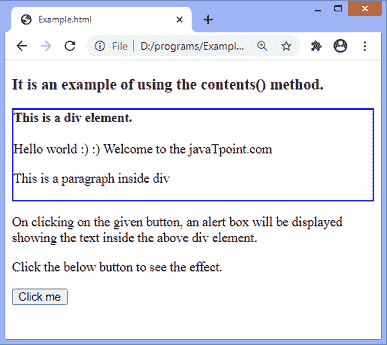
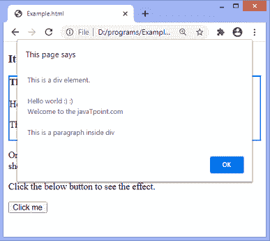

# jQuery contents()方法

> 原文：<https://www.javatpoint.com/jquery-contents-method>

jQuery 中的 **contents()** 方法用于返回直接子元素，包括匹配元素的注释节点和文本。 **contents()** 方法的工作原理类似于 [jQuery](https://www.javatpoint.com/jquery-tutorial) **children()** 方法，只是 **content()** 方法还返回注释节点和文本。

如果一个 iframe 和主页面在同一个域中，我们也可以使用 **contents()** 方法获取它的内容文档。

### 句法

```

$(selector).contents()

```

此方法不接受任何参数。

让我们看一个插图来理解 **contents()** 方法的用法。

### 例子

这是使用 **contents()** 方法的一个简单示例。在本例中，我们使用 **contents()** 方法来获取[T5 div 元素](https://www.javatpoint.com/html-div-tag)的内容。 **contents()** 方法将返回 **div** 元素内部元素的内容。单击给定按钮时，将显示一个警告框，显示 div 元素的内容。

要获取 **div** 元素的特定子元素的内容，我们可以使用 [**filter()** 方法](https://www.javatpoint.com/jquery-filter)来过滤子元素。

```

<!DOCTYPE html>
<html>
<head>
<script src = "https://ajax.googleapis.com/ajax/libs/jquery/3.5.1/jquery.min.js"> </script>
<script>
$(document).ready(function(){
  $("button").click(function(){
    alert($("div").contents().text());
  });
});
</script>
<style>
div{
border: 2px solid blue;
}
</style>
</head>
<body>
<h3> It is an example of using the contents() method. </h3>

<div>
<b> This is a div element. </b>
</br> </br>
<span> Hello world :) :) </span>
<span> Welcome to the javaTpoint.com </span>

<p> This is a paragraph inside div </p>
 </div>

<p> On clicking on the given button, an alert box will be displayed showing the text inside the above div element. </p>

<p> Click the below button to see the effect. </p>

<button> Click me </button>

</body>
</html>

```

[Test it Now](https://www.javatpoint.com/oprweb/test.jsp?filename=jquery-contents-method1)

**输出**

执行后，我们将得到以下输出-



点击给定按钮后，输出将是-



* * *