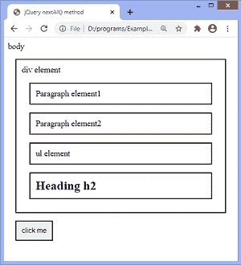
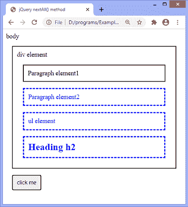
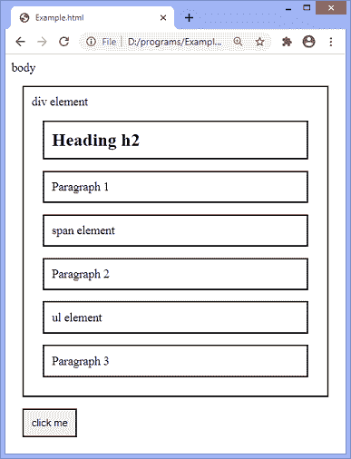
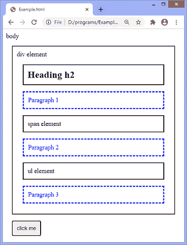
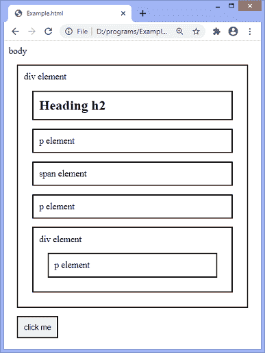
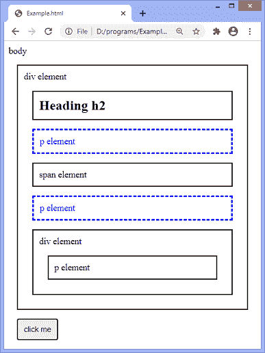

# jQuery nextAll()方法

> 原文：<https://www.javatpoint.com/jquery-nextall-method>

**nextAll()** 方法用于返回指定选择器的所有下一个同级。这是 [jQuery](https://www.javatpoint.com/jquery-tutorial) 中的一个内置方法。该方法与 DOM 元素的下一个同级一起向前遍历。

### 句法

```js

selector.nextAll( filter )

```

**nextAll()** 方法接受一个可选参数 ***[过滤器](https://www.javatpoint.com/jquery-filter)*** ，如上面的语法所述。它指定了一个选择器表达式来缩小下一个同级的搜索范围。为了返回多个兄弟，我们必须用逗号分隔每个表达式。

让我们看一些插图来了解 **nextAll()** 方法的工作原理。

### 示例 1

这是使用 **nextAll()** 方法的一个简单示例。这里有一个 div 元素，包括四个子元素，即两个段落元素，一个 **[ul](https://www.javatpoint.com/html-unordered-list)** 元素和一个[标题](https://www.javatpoint.com/html-heading) **h2** 。我们使用 **nextAll()** 方法来获取 **p** 元素的下一个兄弟。我们没有使用 **nextAll()** 方法的可选参数。

点击给定按钮，将选择 **p** 元素的所有下一个兄弟。

```js

<!DOCTYPE html>
<html>
<head>
<title> jQuery nextAll() method </title>
<style>
.main * {
display: block;
border: 2px solid black;
padding: 10px;
margin: 15px;
}
</style>
<script src = "https://ajax.googleapis.com/ajax/libs/jquery/3.5.1/jquery.min.js"> </script>
<script>
function fun(){
$(document).ready(function(){
$("p").nextAll().css({"color": "blue", "border": "3px dashed blue"});
});
}
</script>
</head>
<body class = "main"> body
<div id = "div1"> div element
<p> Paragraph element1 </p>
<p> Paragraph element2 </p>
<ul> ul element </ul>
<h2> Heading h2 </h2>
</div>
<button onclick = "fun()"> click me </button>
</body>
</html>

```

[Test it Now](https://www.javatpoint.com/oprweb/test.jsp?filename=jquery-nextall-method1)

**输出**



点击给定按钮后， **p** 元素的所有下一个兄弟将被选中，如下图所示-



### 示例 2

在这个例子中，我们使用 **nextAll()** 方法的可选参数来缩小搜索范围。这里有一个包含多个子元素的 div 元素。我们正在传递 **p** 元素作为 **nextAll()** 方法的可选参数。因此，该方法将只返回作为选择器 **h2** 的下一个兄弟的 **p** 元素。

```js

<!DOCTYPE html>
<html>
<head>
<style>
.main * { 
  display: block;
  border: 2px solid black;
  padding: 10px;
  margin: 15px;
}
</style>w
<script src = "https://ajax.googleapis.com/ajax/libs/jquery/3.5.1/jquery.min.js"> </script>
<script>
function fun(){
$(document).ready(function(){
  $("h2").nextAll("p").css({ "color": "blue", "border": "3px dashed blue"});
});
}
</script>
</head>

<body class = "main"> body
  <div id = "div1"> div element
  <h2> Heading h2 </h2>
  <p> Paragraph 1 </p>
<span> span element </span>
<p> Paragraph 2</p>
<ul> ul element </ul>
<p> Paragraph 3 </p>
	</div>
<button onclick = "fun()"> click me </button>
  </body>
</html>

```

[Test it Now](https://www.javatpoint.com/oprweb/test.jsp?filename=jquery-nextall-method2)

**输出**



点击给定按钮后，选择器 **h2** 的所有下一段兄弟将被选中，如下图所示-



### 示例 3

这个例子类似于上面的例子，因为 **nextAll()** 方法将返回选择器 **h2** 的 **p** 兄弟，但是有一个[段落元素](https://www.javatpoint.com/html-paragraph)共享不同的父元素。因此，该方法不会将相应的段落视为选择器 **h2** 的同级，因为其中有不同的父级。

```js

<!DOCTYPE html>
<html>
<head>
<style>
.main * { 
  display: block;
  border: 2px solid black;
  padding: 10px;
  margin: 15px;
}
</style>
<script src = "https://ajax.googleapis.com/ajax/libs/jquery/3.5.1/jquery.min.js"> </script>
<script>
function fun(){
$(document).ready(function(){
  $("h2").nextAll("p").css({ "color": "blue", "border": "3px dashed blue"});
});
}
</script>
</head>

<body class = "main"> body
  <div id = "div1"> div element
  <h2> Heading h2 </h2>
<p> p element </p>
<span> span element </span>
<p> p element </p>
<div> div element <p> p element </p> </div>
	</div>
<button onclick = "fun()"> click me </button>
  </body>
</html>

```

[Test it Now](https://www.javatpoint.com/oprweb/test.jsp?filename=jquery-nextall-method3)

**输出**



点击给定按钮后， **h2** 元素的所有下一段落兄弟将被选中，除了一个具有不同父元素的段落，如下图所示-



* * *