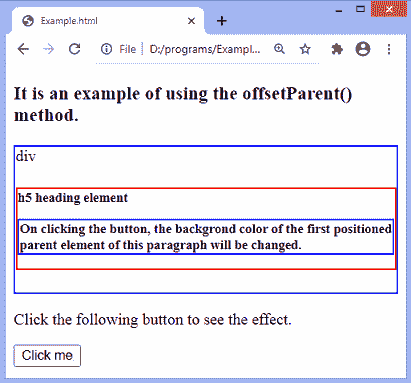
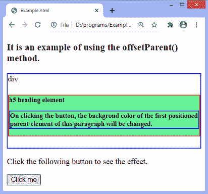

# jQuery offsetParent()方法

> 原文：<https://www.javatpoint.com/jquery-offsetparent-method>

jQuery 中的 **offsetParent()** 方法用于返回位置最近的祖先元素。可以使用 [jQuery](https://www.javatpoint.com/jquery-tutorial) 或通过使用 [CSS 位置](https://www.javatpoint.com/css-position)属性(绝对、相对或固定)来定位元素。

### 句法

```js

$(selector).offsetParent()

```

**offsetParent()** 方法不接受任何参数。

让我们看一个插图来理解 **offsetParent()** 方法的工作原理。

### 例子

这是使用 **offsetParent()** 方法的一个简单示例。在这个例子中，有一个 div 元素包含一个相对定位的标题 **h5** 和一个[段落元素](https://www.javatpoint.com/html-paragraph)。我们使用 **offsetParent()** 方法获取 **p** 元素的第一个定位父元素。[标题](https://www.javatpoint.com/html-heading) **h5** 是 **p** 元素的第一个定位父元素。因此，点击给定的按钮，标题为 **h5、**的 **p、**的第一个定位父项的背景颜色将会改变。

```js

<!DOCTYPE html>
<html>
<head>
<script src = "https://ajax.googleapis.com/ajax/libs/jquery/3.5.1/jquery.min.js"> </script> 
<style>
div, #p1{
 border: 2px solid blue;
 }
h5{
border: 2px solid red;
position: relative;
}
</style>
<script>
$(document).ready(function(){
    $("button").click(function(){
        $("#p1").offsetParent().css( "background-color", "lightgreen" );
    });
});
</script>
</head>
<body>
<h3> It is an example of using the offsetParent() method. </h3>
<div> div
<h5> h5 heading element
<p id = "p1"> On clicking the button, the background color of the first positioned parent element of this paragraph will be changed. </p>
</h5>
</div>
<p> Click the following button to see the effect. </p>
<button> Click me </button>
</body>
</html>

```

[Test it Now](https://www.javatpoint.com/oprweb/test.jsp?filename=jquery-offsetparent-method1)

**输出**

执行上述代码后，输出将是-



点击给定按钮后，输出将是-



* * *