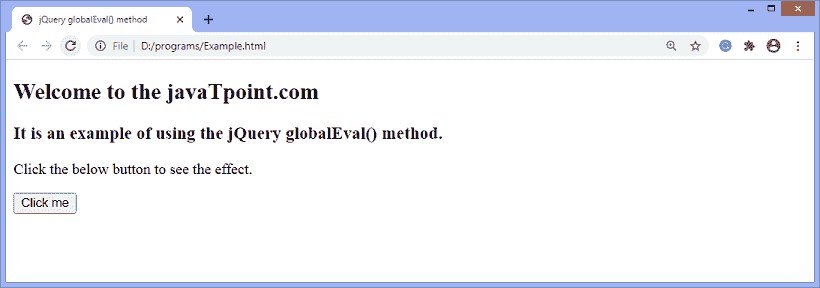
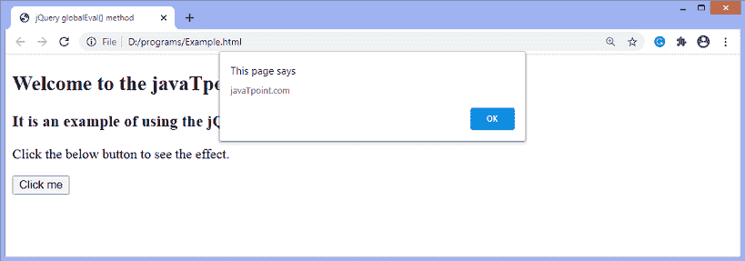

# jQuery globalEval()方法

> 原文：<https://www.javatpoint.com/jquery-globaleval-method>

[jQuery](https://www.javatpoint.com/jquery-tutorial) 中的 **globalEval()** 方法用于全局执行一些 JavaScript 代码。该方法不同于 JavaScript 的 **eval()** 方法，因为 **globalEval()** 方法在全局上下文中执行。

### 句法

使用 **globalEval()** 方法的常用语法如下-

```

jQuery.globalEval( code [, options ] [, doc ]

```

该方法接受如下定义的一些参数-

**代码:**可选指定要执行的部分 [JavaScript](https://www.javatpoint.com/javascript-tutorial) 代码。它是字符串类型。

**选项:**为**平原对象**类型。

**现时:**为**弦**型。这是传递给已执行脚本的**现时**属性。

**单据:**是**单据**类型。它是一个文档，在这个文档中代码将被评估。

现在，让我们看一个插图来理解 **globalEval()** 方法的使用。

### 例子

这是使用 **globalEval()** 方法的一个简单示例。在本例中，我们使用**全局评估()**方法在全局上下文中执行脚本。

```

<!DOCTYPE html>
<html>
<head>
<title> jQuery globalEval() method </title>
<script src = "https://ajax.googleapis.com/ajax/libs/jquery/3.5.1/jquery.min.js"> </script>

</head>
<body>
<h2> Welcome to the javaTpoint.com </h2>
<h3> It is an example of using the jQuery globalEval() method. </h3>
<p> Click the below button to see the effect. </p>
<button> Click me </button>
<script>
$(document).ready(function(){
$("button").click(function(){
function fun() {
jQuery.globalEval( "var a = 'javaTpoint.com'" );
alert(a);
}
fun();
});
});
</script>
</body>
</html>

```

[Test it Now](https://www.javatpoint.com/oprweb/test.jsp?filename=jquery-globaleval-method1)

**输出**

执行上述代码后，输出将是-



点击给定按钮后，输出将是-



* * *