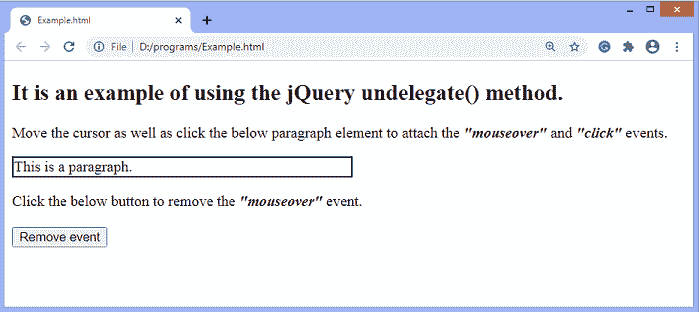

# jQuery undelegate()方法

> 原文：<https://www.javatpoint.com/jquery-undelegate-method>

jQuery 中的 **undelegate()** 方法用于移除使用 jQuery **delegate()** 方法附加的事件处理程序。此方法在[jQuery](https://www.javatpoint.com/jquery-tutorial)3.0 版中被否决。

### 句法

```

$(selector).undelegate(selector, event, function)

```

此方法接受三个可选参数，描述如下-

**选择器:**可选参数。它指定应该从中移除事件处理程序的选择器。

**事件:**为可选参数。此参数指定要从选定元素中移除的一个或多个事件。如果我们必须指定多个事件，事件值必须用空格隔开。

**功能:**也是可选参数。它指定要移除的特定事件处理函数。

如果在没有参数的情况下调用 **undelegate()** 方法，该方法将移除附加到元素的所有处理程序。如果我们必须移除特定的事件处理程序，我们可以提供事件名称、选择器和处理程序函数名称的组合。

现在，让我们看一些插图来理解**undelete()**方法的使用。

### 示例 1

这是使用**取消删除()**方法的一个简单示例。这里，我们使用的是可选参数 ***[事件](https://www.javatpoint.com/jquery-events)*** 的 undelegate()方法。因此，该方法将移除传递给它的相应事件。在这个例子中，有两个 **h3** [标题元素](https://www.javatpoint.com/html-heading)和一个按钮。当用户将文本为 ***【悬停我】*** 的 **h3** 元素悬停时， **delegate()** 方法将把**鼠标悬停在**事件上附加到相应的元素上。单击给定的按钮，附加的事件将被删除。

我们可以通过首先悬停一个 **h3** 元素，然后在悬停另一个 **h3** 元素之前单击按钮来检查**取消删除()**方法的工作情况。悬停在一个 h3 标题上时，相应元素的样式会发生变化，当我们单击给定的按钮时，悬停不会影响另一个 h3 元素。

```

<!DOCTYPE html>
<html>
<head>
<script src = "https://ajax.googleapis.com/ajax/libs/jquery/3.5.1/jquery.min.js"> </script>
<script>
   $(document).ready(function(){
   $("body").delegate("h3", "mouseover", function(){
	   $(this).css({"background-color": "pink", "font-size": "25px"});
      });
      $("button").click(function(){
         $("body").undelegate("mouseover");
      });
   });
</script>
</head>
<body>
<h2> It is an example of using the jQuery undelegate() method. </h2>
<p> Move the cursor over the text <b> <i> "Hover me" </i> </b> to attach the mouseover event. </p>
<h3> Hover me </h3>
<button> Remove event </button>
<h3> Hover me </h3>
</body>
</html>

```

[Test it Now](https://www.javatpoint.com/oprweb/test.jsp?filename=jquery-undelegate-method1)

**输出**

执行上述代码后，输出将是-


在第一个 **h3** 元素上移动光标，输出将是-


单击给定按钮后，当我们将另一个 **h3** 元素悬停时，不会发生任何事情，因为事件已被移除。

### 示例 2

这是使用**取消删除()**方法的另一个示例。在这个例子中，我们使用 **undelegate()** 方法，一旦事件被触发了一定的次数，就移除一个事件处理程序。这里有一个标题 h3(正文 ***【点击我】*** )，大小只能增加三倍。因为**取消删除()**功能一旦被触发三次，就会移除其 [**点击**事件](https://www.javatpoint.com/jquery-click)。每点击一次，标题的大小就会增加 **10px** 。

```

<!DOCTYPE html>
<html>
<head>
<script src = "https://ajax.googleapis.com/ajax/libs/jquery/3.5.1/jquery.min.js"> </script>
<script>
$(document).ready(function(){
var i = 0, j = 1;
$("h3").click(function(e){
$("h3").animate({fontSize: "+=10px"}).text(j + " times");
i++;
j++;
if (i >= 3) {
$(this).undelegate(e);
}
});
});
</script>
</head>
<body>
<h2> It is an example of using the jQuery undelegate() method. </h2>
<p> The style of the following heading can only be changed thrice. </p>
<p> Click the follwing text to see the effect. </p>
<h3 style = "border: 2px solid black"> Click me </h3>
</body>
</html>

```

[Test it Now](https://www.javatpoint.com/oprweb/test.jsp?filename=jquery-undelegate-method2)

**输出**

执行上述代码后，输出将是-


标题 **h3** 带文字 ***点击我*** 只能点击三次。点击文本 ***三次*** 后，输出会是-


### 示例 3

在本例中，我们使用了**undelete()**方法的所有可选参数。这里有两个功能命名为**字体()**和**大小()**，一个是增加字体大小，另一个是增加宽度和高度。当用户将鼠标悬停在加边框的文本上时， [**鼠标悬停在**](https://www.javatpoint.com/jquery-mouseover) 事件上，大小()函数将被附加到其上，单击加边框的文本时，**单击**事件，字体()函数将被附加到其上。

这里，我们使用**取消删除()**功能仅从带边框的文本中移除**鼠标悬停**事件和**大小()**功能。所以，点击按钮后，悬停不会影响带边框的文字，但用户还是点击它来增加其字体大小。

```

<!DOCTYPE html>
<html>
<head>
<script src = "https://ajax.googleapis.com/ajax/libs/jquery/3.5.1/jquery.min.js"> </script>
<script>
function font() {
$(this).animate({fontSize: "+=5px"});
}
function size() {
$(this).animate({width: "+=20px"});
$(this).animate({height: "+=20px"});
}
$(document).ready(function(){
  $("body").delegate("p", "click", font);
  $("body").delegate("p", "mouseover", size);
  $("button").click(function(){
    $("body").undelegate("p", "mouseover", size);
  });
});
</script></head>
<body>
<h2> It is an example of using the jQuery undelegate() method. </h2>
<span> Move the cursor as well as click the below paragraph element to attach the <b> <i> "mouseover" </b> </i> and  <b> <i> "click" </b> </i> events. </span>
<p style = "border:2px solid black; width: 50%;"> This is a paragraph. </p>
<span> Click the below button to remove the <b> <i> "mouseover" </b> </i> event. </span> </br></br>
<button> Remove event </button>
</body>
</html>

```

[Test it Now](https://www.javatpoint.com/oprweb/test.jsp?filename=jquery-undelegate-method3)

**输出**



在悬停和单击带边框的文本时，输出将是-


点击给定按钮后，悬停不会影响加边框的文字，但我们仍然可以点击它来增加字体大小。

* * *