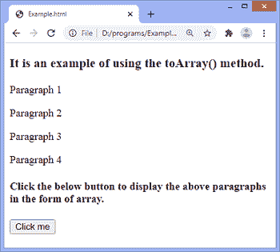
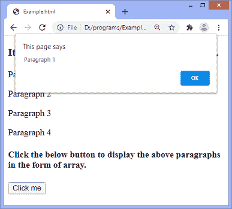

# jQuery toArray()方法

> 原文：<https://www.javatpoint.com/jquery-toarray-method>

**toArray()** 方法用于返回作为数组的 [jQuery](https://www.javatpoint.com/jquery-tutorial) 集合中包含的所有元素。

### 句法

```js

$(selector).toArray()

```

此方法不接受任何参数。

我们可以通过一个例子来理解 **toArray()** 方法的用法。

### 例子

在本例中，我们使用 **toArray()** 方法将段落转换为数组。点击给定按钮后，[段落元素](https://www.javatpoint.com/html-paragraph)将被转换为一个数组，并显示一个警告框，显示段落元素的内部 HTML。

```js

<!DOCTYPE html>
<html>
<head>
<script src = "https://ajax.googleapis.com/ajax/libs/jquery/3.5.1/jquery.min.js"> </script>
<script>
$(document).ready(function(){
  $("button").click(function(){
    var i;
    var x = $("p").toArray();
    for (i = 0; i< x.length; i++) {
      alert(x[i].innerHTML);
    }
  });
});
</script>
</head>
<body>
<h3> It is an example of using the toArray() method. </h3>

<p> Paragraph 1  </p>
<p> Paragraph 2  </p>
<p> Paragraph 3  </p>
<p> Paragraph 4  </p>

<h4> Click the below button to display the above paragraphs in the form of array. </h4>
<button> Click me </button>
<span></span>
</body>
</html>

```

[Test it Now](https://www.javatpoint.com/oprweb/test.jsp?filename=jquery-toarray-method1)

**输出**



点击给定按钮后，将显示一个警告框，如下图所示。



同样，点击提醒框中的**确定**按钮，将显示另外三个提醒框。这是因为程序中有四个段落元素。

* * *