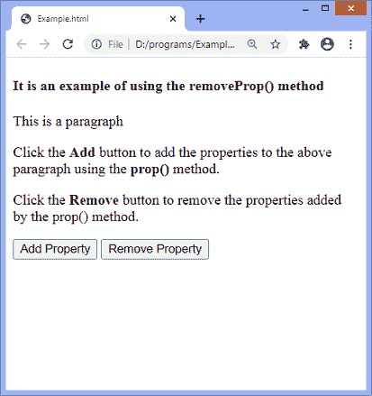
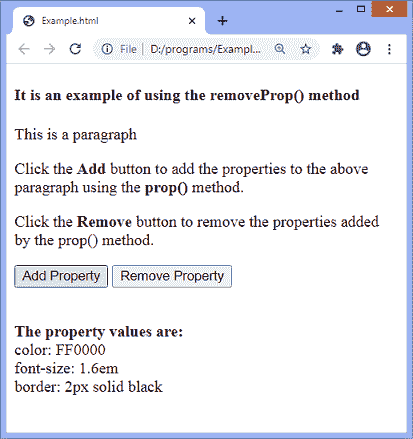
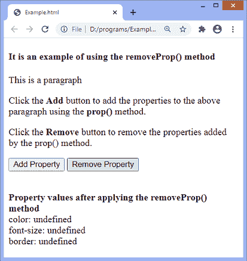

# jQuery removeProp()方法

> 原文：<https://www.javatpoint.com/jquery-removeprop-method>

**removeProp()** 方法用于移除 **prop()** 方法添加的属性。它是 jQuery 中的一个内置方法。 [jQuery](https://www.javatpoint.com/jquery-tutorial) 中的 **prop()** 方法向所选元素添加属性。

不应使用 **removeProp()** 方法移除 [HTML 属性](https://www.javatpoint.com/html-attributes)，如 id、类等。要删除这样的属性，我们可以使用 **removeAttr()** 方法。

### 句法

```

$(selector).removeProp(property)

```

此方法接受单个参数，定义如下-

**属性:**为必选项。它指定需要移除的属性名。

让我们看一个插图来理解 **removeProp()** 方法的工作原理。

### 例子

这是使用 **removeProp()** 方法的一个简单示例。在这个例子中，有一个段落元素带有 **id = "p1"** 。还有两个名为**的按钮添加属性**和**移除属性**。当用户点击**添加属性**按钮时，属性将被添加到带有 **id = "p1 "的段落中。**而点击**移除属性**按钮后，**移除道具()**方法将触发并移除使用 [**道具()**方法](https://www.javatpoint.com/jquery-prop)添加的属性。

```

<!DOCTYPE html>
<html>
<head>
<script src = "https://ajax.googleapis.com/ajax/libs/jquery/3.5.1/jquery.min.js"> </script>

<script>
$(document).ready(function(){
$("#btn1").click(function(){
var $x = $("#p1");
var $y = $("#p2");
    $x.prop("color", "FF0000");
	$x.prop("font-size", "1.6em");
	$x.prop("border", "2px solid black");
	$y.html(" </br> <b> The property values are: </b> </br> color: " + $x.prop("color") + " </br> font-size: " + $x.prop("font-size") + " </br> border: " + $x.prop("border"));
	});
  $("#btn2").click(function(){
  var $x = $("#p1");
    var $y = $("#p2");    
	 $x.removeProp("color");
	  $x.removeProp("font-size");
	   $x.removeProp("border");
    $y.html(" </br> <b> Property values after applying the removeProp() method </b> </br> color: " + $x.prop("color") + " </br> font-size: " + $x.prop("font-size") + " </br> border: " + $x.prop("border"));
  });
});
</script>
</head>
<body>
<h4> It is an example of using the removeProp() method </h4>
<p id = "p1"> This is a paragraph </p>
<p> Click the <b> Add </b> button to add the properties to the above paragraph using the <b> prop() </b> method. </p>
<p> Click the <b> Remove </b> button to remove the properties added by the prop() method. </p>
<button id = "btn1"> Add Property </button>
<button id = "btn2"> Remove Property </button>
<p id = "p2"> </p>
</body>
</html>

```

[Test it Now](https://www.javatpoint.com/oprweb/test.jsp?filename=jquery-removeprop-method1)

**输出**



点击给定的**添加**按钮后，输出将为-



点击给定的**移除**按钮后，输出将为-



* * *