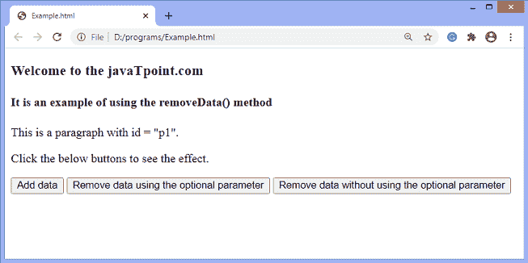
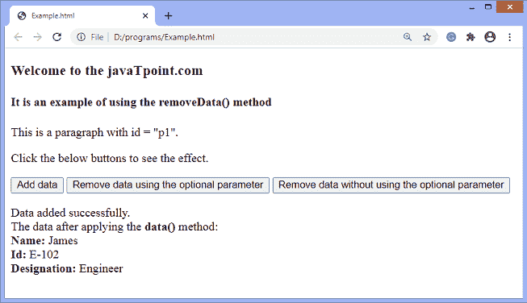
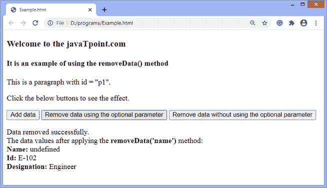
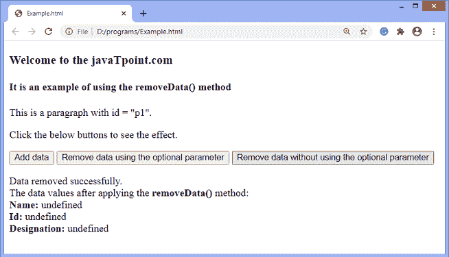

# jQuery removeData()方法

> 原文:[https://www.javatpoint.com/jquery-removedata-method](https://www.javatpoint.com/jquery-removedata-method)

**removeData()** 方法用于移除之前使用 **data()** 方法的数据集。这是 [jQuery](https://www.javatpoint.com/jquery-tutorial) 中的一个内置方法。**数据()**方法用于附加和获取所选元素的数据。

### 句法

```

$(selector).removeData(name)

```

以上语法中的 ***选择器*** 是要删除其数据的所选元素。**删除数据()**接受一个可选参数，定义如下-

**名称:**是需要删除的数据名称。这是一个可选参数。此参数用于移除特定值。如果未指定，则**移除数据()**方法将移除与所选元素相关联的所有存储数据。

让我们看一个插图来理解 **removeData()** 方法的工作原理。

### 示例 1

这是使用 **removeData()** 方法的一个示例。在本例中，我们移除由 **data()** 方法添加的数据，使用或不使用 **removeData()** 方法的可选值。

这里有一个 **id = "p1"** 的段落元素。还有三个按钮可以添加或删除数据。当用户点击**第一个**按钮时，数据将被添加到带有 **id = "p1 "的段落中。**点击**第二个**按钮， **removeData()** 方法将触发并删除使用 [**data()** 方法](https://www.javatpoint.com/jquery-data-method)添加的具体数据**“名称”**。单击第三个按钮，该方法将移除与所选元素相关联的所有存储数据。

```

<!DOCTYPE html>
<html>
<head>
<script src = "https://ajax.googleapis.com/ajax/libs/jquery/3.5.1/jquery.min.js"> </script>

<script>
$(document).ready(function(){
$("#btn1").click(function(){
$("#p1").data("name", "James"); 
$("#p1").data("id", "E-102"); 
$("#p1").data("designation", "Engineer"); 
$("#p2").html("Data added successfully. </br> The data after applying the <b> data() </b> method: </br> <b> Name: </b> " + $("#p1").data("name") + " </br> <b> Id: </b> " + $("#p1").data("id") + " </br> <b> Designation: </b> " + $("#p1").data("designation")); 
	});
  $("#btn2").click(function(){
 $("#p1").removeData("name"); 
$("#p2").html("Data removed successfully. </br> The data values after applying the <b> removeData('name') </b> method: </br> <b> Name: </b> " + $("#p1").data("name") + " </br> <b> Id: </b> " + $("#p1").data("id") + " </br> <b> Designation: </b> " + $("#p1").data("designation"));  
});
$("#btn3").click(function(){
 $("#p1").removeData(); 
$("#p2").html("Data removed successfully. </br> The data values after applying the <b> removeData() </b> method: </br> <b> Name: </b> " + $("#p1").data("name") + " </br> <b> Id: </b> " + $("#p1").data("id") + " </br> <b> Designation: </b> " + $("#p1").data("designation"));   
});
});
</script>
</head>
<body>
<h3> Welcome to the javaTpoint.com </h3>
<h4> It is an example of using the removeData() method </h4>
<p id = "p1"> This is a paragraph with id = "p1". </p>
<p> Click the below buttons to see the effect. </p>
<button id = "btn1"> Add data </button>
<button id = "btn2"> Remove data using the optional parameter </button>
<button id = "btn3"> Remove data without using the optional parameter </button>
<p id = "p2"> </p>
</body>
</html>

```

[Test it Now](https://www.javatpoint.com/oprweb/test.jsp?filename=jquery-removedata-method1)

**输出**



点击**添加数据**按钮后，输出为-



点击**“使用可选参数**删除数据”按钮后，输出将为-



点击**“不使用可选参数移除数据”**按钮后，输出将为-



* * *