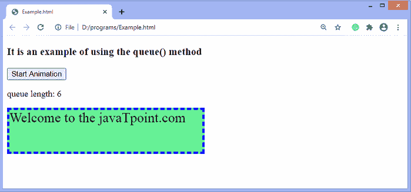

# jQuery 队列()方法

> 原文：<https://www.javatpoint.com/jquery-queue-method>

jQuery 中的 **queue()** 方法用于显示所选元素等待执行的函数队列。它是 jQuery 中的一个内置函数。可以有一个或多个函数可以等待执行。我们可以使用**队列()**方法和**出列()**方法。

一个元素可以有多个队列。但是总是有一个默认的 [jQuery](https://www.javatpoint.com/jquery-tutorial) 队列，那就是**“FX”**队列。

### 句法

使用**队列()**方法的常用语法如下-

```js

$(selector).queue(queueName)

```

上面语法中提到的 ***queueName*** 是 **queue()** 方法的可选参数，指定队列的名称。如果省略，默认值**“FX”**假定为**、**，即标准效果队列。

现在，让我们看一个插图来理解**队列()**方法的概念。

### 例子

这是使用 **queue()** 方法的一个简单示例。这里，有一个 div 元素，当点击给定的按钮时开始制作动画。单击给定的按钮，将显示队列的长度。我们正在循环队列，因此长度会相应改变。

```js

<!DOCTYPE html>
<html>
<head>
<script src = "https://ajax.googleapis.com/ajax/libs/jquery/3.5.1/jquery.min.js"></script>
<script>
$(document).ready(function(){
  $("button").click(function(){
    var div = $("div");
    begin();
    show();

    function begin(){
$("div").animate({height: 100}, "slow").text("Welcome to the javaTpoint.com");
$("div").animate({width: 250 }, "slow");
$("div").animate({height: 50 }, "slow");
$("div").animate({width: 150 }, "slow");
$("div").animate({height: 75 }, "slow");
$("div").animate({width: 350 }, "slow", begin);

    }

    function show(){
      var i = div.queue();
      $("span").text(i.length);   
      setTimeout(show);
    }
  });
});
</script>
<style>
div {
background: lightgreen;
border: 4px dashed blue;
font-size: 25px;
height: 60px;
width: 60px;
margin-top: 15px;
}

</style>
</head>
<body>
<h3> It is an example of using the queue() method </h3>  
<button> Start Animation </button>

<p> queue length: <span> </span> </p>

<div> </div>

</body>
</html>

```

[Test it Now](https://www.javatpoint.com/oprweb/test.jsp?filename=jquery-queue-method1)

**输出**

执行上述代码后，我们将看到以下输出-


点击给定按钮，动画将开始，队列长度将显示如下-



* * *