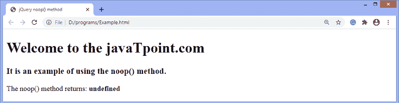

# jQuery noop()方法

> 原文：<https://www.javatpoint.com/jquery-noop-method>

**noop()** 功能是 [jQuery](https://www.javatpoint.com/jquery-tutorial) 中的一个空功能。它不接受任何参数。当我们必须传递一个什么都不做的函数时，我们可以使用这个函数。此方法返回 undefined。

我们可以使用 **noop()** 函数作为单个空函数，而不是声明多个匿名函数。

### 句法

使用 **noop()** 函数的常用语法如下-

```js

jQuery.noop()

```

它不接受任何论点。

现在，让我们看一个使用 **noop()** 方法的例子。

### **例**

这是使用 **noop()** 方法的一个简单示例。这里，我们将 **noop()** 方法返回的值存储在一个变量中，并使用 innerHTML 打印该变量。

```js

<!DOCTYPE html> 
<html> 

<head> 
	<title> jQuery noop() method </title> 
	<script src = "https://ajax.googleapis.com/ajax/libs/jquery/3.5.1/jquery.min.js"> </script> 
</head> 
<body> 
	<h1> Welcome to the javaTpoint.com </h1> 
	<h3> It is an example of using the noop() method. </h3> 
   <p id = "p1"> The noop() method returns: <b id = "b1"> </b> </p> 

    <script> 
	$("document").ready(function(){
      var a = jQuery.noop(); 
      document.getElementById("b1").innerHTML = a; 
	  });
    </script> 
</body> 
</html>

```

[Test it Now](https://www.javatpoint.com/oprweb/test.jsp?filename=jquery-noop-method1)

**输出**

执行上述代码后，输出将是-



* * *