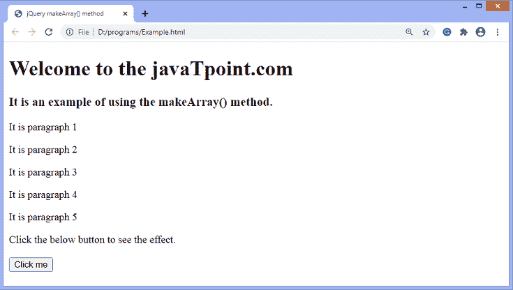
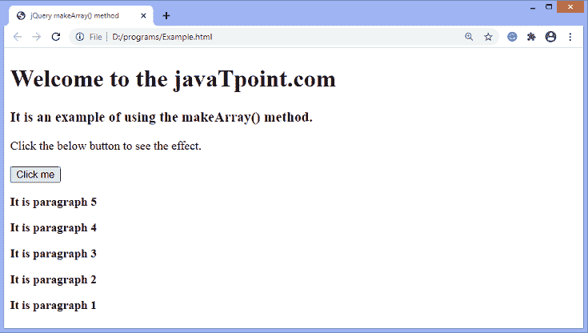
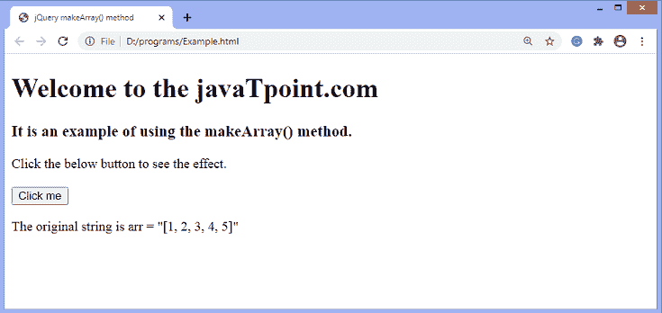
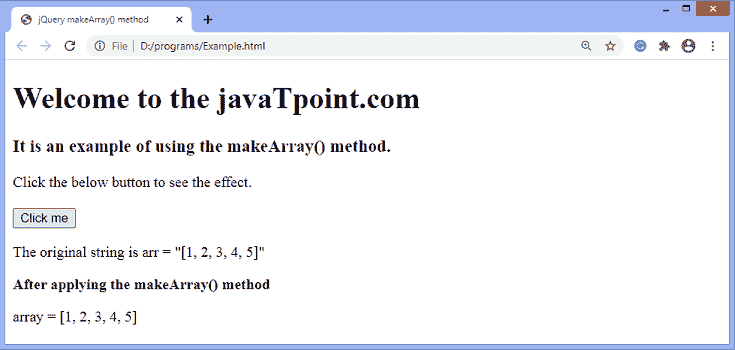

# jQuery makeArray()方法

> 原文：<https://www.javatpoint.com/jquery-makearray-method>

顾名思义， **makeArray()** 方法是将一个类似数组的对象转换成真正的 JavaScript 数组。它返回数组。

### 句法

```js

jQuery.makeArray( obj )

```

此方法接受单个参数，定义如下-

**obj -** 它是任何要变成原生数组的对象。

让我们通过一些插图来了解**makerearray()**方法的工作原理。

### 示例 1

在这个例子中，我们使用 **makeArray()** 方法将一组 [HTML](https://www.javatpoint.com/html-tutorial) 元素变成一个项目数组。我们可以使用 **isArray()** 方法来检查元素是否转换为数组。如果 **isArray()** 方法返回 true，则元素转换为数组，否则不转换。

我们也可以使用 [jQuery](https://www.javatpoint.com/jquery-tutorial) **type()** 方法来检查变量 **arr** 的类型。

```js

<!DOCTYPE html>
<html>

<head>
<title> jQuery makeArray() method </title>
<script src = "https://ajax.googleapis.com/ajax/libs/jquery/3.5.1/jquery.min.js"> </script>
</head>

<body>

<h1> Welcome to the javaTpoint.com </h1>

<h3> It is an example of using the makeArray() method. </h3>
<p> It is paragraph 1 </p>
<p> It is paragraph 2 </p>
<p> It is paragraph 3 </p>
<p> It is paragraph 4 </p>
<p> It is paragraph 5 </p>
<span> Click the below button to see the effect. </span>
</br>
</br>
<button> Click me </button>
<b> </b>

<script>
$("document").ready(function(){
$("button").click(function(){
var arr = $.makeArray($("p"));
arr.reverse();
$("b").append(arr);
});
});
</script>
</body>

</html>

```

[Test it Now](https://www.javatpoint.com/oprweb/test.jsp?filename=jquery-makearray-method1)

**输出**

执行上述代码后，输出将是-



点击给定按钮后，输出将是-



### 示例 2

这里，我们使用 **makeArray()** 方法将一个类似数组的字符串 ***arr*** 转换成一个数组。转换结果将存储在变量 ***arr1*** 中。因此，我们也使用 **jQuery.type()** 方法来检查变量 **arr1** 的类型。

在输出中，我们可以看到变量 **arr1** 的类型被写成一个**数组**，字符串的值也被转换成一个数组。

```js

<!DOCTYPE html>
<html>

<head>
<title> jQuery makeArray() method </title>
<script src = "https://ajax.googleapis.com/ajax/libs/jquery/3.5.1/jquery.min.js"> </script>
</head>

<body>

<h1> Welcome to the javaTpoint.com </h1>
<h3> It is an example of using the makeArray() method. </h3>
<span> Click the below button to see the effect. </span>
</br>
</br>
<button> Click me </button>
<p id = "p1"> The original string is arr = "[1, 2, 3, 4, 5]" </p>
<b> </b>
<p id = "p2"> </p>
<script>
$("document").ready(function(){
$("button").click(function(){
var arr = "[1, 2, 3, 4, 5]";
$("b").append(" After applying the makeArray() method ");
var newArr = jQuery.makeArray(arr);
$("#p2").append(jQuery.type(newArr) + " = " + newArr);
});
});
</script>
</body>

</html>

```

[Test it Now](https://www.javatpoint.com/oprweb/test.jsp?filename=jquery-makearray-method2)

**输出**

执行上述代码后，输出将是-



点击给定按钮后，输出将是-



* * *