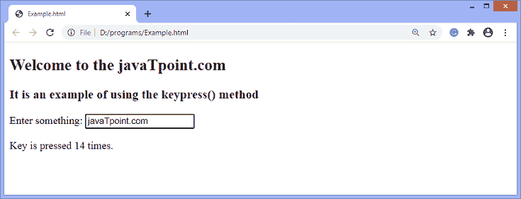

# jQuery keypress()方法

> 原文：<https://www.javatpoint.com/jquery-keypress-method>

[jQuery](https://www.javatpoint.com/jquery-tutorial) 中的**按键()**方法用于触发**按键**事件，或者在键盘的某个按键被按下时，即发生**按键**事件时附加要执行的功能。此方法可用于检查是否按下了任何键盘键。

该方法不考虑 **Ctrl、Alt、Shift、Esc** 等键盘按钮。我们可以使用**向下键()**方法来检查这些键。**按键**事件类似于**按键**事件。

### 句法

**按键()**方法在使用或不使用任何参数的情况下使用。使用**按键()**方法的语法如下-

**触发按键事件**

```

$(selector).keypress()

```

**当按键事件发生时附加要执行的功能**

```

$(selector).keypress(function)

```

上述语法中提到的 ***功能*** 是可选参数。它指定按键事件触发时执行的函数。

让我们通过一些插图来了解**按键()**方法的工作原理。

### 示例 1

在本例中，我们使用**按键()**方法来计算用户在给定文本字段中输入的次数。这里，有一个文本字段需要一些输入。当用户在文本字段中写东西时，每次输入都会被计数。

这里，我们使用的是**按键()**方法的可选参数。因此，该方法将在按键时触发处理程序。除了一些特殊的按键，如 **Shift、Delete、Esc、**等，它可以在所有键盘按键上工作。

```

<!DOCTYPE html>
<html>
<head>
<script src = "https://ajax.googleapis.com/ajax/libs/jquery/3.5.1/jquery.min.js"> </script>
<script>
var x = 0;
$(document).ready(function(){
  $("input").keypress(function(){
    $("span").text(x += 1);
  });
});
</script>
</head>
<body>
<h2> Welcome to the javaTpoint.com </h2>
<h3> It is an example of using the keypress() method </h3>

Enter something: <input type = "text">

<p> Key is pressed <span> 0 </span> times. </p>

</body>
</html>

```

[Test it Now](https://www.javatpoint.com/oprweb/test.jsp?filename=jquery-keypress-method1)

**输出**

执行上述代码后，输出将是-


在给定的文本字段中写入内容后，输出将是-



### 示例 2

在本例中，我们使用带有处理程序参数的**按键()**事件来检测按键事件。一旦按键，方法将触发处理程序。当用户单击键盘上的某个键时，将显示一个警告框，显示一条消息。

虽然该方法会触发除 **Ctrl、Shift、Esc、**等特殊或非打印键以外的所有键的处理程序。

如果我们使用**键下()**方法，而不是使用**键下()**方法，处理程序将触发键盘的所有键，包括特殊或非打印键。

```

<!DOCTYPE html>
<html>
<head>
<script src = "https://ajax.googleapis.com/ajax/libs/jquery/3.5.1/jquery.min.js"> </script>
<script>
var x = 0;
$(document).keypress(function(){
    alert(" A key is pressed from a keyboard ");
});
</script>
</head>
<body>
<h2> Welcome to the javaTpoint.com </h2>
<h3> It is an example of using the keypress() method </h3>
<p> Click any key from your keyboard </p>

</body>
</html>

```

[Test it Now](https://www.javatpoint.com/oprweb/test.jsp?filename=jquery-keypress-method2)

**输出**

执行上述代码后，输出将是-


从键盘上按下一个键后，输出将是-


### 示例 3

这是使用**按键()**方法的另一个例子。它类似于上面的例子，除了这里的警告框将显示从键盘上按下了哪个键。

在本例中，我们使用**按键()**方法来检测从键盘上按下了哪个键。该方法将触发除某些特殊键或不可打印键之外的所有键盘键的处理程序。

```

<!DOCTYPE html>
<html>
<head>
<script src = "https://ajax.googleapis.com/ajax/libs/jquery/3.5.1/jquery.min.js"> </script>
<script> 
$(document).keypress(function(e){ 
    var k = e.keyCode; 
    var ch = String.fromCharCode(k); 
        alert('The pressed key is: ' + ch);     
}); 
</script> 
</head>
<body>
<h2> Welcome to the javaTpoint.com </h2>
<h3> It is an example of using the keypress() method </h3>
<p> Click any key from your keyboard </p>

</body>
</html>

```

[Test it Now](https://www.javatpoint.com/oprweb/test.jsp?filename=jquery-keypress-method3)

**输出**

执行上述代码后，输出将是-


从键盘上按下一个键后，输出将是-


与上面的截图类似，除了一些特殊的键，每个键都会显示警告框。

* * *