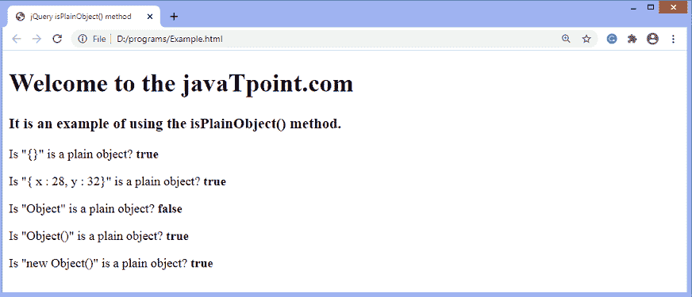

# jQuery isPlainObject()方法

> 原文：<https://www.javatpoint.com/jquery-isplainobject-method>

**IsLainObject()**方法返回一个布尔值，并确定传递的参数是否是普通对象。如果发现传递的值是普通对象，则返回 ***真*** 。否则返回 ***假*** 。使用**“{ }”**或使用**“新对象”**创建普通对象。因此，对于使用**“{ }”**或使用**“新对象()”**创建的对象，**isplaynobject()**方法返回 ***true*** 。

### 句法

该方法的常用语法如下-

```

jQuery.isPlainObject( obj )

```

此方法接受单个参数，定义如下-

**obj -** 是要检查的对象，看是否是普通对象。

让我们用一个例子来理解**isplaynobject()**方法的工作原理。

### 例子

在这个例子中，我们使用**isplaynobject()**方法来确定传递的值是否是普通对象。在这里，我们传递不同的值，如 **{}、对象、**等。作为论据。

```

<!DOCTYPE html>
<html>

<head>
<title> jQuery isPlainObject() method </title>
<script src = "https://ajax.googleapis.com/ajax/libs/jquery/3.5.1/jquery.min.js"> </script>
</head>
<body>
<h1> Welcome to the javaTpoint.com </h1>
<h3> It is an example of using the isPlainObject() method. </h3>
<p> Is "{}" is a plain object? <b id = "b1"> </b> </p>
<p> Is "{ x : 28, y : 32}" is a plain object? <b id = "b2"> </b> </p>
<p> Is "Object" is a plain object? <b id = "b3"> </b> </p>
<p> Is "Object()" is a plain object? <b id = "b4"> </b> </p>
<p> Is "new Object()" is a plain object? <b id = "b5"> </b> </p>
<script>
var a = jQuery.isPlainObject({});
var b = jQuery.isPlainObject({ x : 28, y : 32 });
var c = jQuery.isPlainObject(Object);
var d = jQuery.isPlainObject(Object());
var e = jQuery.isPlainObject(new Object());

$( "#b1" ).text( a );
$( "#b2" ).text( b );
$( "#b3" ).text( c );
$( "#b4" ).text( d );
$( "#b5" ).text( e );
</script>
</body>

</html>

```

[Test it Now](https://www.javatpoint.com/oprweb/test.jsp?filename=jquery-isplainobject-method1)

**输出**

执行上述代码后，输出将是-



* * *