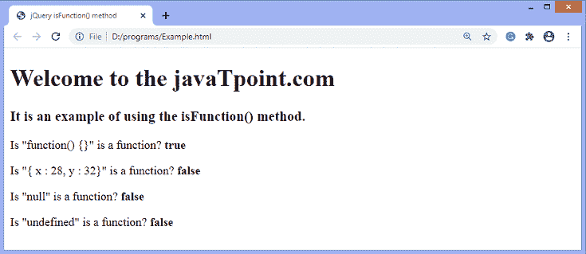

# jQuery isFunction()方法

> 原文:[https://www.javatpoint.com/jquery-isfunction-method](https://www.javatpoint.com/jquery-isfunction-method)

**isFunction()** 方法用于测试传递的参数是否为函数。此方法返回一个布尔值。如果发现传递的值是函数，则返回 ***真*** 。否则返回 ***假*** 。

### 句法

```

jQuery.isFunction( val )

```

此方法接受单个参数，定义如下-

**val -** 任意待测值。

让我们用一个例子来理解 **isFunction()** 方法的工作原理。

### 例子

在这个例子中，我们使用 **isFunction()** 方法来确定传递的值是否是函数。这里，我们传递不同的值，如**空值、未定义值、**等。，作为论据。

```

<!DOCTYPE html> 
<html> 

<head> 
	<title> jQuery isFunction() method </title> 
	<script src = "https://ajax.googleapis.com/ajax/libs/jquery/3.5.1/jquery.min.js"> </script> 
</head> 
<body> 
	<h1> Welcome to the javaTpoint.com </h1> 
	<h3> It is an example of using the isFunction() method. </h3> 
	<p> Is "function() {}" is a function? <b id = "b1"> </b> </p> 
	<p> Is "{ x : 28, y : 32}" is a function? <b id = "b2"> </b> </p> 
	<p> Is "null" is a function? <b id = "b3"> </b> </p> 
	<p> Is "undefined" is a function? <b id = "b4"> </b> </p> 	
	<script> 
		var a = jQuery.isFunction(function() {}); 
		var b = jQuery.isFunction({ x : 28, y : 32 }); 
		var c = jQuery.isFunction(null); 
		var d = jQuery.isFunction(undefined); 
		$( "#b1" ).text( a ); 
		$( "#b2" ).text( b ); 
		$( "#b3" ).text( c ); 
		$( "#b4" ).text( d ); 
	</script> 
</body> 
</html>

```

[Test it Now](https://www.javatpoint.com/oprweb/test.jsp?filename=jquery-isfunction-method1)

**输出**

执行上述代码后，输出将是-



* * *