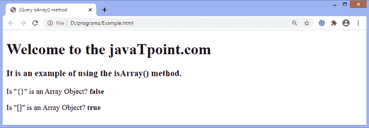
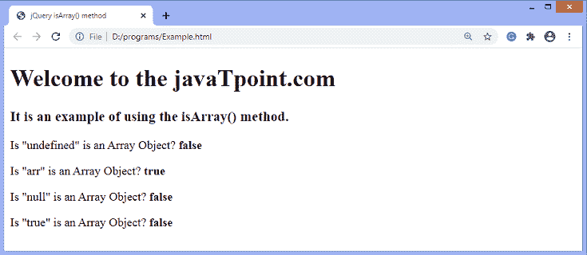

# jQuery isArray()方法

> 原文：<https://www.javatpoint.com/jquery-isarray-method>

**isArray()** 方法用于测试传递的参数是否为数组。此方法返回一个布尔值。如果发现传递的值是数组，则返回 ***真*** 。否则返回 ***假*** 。

### 句法

```

jQuery.isArray( obj )

```

此方法接受单个参数，定义如下-

**obj -** 是测试是否是数组的任意对象。

让我们通过一些插图来了解 **isArray()** 方法的工作原理。

### 示例 1

在这个例子中，我们使用 **isArray()** 方法来确定传递的参数是否是数组。这里我们传递花括号 **{}** ，方括号 **[]** 作为论证。

```

<!DOCTYPE html> 
<html> 

<head> 
	<title> jQuery isArray() method </title> 
	<script src = "https://ajax.googleapis.com/ajax/libs/jquery/3.5.1/jquery.min.js"> </script> 
</head> 

<body> 

	<h1> Welcome to the javaTpoint.com </h1> 
	<h3> It is an example of using the isArray() method. </h3> 
	<p> Is "{}" is an Array Object? <b id = "b1"> </b> </p> 
	<p> Is "[]" is an Array Object? <b id = "b2"> </b> </p> 
	<script> 
	$("document").ready(function(){
                $( "#b1" ).append( "" + $.isArray({})); 
				$( "#b2" ).append( "" + $.isArray([])); 
	});
	</script> 
</body> 

</html>

```

[Test it Now](https://www.javatpoint.com/oprweb/test.jsp?filename=jquery-isarray-method1)

**输出**

执行上述代码后，输出将是-



### 示例 2

在这个例子中，我们使用 **isArray()** 方法来检查不同的值，看看该方法返回的是 ***真*** 还是 ***假*** 。我们正在定义一个数组 **arr** ，对于该数组，该方法返回 ***【真】*** ，对于其他值如 **undefined，null，true** ，isArray()方法将返回 ***false。*T21】**

```

<!DOCTYPE html>
<html>

<head>
<title> jQuery isArray() method </title>
<script src = "https://ajax.googleapis.com/ajax/libs/jquery/3.5.1/jquery.min.js"> </script>
</head>

<body>

<h1> Welcome to the javaTpoint.com </h1>
<h3> It is an example of using the isArray() method. </h3>
<p> Is "undefined" is an Array Object? <b id = "b1"> </b> </p>
<p> Is "arr" is an Array Object? <b id = "b2"> </b> </p>
<p> Is "null" is an Array Object? <b id = "b3"> </b> </p>
<p> Is "true" is an Array Object? <b id = "b4"> </b> </p>
<script>
$("document").ready(function(){
var arr = new Array(1, 2, 3, 4, 5);
$( "#b1" ).append( "" + $.isArray(undefined));
$( "#b2" ).append( "" + $.isArray(arr)); // It will return true
$( "#b3" ).append( "" + $.isArray(null));
$( "#b4" ).append( "" + $.isArray(true));

});
</script>
</body>

</html>

```

[Test it Now](https://www.javatpoint.com/oprweb/test.jsp?filename=jquery-isarray-method2)

**输出**

执行上述代码后，输出将是-



* * *