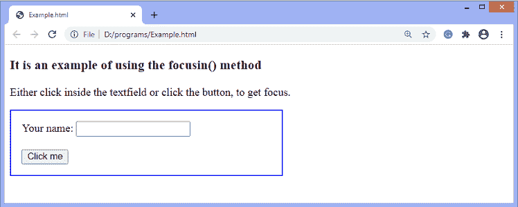
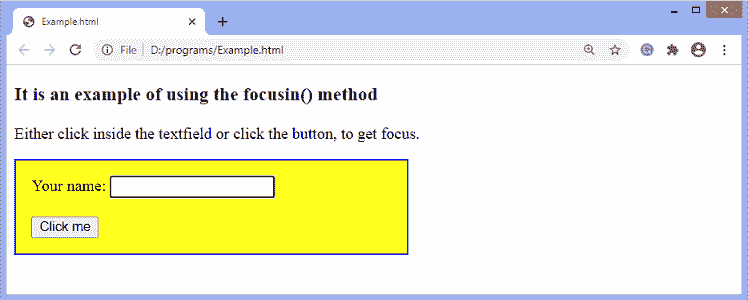

# jQuery focusin()方法

> 原文：<https://www.javatpoint.com/jquery-focusin-method>

**focusin()** 方法用于绑定一个函数，当一个元素或其中的任何元素获得焦点时，函数就会执行。当元素通过选项卡导航或鼠标单击被选中时，它会获得焦点。它不同于 **focus()** 方法，因为 **focusin()** 方法也会在元素的子元素获得焦点时触发。

**focusin()** 方法一般与 [**focusout()** 方法](jquery-focusout-method)一起使用。

### 句法

```js

$(selector).focusin(function)

```

此方法接受单个参数，定义如下-

**功能:**指定发生**焦点**事件时要执行的功能。

现在我们用一个例子来理解 **focusin()** 方法。

### 例子

在这个例子中，我们使用 **focusin()** 方法来改变 **div** 元素的样式，当它或它里面的任何元素获得焦点时。这里有一个 div 元素，包括一个 textfield 和一个按钮。当用户点击文本字段或按钮时，触发**聚焦**事件，div 元素的背景颜色将被改变。

如果我们使用 **focus()** 方法，而不是使用 **focusin()** 方法，那么点击[T5】div 元素](https://www.javatpoint.com/html-div-tag)内的元素不会发生任何事情。这是因为当元素的子元素获得焦点时， **focus()** 方法不会触发。

```js

<!DOCTYPE html>
<html>
<head>
<script src = "https://ajax.googleapis.com/ajax/libs/jquery/3.5.1/jquery.min.js"> </script>
<style>
div {
border: 2px solid blue;
padding: 15px;
width: 50%;
}
</style>
<script>
$(document).ready(function(){
  $("div").focusin(function(){
    $(this).css("background-color", "yellow");
  });

});
</script>
</head>
<body>
<h3> It is an example of using the focusin() method </h3>
<p> Either click inside the textfield or click the button, to get focus. </p>
<div>
  Your name: <input type = "text">
  </br> </br>
  <button> Click me </button>
</div>

</body>
</html>

```

[Test it Now](https://www.javatpoint.com/oprweb/test.jsp?filename=jquery-focusin-method1)

**输出**

执行上述代码后，我们将获得以下输出-



点击文本字段后，输出将是-



* * *