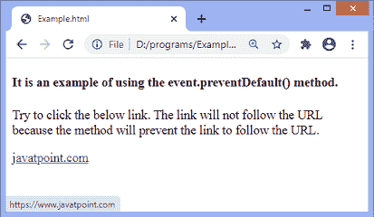
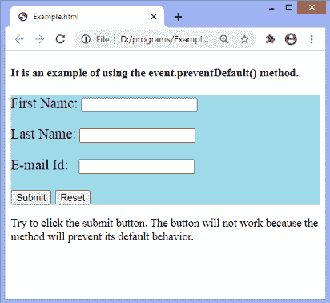

# jQuery event.preventDefault()方法

> 原文:[https://www . javatpoint . com/jquery-event-preventdefault-method](https://www.javatpoint.com/jquery-event-preventdefault-method)

顾名思义， **preventDefault()** 方法防止所选元素发生默认动作。举例来说，这种方法可以阻止提交按钮提交表单，或者可以防止锚点跟随[网址](https://www.javatpoint.com/url)。此方法不返回值。

### 句法

```

event.preventDefault()

```

**preventDefault()** 方法不接受任何参数。上述语法中提到的 ***事件*** 是必须指定的。

让我们用一些例子来理解这个方法。

### 示例 1

这是使用 **preventDefault()** 方法的一个简单示例。在本例中，我们使用 **event.preventDefault()** 方法来阻止主播跟随 [URL](https://www.javatpoint.com/url-full-form) 。当我们试图点击给定的网址时，链接将不起作用

```

<!DOCTYPE html>
<html>
<head>
<script src = "https://ajax.googleapis.com/ajax/libs/jquery/3.5.1/jquery.min.js"></script>
<script>
$(document).ready(function(){
  $("a").click(function(e){
    e.preventDefault();
  });
});
</script>
</head>
<body>

<h4> It is an example of using the event.preventDefault() method. </h4>
<p> Try to click the below link. The link will not follow the URL because the method will prevent the link to follow the URL. </p>

<a href = "https://www.javatpoint.com/"> javatpoint.com </a>

</body>
</html>

```

[Test it Now](https://www.javatpoint.com/oprweb/test.jsp?filename=jquery-event-preventdefault-method1)

**输出**

执行上述代码后，输出将是-



### 示例 2

这是使用 **event.preventDefault()** 方法的另一个简单示例。在这个例子中，我们使用方法来阻止提交按钮提交一个 [HTML 表单](https://www.javatpoint.com/html-form)。这里有一个包含一些文本字段和按钮的 [HTML](https://www.javatpoint.com/html-tutorial) 表单。有一个提交按钮，用于提交表单数据。但是当我们尝试单击提交按钮时，该按钮将不起作用。

```

<!DOCTYPE html>
<html>
<head>
<script src = "https://ajax.googleapis.com/ajax/libs/jquery/3.5.1/jquery.min.js"></script>
<script>
$(document).ready(function(){
  $("#s1").click(function(e){
    e.preventDefault();
  });
});
</script>
</head>
<body>

<h4> It is an example of using the event.preventDefault() method. </h4>
	<form id = "myForm" action = "#" style = "font-size: 20px;background: lightblue;" >
	<p> First Name: <input type = "text" id = "fname" /> </p>
	<p> Last Name: <input type = "text" id = "lname" /> </p>
	<p> E-mail Id:  <input type = "email"/> </p>
	<input type = "submit" id = "s1">
	<button type = "reset"> Reset </button>
	</form>
<p> Try to click the submit button. The button will not work because the method will prevent its default behavior. </p>

</body>
</html>

```

[Test it Now](https://www.javatpoint.com/oprweb/test.jsp?filename=jquery-event-preventdefault-method2)

**输出**

执行上述代码后，输出将是-



* * *