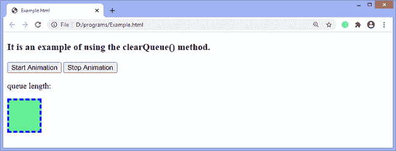
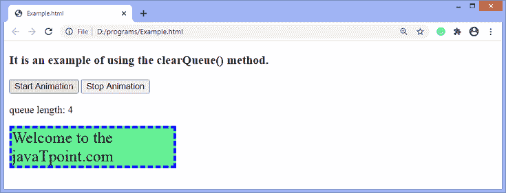
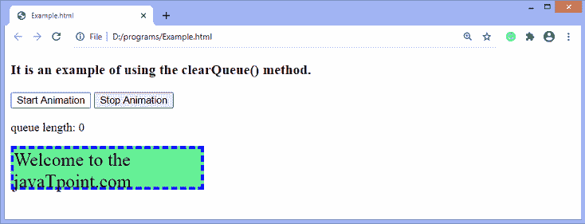

# jQuery clearQueue()方法

> 原文：<https://www.javatpoint.com/jquery-clearqueue-method>

顾名思义， **clearQueue()** 方法用于移除队列中所有尚未执行的项目。当一个函数开始执行时，它会一直运行到完成。

它不同于 [**stop()** 方法](https://www.javatpoint.com/jquery-stop-method)，因为 **stop()** 方法只对动画起作用，但是 **clearQueue()** 方法可以用来移除任何排队的函数。

### 句法

使用 **clearQueue()** 方法的常用语法如下-

```js

$(selector).clearQueue(queueName)

```

上面语法中提到的 ***queueName*** 是 **clearQueue()** 方法的可选参数，指定队列的名称。如果省略，则假设默认值**“FX”**，即标准效果队列。

因此，如果使用 **clearQueue()** 方法而没有任何参数，该方法将从 **fx** 中移除剩余的函数。

现在，让我们看一个插图来理解 **clearQueue()** 方法的概念。

### 例子

这是一个使用 **clearQueue()** 方法的简单例子。在这个例子中，我们使用了 **clearQueue()** 方法和[T5】queue()方法](jquery-queue-method)。这里有一个 div 元素和两个按钮。点击 ***开始动画*** 按钮 [div 元素](https://www.javatpoint.com/html-div-tag)开始动画，显示队列长度。我们正在循环队列，因此长度会相应改变。

点击 ***【停止动画】*** 按钮，动画停止，队列长度等于零。这是因为 **clearQueue()** 方法将删除队列中所有未执行的项目。

```js

<!DOCTYPE html>
<html>
<head>
<script src = "https://ajax.googleapis.com/ajax/libs/jquery/3.5.1/jquery.min.js"></script>
<script>
$(document).ready(function(){
$("#btn1").click(function(){
begin();
show();
    function begin(){
$("div").animate({height: 100}, "slow").text("Welcome to the javaTpoint.com");
$("div").animate({width: 250 }, "slow");
$("div").animate({height: 50 }, "slow");
$("div").animate({width: 150 }, "slow");
$("div").animate({height: 75 }, "slow");
$("div").animate({width: 350 }, "slow", begin);
    }

    function show(){
      var i = $("div").queue();
      $("span").text(i.length);   
      setTimeout(show);
    }
  });
  $("#btn2").click(function(){
$("div").clearQueue();
  });
});
</script>
<style>
div {
background: lightgreen;
border: 4px dashed blue;
font-size: 25px;
height: 60px;
width: 60px;
margin-top: 15px;
}

</style>
</head>
<body>
<h3> It is an example of using the clearQueue() method. </h3>  
<button id = "btn1"> Start Animation </button>
<button id = "btn2"> Stop Animation </button>

<p> queue length: <span> </span> </p>

<div> </div>

</body>
</html>

```

[Test it Now](https://www.javatpoint.com/oprweb/test.jsp?filename=jquery-clearqueue-method1)

**输出**

执行上述代码后，我们将看到以下输出-



点击 ***【开始动画】*** 按钮，动画开始，队列长度显示如下-




点击 ***【停止动画】*** 按钮，动画停止，队列长度显示如下-



* * *