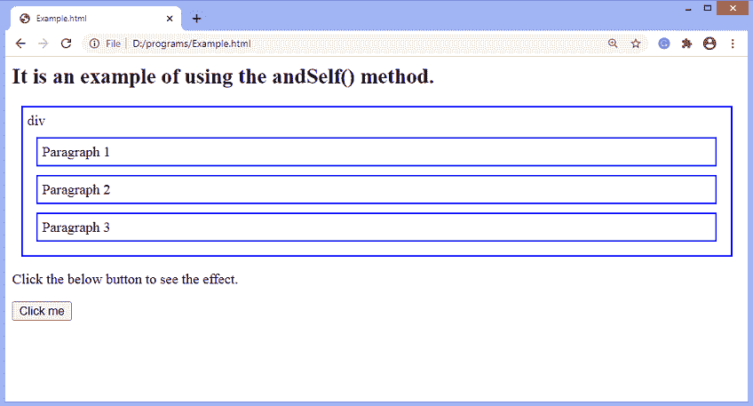
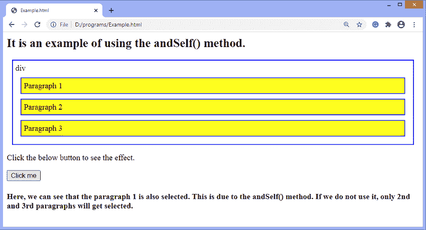
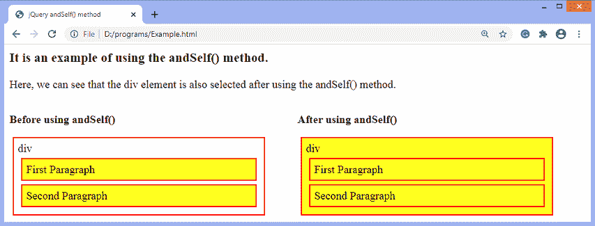

# jQuery 和 Self()方法

> 原文:[https://www.javatpoint.com/jquery-andself-method](https://www.javatpoint.com/jquery-andself-method)

jQuery 中的**和**方法用于将前一组元素添加到当前集合中。jQuery 中的对象维护一个内部堆栈，跟踪匹配元素集的变化。当我们需要前一组元素时，**和【自我()**方法会有所帮助。这是 [jQuery](https://www.javatpoint.com/jquery-tutorial) 中的一个内置方法。

当我们在脚本中有多个遍历，并且我们必须添加在最后一次遍历之前匹配的东西时，这个方法很有用。

jQuery 中不推荐使用**和 Self()** ，我们可以使用 [**addBack()** 方法](jquery-addback-method)来代替。在 jQuery 版本 **3.0** 中被完全移除。我们可以使用 jQuery 版本 **2.1.3** 来查看**和 Self()** 方法的工作情况。

### 句法

该方法的常用语法如下-

```

selector.andSelf()

```

此方法在没有任何参数的情况下使用，因为它不接受任何参数。

让我们看一些使用**和 Self()** 方法的例子。

### 示例 1

在本例中，我们将**和 Self()** 方法应用于带有 **id = "p1"** 的段落元素。在这里，我们也使用[**【next all()】**方法](https://www.javatpoint.com/jquery-nextall-method)来选择段落元素的下一个段落兄弟，id = "p1" 。

我们用的是 jQuery 版本 **2.1.3** ，那是因为**和 Self()** 方法对当前的 jQuery 版本不起作用。

```

<html> 
<head>  
<style> 
	.para, div { 
		margin: 10px; 
		padding: 5px; 
		border: 2px solid blue; 
	}
</style> 
<script src = "https://ajax.googleapis.com/ajax/libs/jquery/2.1.3/jquery.min.js"> </script>
</head> 
<body> 
<h2> It is an example of using the andSelf() method. </h2>
			<div> div
			<p id = "p1" class = "para"> Paragraph 1 </p> 
			<p class = "para"> Paragraph 2 </p> 
			<p class = "para"> Paragraph 3 </p> 
		</div> 
		<p> Click the below button to see the effect. </p>
		<button> Click me </button>
		<h4> Here, we can see that the paragraph 1 is also selected. This is due to the andSelf() method. If we do not use it, only 2nd and 3rd paragraphs will get selected. </h4>
<script> 
$(document).ready(function() {
$("h4").hide();
$("button").click(function() {
$("h4").show();
$("#p1").nextAll().andSelf().css( "background-color", "yellow" ); 
});
});
</script> 
</body> 
</html>

```

[Test it Now](https://www.javatpoint.com/oprweb/test.jsp?filename=jquery-andself-method1)

**输出**

执行上述代码后，输出将是-



点击给定按钮后，输出将是-



### 示例 2

在这里，我们展示了两个 **div 的**，其中第一个 div 在没有应用**和【自我()】**方法的情况下使用，而在第二个 div 中，我们应用了**和【自我()】**方法。在输出中，我们将看到两个 div，包括段落元素。在不使用 andSelf()方法的情况下，只会选择段落元素，而在使用**和 Self()** 方法后，div 也会和段落元素一起被选择。

我们用的是 jQuery 版本 **2.1.3** ，那是因为**和 Self()** 方法对当前的 jQuery 版本不起作用。

```

<html>
<head>
  <title> jQuery andSelf() method </title>
  <style>
  .div,.para {
    border: 2px solid red;
	margin: 5px;
    padding: 5px;
  }
  .left, .right {
    width: 45%;
    float: left;
  }
  .right {
    margin-left: 5%;
  }
  </style>
  <script src = "https://ajax.googleapis.com/ajax/libs/jquery/2.1.3/jquery.min.js"> </script>
</head>
<body>
<h3> It is an example of using the andSelf() method. </h3> 
<p> Here, we can see that the div element is also selected after using the andSelf() method. </p>
<div class = "left">
  <p> <b> Before using andSelf() </b> </p>
  <div class = "before div">
  div
    <p class = "para"> First Paragraph </p>
    <p class = "para"> Second Paragraph </p>
  </div>
</div>
<div class = "right">
  <p> <b> After using andSelf() </b> </p>
  <div class = "after div">
  div
    <p class = "para"> First Paragraph </p>
    <p class = "para"> Second Paragraph </p>
  </div>
</div>
<script>
$( ".before" ).find( "p" ).css( "background-color", "yellow" );
$( ".after" ).find( "p" ).andSelf().css( "background-color", "yellow" );
</script>

</body>
</html>

```

[Test it Now](https://www.javatpoint.com/oprweb/test.jsp?filename=jquery-andself-method2)

**输出**

执行上述代码后，输出将是-



* * *