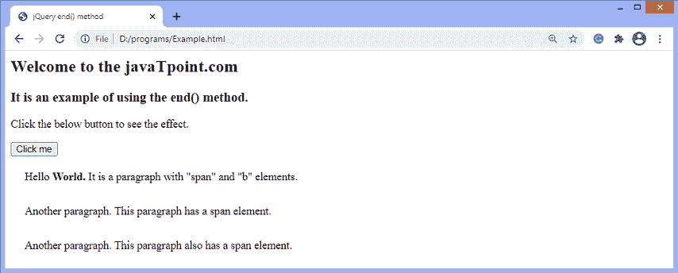

# jQuery end()方法

> 原文：<https://www.javatpoint.com/jquery-end-method>

jQuery 中的 **end()** 方法用于结束当前链中最近的过滤操作，并将匹配的元素集返回到之前的状态。此方法在没有任何参数的情况下使用。

当 [jQuery](https://www.javatpoint.com/jquery-tutorial) 用于链接目的时， **end()** 方法很有用。

### 句法

```js

operations.end() 

```

此方法不接受任何参数。

现在，让我们通过一些插图来了解 **end()** 方法的工作原理。

### 示例 1

这是使用 **end()** 方法的一个简单示例。在这里，链将首先搜索其中具有 [**span**](https://www.javatpoint.com/html-span-tag) 和 **b** 元素的段落元素，然后点击按钮，将选择[段落](https://www.javatpoint.com/html-paragraph)元素中的 span 元素。

```js

<html>
<head>
<title> jQuery end() method </title>
<script type = "text/javascript" src = "https://ajax.googleapis.com/ajax/libs/jquery/3.5.1/jquery.min.js">
</script>

<script>
$(document).ready(function(){
$("button").click(function(){
$("p").find("span").find("b").end().css("border", "2px blue solid");
});
});
</script>

<style>
.para{
margin: 10px;
padding: 10px;
}
</style>
</head>

<body>
<h2> Welcome to the javaTpoint.com </h2>
<h3> It is an example of using the end() method. </h3>
<p> Click the below button to see the effect. </p>
<button> Click me </button>
<p class = "para"> <span> Hello <b> World. </b> </span> It is a paragraph with "span" and "b" elements. </p>
<p class = "para"> <span> Another paragraph. </b> </span>  This paragraph has a span element. </p>
<p class = "para"> <span> Another paragraph.  </b> </span> This paragraph also has a span element. </p>
</body>
</html>

```

[Test it Now](https://www.javatpoint.com/oprweb/test.jsp?filename=jquery-end-method1)

**输出**

执行上述代码后，输出将是-



点击给定按钮后，输出将是-


### 示例 2

在这个例子中，链中有两种方法，分别是 **find()** 方法和 **first()** 方法，段落元素的背景颜色应该相应地改变。但是点击给定按钮后， **end()** 方法将删除链中的最后一个方法，并更改包括 span 元素在内的段落元素的背景颜色。

```js

<!DOCTYPE html>
<html>
<head>
<title> jQuery end() method </title>
<script src = "https://ajax.googleapis.com/ajax/libs/jquery/3.5.1/jquery.min.js"> </script>
<script>
$(document).ready(function(){
$("button").click(function(){
$("p").find("span").first().css({"background-color" : "lightblue"}).end().css({"background-color" : "yellow"});
});
});
</script>
</head>
<body>
<h2> Welcome to the javaTpoint.com </h2>
<h3> It is an example of using the end() method. </h3>
<b> Click the below button to see the effect. </b>
</br> </br>
<button> Click me </button>
<p class = "para"> Paragraph  <span> 1 with span element </span> </p>
<p class = "para"> Paragraph 2 </p>
<p class = "para"> Paragraph  <span> 3 with span element </span> </p>
<p class = "para"> Paragraph 4 </p>
</body>
</html>

```

[Test it Now](https://www.javatpoint.com/oprweb/test.jsp?filename=jquery-end-method2)

**输出**

执行上述代码后，输出将是-


点击给定按钮后，输出将是-


* * *