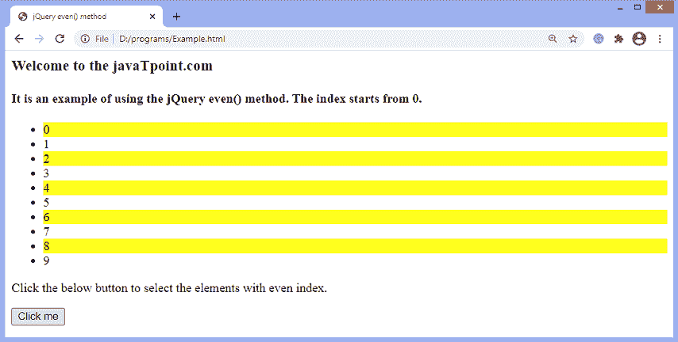
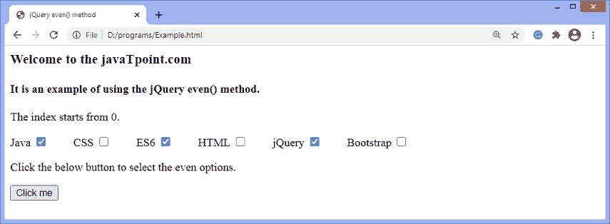

# jQuery even()方法

> 原文:[https://www.javatpoint.com/jquery-even-method](https://www.javatpoint.com/jquery-even-method)

[jQuery](https://www.javatpoint.com/jquery-tutorial) 中的**偶()**方法用于选择索引号为偶(如 2、4、6 等)的元素。).索引从 0 开始。它的工作原理类似于**奇数()**方法，但它选择偶数。

**偶数()**方法从所选元素集中返回偶数索引元素。此方法在没有任何参数的情况下使用。

### 句法

```

$(selector).even()

```

它不接受任何参数。

让我们看一些插图来了解**甚至()**方法的工作原理。

### 示例 1

这是使用**偶()**方法的一个简单例子。在这个例子中，我们使用**偶数()**方法来选择具有偶数索引的列表项。从 0 到 9 有十个列表项。索引从 0 开始。因此，单击给定的按钮，该方法将选择出现在偶数索引值上的列表元素。

我们必须点击给定的按钮才能看到效果。

```

<html>
<head>
<title> jQuery even() method </title>

<script src = "https://ajax.googleapis.com/ajax/libs/jquery/3.5.1/jquery.min.js"></script>
</head>
<body>

<h3> Welcome to the javaTpoint.com </h3>
<h4> It is an example of using the jQuery even() method. The index starts from 0\. </h4>
<ul>
	<li> 0 </li>
	<li> 1 </li>
	<li> 2 </li>
	<li> 3 </li>
	<li> 4 </li>
	<li> 5 </li>
	<li> 6 </li>
	<li> 7 </li>
	<li> 8 </li>
	<li> 9 </li>
</ul>

<p> Click the below button to select the elements with even index. </p>
<button> Click me </button>

<script>
$(document).ready(function(){
	$("button").click(function() {
	$("li").even().css("background-color", "yellow");
    });
	});
</script>

</body>
</html>

```

[Test it Now](https://www.javatpoint.com/oprweb/test.jsp?filename=jquery-even-method1)

**输出**

执行上述代码后，输出将是-


点击给定按钮后，输出将是-



### 示例 2

这是使用**偶()**方法的另一个例子。在这个例子中，有一些复选框。我们使用偶数()方法来选择偶数复选框。这里有六个复选框，从零索引开始。索引从 0 开始。因此，单击给定的按钮，该方法将选择出现在偶数索引值上的复选框。

我们必须点击给定的按钮才能看到效果。

```

<html>
<head>
<title> jQuery even() method </title>

<script src = "https://ajax.googleapis.com/ajax/libs/jquery/3.5.1/jquery.min.js"></script>
</head>
<body>
<h3> Welcome to the javaTpoint.com </h3>
<h4> It is an example of using the jQuery even() method. </h4>
<p> The index starts from 0\. </p>

    Java <input type = "checkbox">    

    CSS <input type = "checkbox">    

    ES6 <input type = "checkbox">    

    HTML <input type = "checkbox">    

    jQuery <input type = "checkbox">    

	Bootstrap <input type = "checkbox">

<p> Click the below button to select the even options. </p>
<button> Click me </button>

<script>
$(document).ready(function(){
	$("button").click(function() {
	$("input").even().attr("checked", true);
    });
	});
</script>

</body>
</html>

```

[Test it Now](https://www.javatpoint.com/oprweb/test.jsp?filename=jquery-even-method2)

**输出**

执行上述代码后，输出将是-


点击给定按钮后，输出将是-



* * *