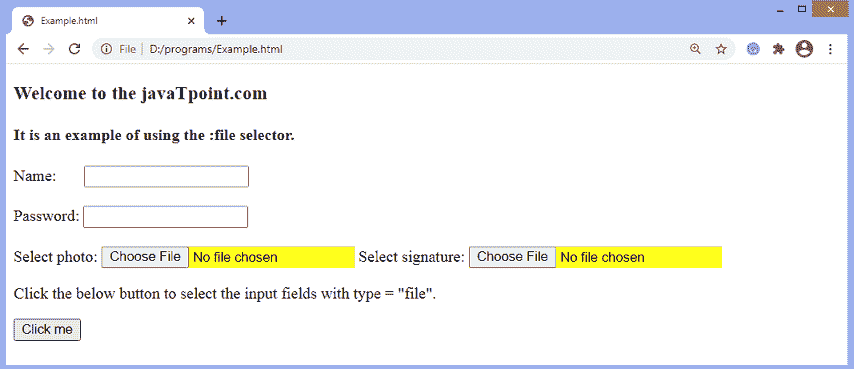

# jQuery:文件选择器

> 原文：<https://www.javatpoint.com/jquery-file-selector>

[jQuery](https://www.javatpoint.com/jquery-tutorial) 中的**:文件**选择器用于选择带有**类型=“文件”**的元素。

### 句法

使用**:文件**选择器的常用语法如下-

```

$(":file")

```

选择器在使用时没有任何参数。一个表单可以包含多个文件元素。我们可以使用元素的类或 id 选择 type = "file "的任何特定输入元素。

让我们看一个插图来了解**:文件**选择器的工作原理。

### 例子

这是一个使用**:文件**选择器的简单例子。在本例中，有三个输入字段，一个是 type = "text "，另一个是 type = "password "，最后一个是 type = "file "。单击给定按钮时，文件选择器将选择 type = "file "的输入字段。

```

<!DOCTYPE html>
<html>
<head>
<script src = "https://ajax.googleapis.com/ajax/libs/jquery/3.5.1/jquery.min.js"> </script>
<script>
$(document).ready(function() {
$("button").click(function() {
  $(":file").css("background-color", "yellow");
  });
});
</script>
</head>
<body>
<h3> Welcome to the javaTpoint.com </h3>
<h4> It is an example of using the :file selector. </h4>
  Name:    <input type = "text"> </br> </br>
  Password: <input type = "password"> </br> </br>
  Select photo: <input type = "file"> 
  Select signature: <input type = "file"> 
  <p> Click the below button to select the input fields with type = "file". </p>
  <button> Click me </button>
</body>
</html>

```

[Test it Now](https://www.javatpoint.com/oprweb/test.jsp?filename=jquery-file-selector1)

**输出**

执行上述代码后，输出将是-


点击给定按钮后，type = "file "输入字段的背景颜色将发生变化，如下图所示-



* * *