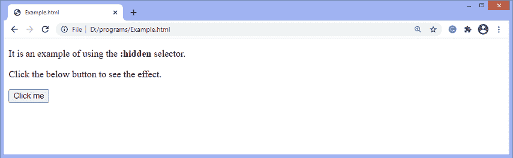
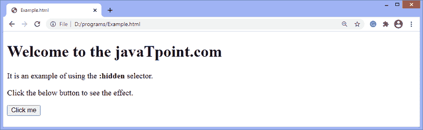
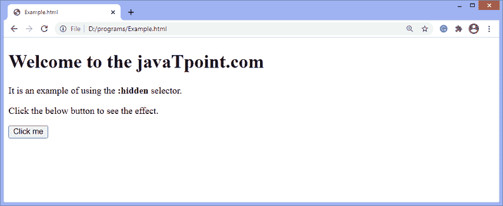

# jQuery:隐藏选择器

> 原文:[https://www.javatpoint.com/jquery-hidden-selector](https://www.javatpoint.com/jquery-hidden-selector)

[jQuery](https://www.javatpoint.com/jquery-tutorial) 中的**:隐藏**选择器用于选择隐藏的元素。它作用于隐藏的元素。选择器将选择满足以下任何条件的隐藏元素-

*   type = "hidden "的表单元素。
*   宽度和高度设置为 0 的元素。
*   带有**显示的元素:无**。
*   也隐藏子元素的隐藏父元素。

如果元素或其任何父元素占用隐藏空间，则不认为元素是隐藏的。不占用隐藏空间的元素或其父元素被认为是隐藏元素。因此，使用 CSS 属性**可见性:隐藏**和**不透明度:0** 的元素被认为是可见的，因为它们消耗了隐藏空间。**:隐藏**选择器不使用 [CSS](https://www.javatpoint.com/css-tutorial) 属性对元素进行操作，例如**可见性:隐藏**和**不透明度:0** 。

### 句法

使用**:隐藏**选择器的常用语法如下-

```

$(":hidden")

```

选择器在使用时没有任何参数。但是，我们必须在选择器之前使用 id、类或标记名来选择特定的元素。

现在，让我们看一些插图来了解**:隐藏**选择器的工作原理。

### 示例 1

在本例中，我们使用**:隐藏**选择器选择 [**h1** 标题元素](https://www.javatpoint.com/html-heading)，该元素使用**显示:无** CSS 属性隐藏。单击给定的按钮，该元素将被选中。

```

<!DOCTYPE html>
<html>

<head>
<script src = "https://ajax.googleapis.com/ajax/libs/jquery/3.5.1/jquery.min.js"> </script>
<script>
$(document).ready(function() {
$("button").click(function() {
$("h1:hidden").show();
});
});
</script>
</head>

<body>
<h1 style = "display:none;"> Welcome to the javaTpoint.com </h1>
<p> It is an example of using the <b> :hidden </b> selector. </p>
<p> Click the below button to see the effect. </p>
<button id = "btn"> Click me </button>
</body>

</html>

```

[Test it Now](https://www.javatpoint.com/oprweb/test.jsp?filename=jquery-hidden-selector1)

**输出**

执行上述代码后，输出将是-



点击给定按钮后，输出将是-



### 示例 2

在这个例子中，有一些隐藏的 div 元素和一些隐藏的输入字段。**:隐藏**选择器将选择隐藏的 div 元素和输入字段。单击给定按钮时，一个警告框将显示输入字段的值，隐藏的 [div 元素](https://www.javatpoint.com/html-div-tag)也将显示。

```

<!DOCTYPE html>
<html>
<head>
<style>
div {
height: 50px;
width: 50px;
margin: 5px;
text-align: center;
background: lightblue;
border: 2px solid black;
float: left;
}
.hide {
display: none;
}
</style>
<script src = "https://ajax.googleapis.com/ajax/libs/jquery/3.5.1/jquery.min.js"> </script>
</head>

<body>
<h1> Welcome to the javaTpoint.com </h1>
<p> It is an example of using the <b> :hidden </b> selector. </p>
<p> Click the below button to see the effect. </p>
<button> Click me </button>
<br><br>
<div class = "hide"> div 1 </div>
<div class = "hide"> div 2 </div>
<div class = "hide"> div 3 </div>
<div class = "hide"> div 4 </div>
<input type = "hidden" value = "Name">
<input type = "hidden" value = "Email">
<input type = "hidden" value = "Mobile no.">
<script>
$(document).ready(function() {
$("button").click(function() {
$("div:hidden").show();
$( "input:hidden" ).each(function(){
var value = $(this).val();
alert(value);
});
});
});
</script>

</body>

</html>

```

[Test it Now](https://www.javatpoint.com/oprweb/test.jsp?filename=jquery-hidden-selector2)

**输出**

执行上述代码后，输出将是-



单击上面截图中的按钮，将显示输入字段和 div 元素的值。

* * *