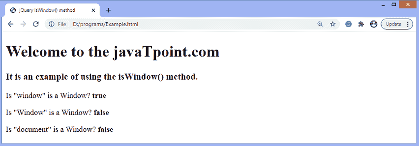

# jQuery isWindow()方法

> 原文：<https://www.javatpoint.com/jquery-iswindow-method>

**isWindow()** 方法用于测试传递的参数是否为窗口。此方法返回一个布尔值。如果发现传递的值是窗口，则返回 ***真*** 。否则返回 ***假*** 。

### 句法

```js

jQuery.isWindow( obj )

```

此方法接受一个参数，定义如下-

**obj -** 它指定一个对象来测试它是否是窗口。

让我们用一个例子来理解 **isWindow()** 方法的工作原理。

### 例子

这是使用 **isWindow()** 方法的一个简单示例。在本例中，我们使用 **isWindow()** 方法来确定传递的值是否是窗口。这里，我们传递不同的值作为参数。

```js

<!DOCTYPE html>
<html>

<head>
<title> jQuery isWindow() method </title>
<script src = "https://ajax.googleapis.com/ajax/libs/jquery/3.5.1/jquery.min.js"> </script>
</head>
<body>
<h1> Welcome to the javaTpoint.com </h1>
<h3> It is an example of using the isWindow() method. </h3>
<p> Is "window" is a Window? <b id = "b1"> </b> </p>
<p> Is "Window" is a Window? <b id = "b2"> </b> </p>
<p> Is "document" is a Window? <b id = "b3"> </b> </p>
<script>
var a = jQuery.isWindow(window);
var b = jQuery.isWindow(Window);
var c = jQuery.isWindow(document);
$( "#b1" ).text( a );
$( "#b2" ).text( b );
$( "#b3" ).text( c );
</script>
</body>
</html>

```

[Test it Now](https://www.javatpoint.com/oprweb/test.jsp?filename=jquery-iswindow-method1)

**输出**

执行上述代码后，输出将是-



* * *